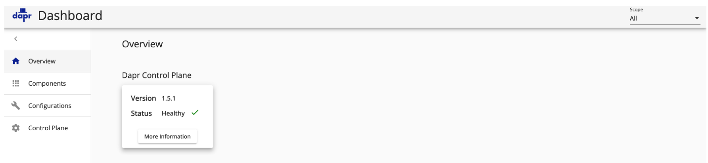
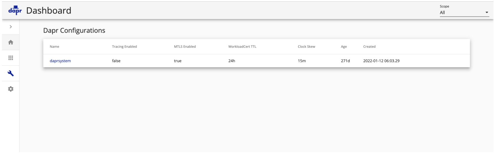
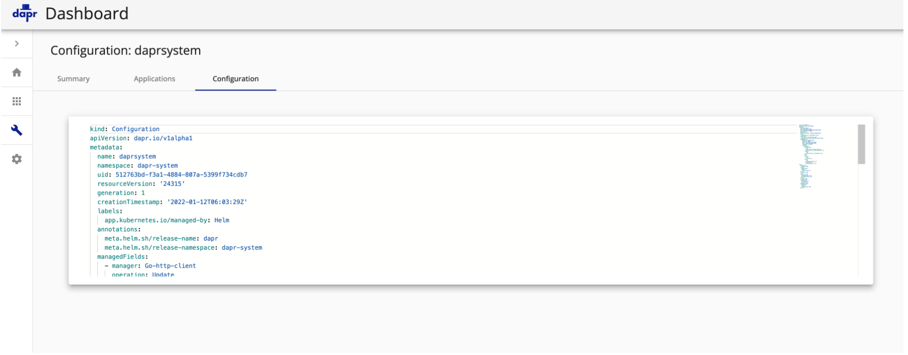

# Dapr Dashboard configurations 未授权访问漏洞 CVE-2022-38817

## 漏洞描述

Dapr Dashboard 存在 未授权访问漏洞，在未经授权的情况下获取云上redis、mongodb、rabbitmq等应用的明文配置信息，并可以进一步利用这些配置信息获取云上的敏感数据

## 漏洞影响

```
Dapr Dashboard
```

## 网络测绘

```
"Dapr Dashboard"
```

## 漏洞复现

主页面



验证POC

```
/configurations
```



