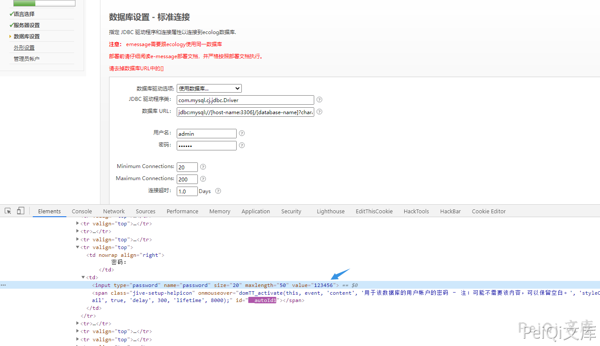
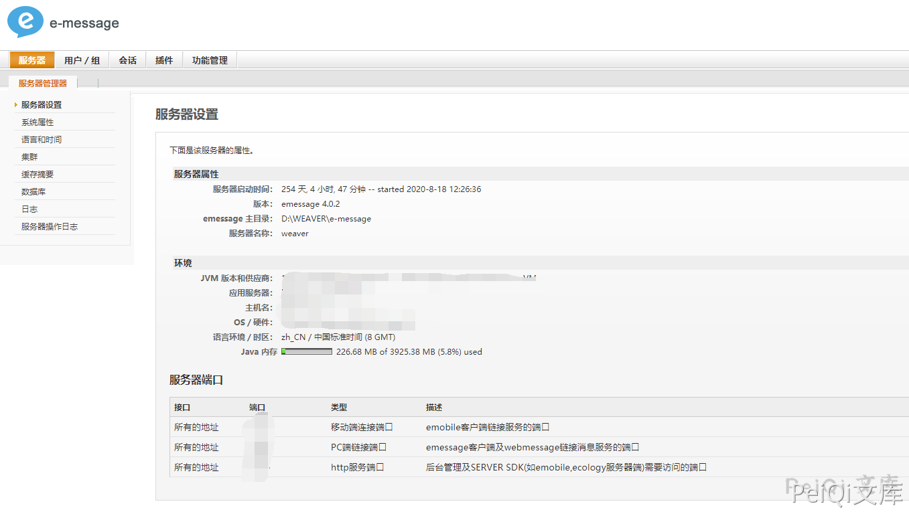

# E-message 越权访问漏洞

## 漏洞描述

E-message 存在越权访问漏洞，由于配置页面没有做权限设定，导致攻击者可以访问并重置账号密码等操作

## 漏洞影响

```
E-message
```

## 网络测绘

```
title="emessage 设置: 数据库设置 - 标准连接"
```

## 漏洞复现

访问安装页面

```plain
http://xxx.xxx.xxx.xxx/setup/setup-datasource-standard.jsp
```




可以获取账号密码信息，一路点击右下角的继续将会跳转修改管理员账号密码页面，修改后登录即可获取后台权限


