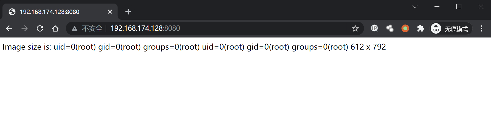
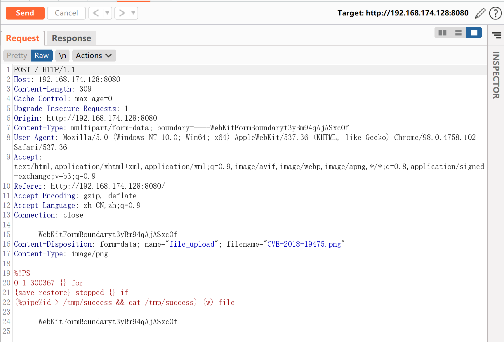
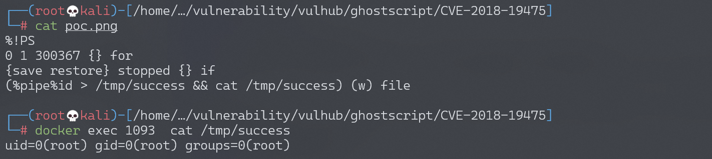

# GhostScript 沙箱绕过（命令执行）漏洞 CVE-2018-19475

## 漏洞描述

2018年底来自Semmle Security Research Team的Man Yue Mo发表了CVE-2018-16509漏洞的变体CVE-2018-19475，可以通过一个恶意图片绕过GhostScript的沙盒，进而在9.26以前版本的gs中执行任意命令。

参考链接：

- https://blog.semmle.com/ghostscript-CVE-2018-19475/
- https://bugs.ghostscript.com/show_bug.cgi?id=700153

## 环境搭建

Vulhub执行如下命令启动漏洞环境（其中包括 GhostScript 9.25、ImageMagick 7.0.8-20）：

```
docker-compose up -d
```

环境启动后，访问`http://your-ip:8080`将可以看到一个上传组件。

## 漏洞复现

将POC作为图片上传，执行命令`id > /tmp/success && cat /tmp/success`：




Burpsuite抓包查看执行命令：



进入容器，可以看到/tmp/success已被创建，`id`命令执行结果也被成功写入文件。



真实环境下通常无法直接回显漏洞执行结果，你需要使用带外攻击的方式来检测漏洞。

