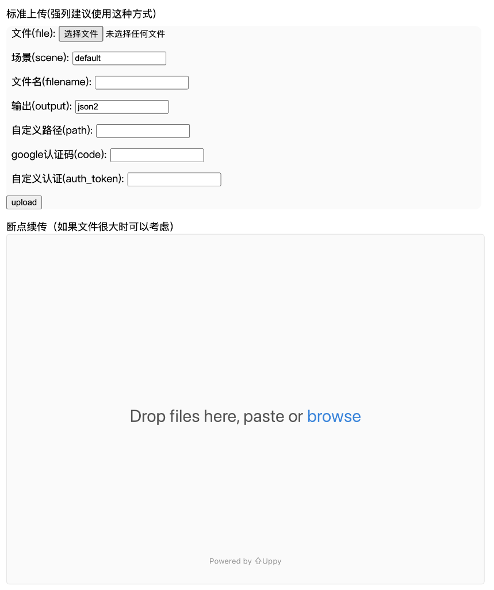
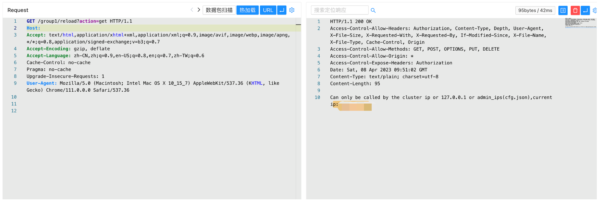
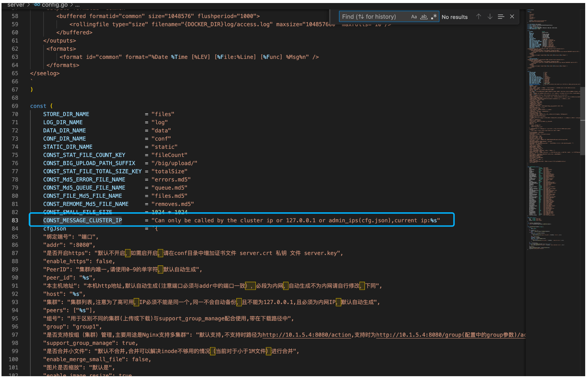
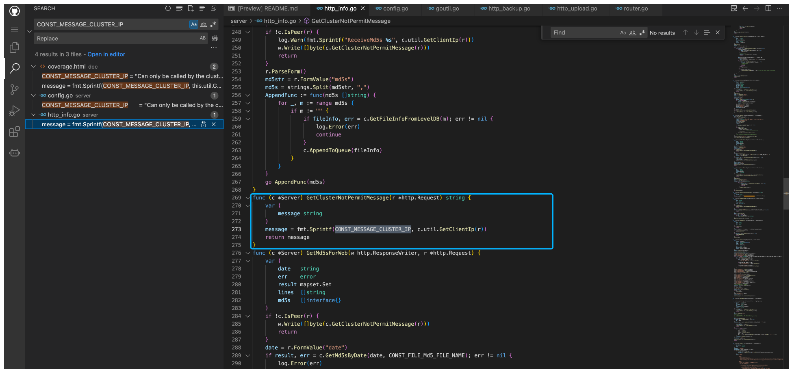
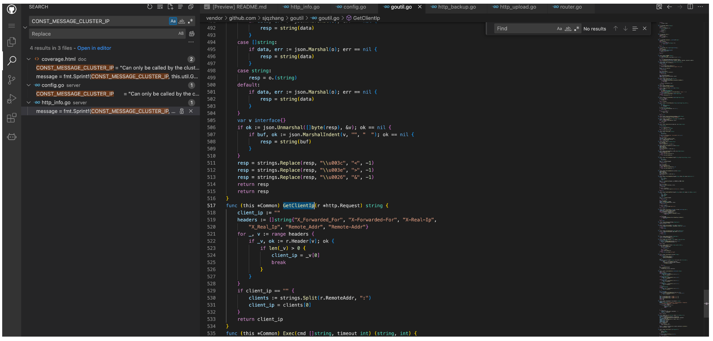
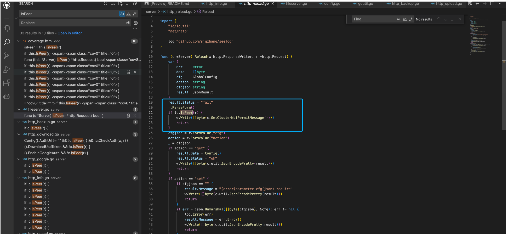
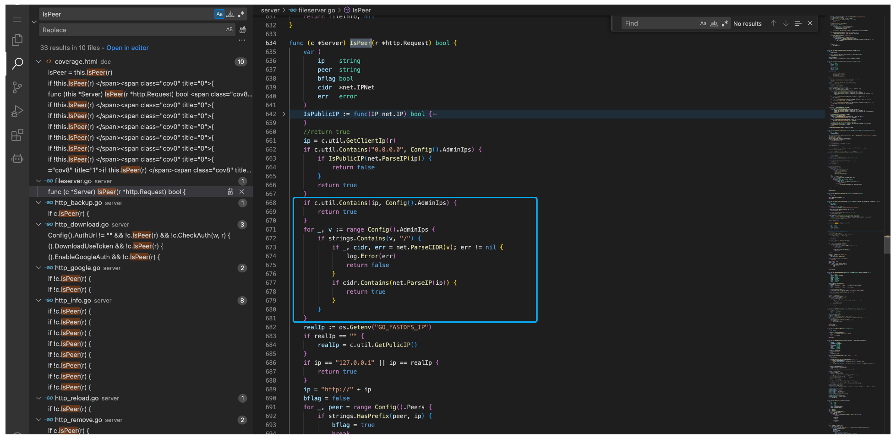
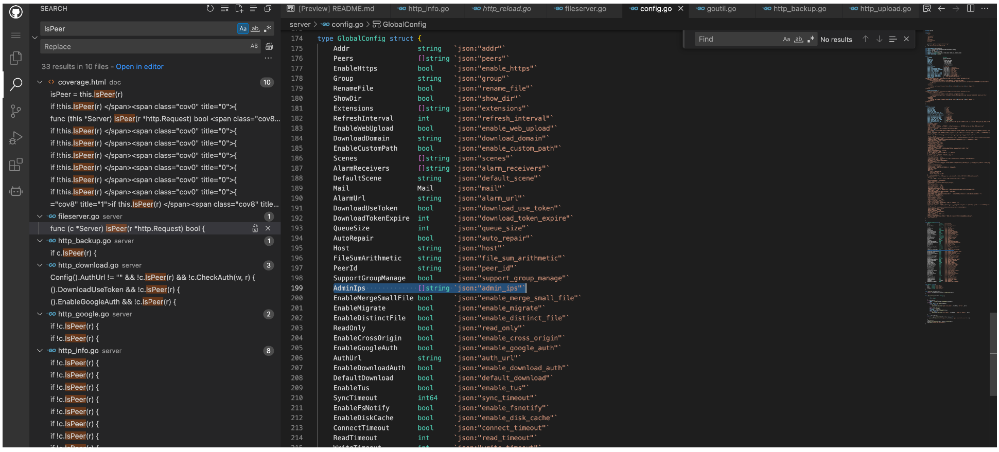
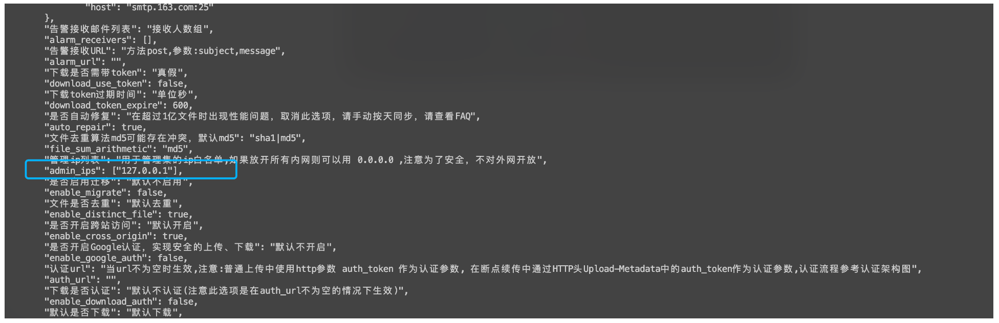
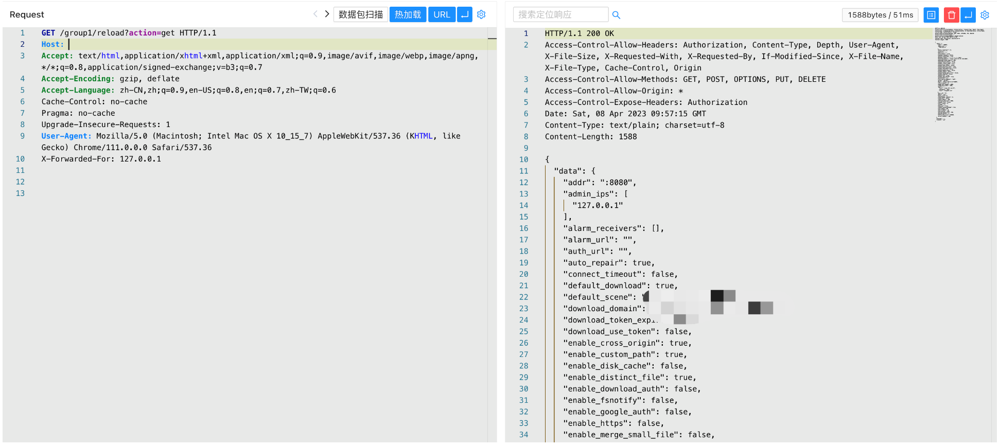

# Go-fastdfs GetClientIp 未授权访问漏洞

## 漏洞描述

Go-fastdfs GetClientIp方法存在XFF头绕过漏洞，攻击者通过漏洞可以未授权调用接口，获取配置文件等敏感信息

## 漏洞影响

```
Go-fastdfs
```

## 网络测绘

```
"go-fastdfs"
```

## 漏洞复现

主页面



调用读取配置接口，返回 ip 不允许访问

```
/group1/reload?action=get
```



追踪错误信息代码





跟一下 GetClientIp方法，这里会从 X-Forwarded-For 等参数获取值



回到调用的起点，验证方法为调用 IsPeer 参数





这里主要是验证获取到的值是否为配置中的 AdminIps



在配置文件 cfg.json 中 admin_ips 默认为 127.0.0.1 (可被爆破)



所以通过设置 X-Forwarded-For 就可以绕过接口调用限制，执行修改配置文件等操作，验证POC

```
/group1/reload?action=get

X-Forwarded-For: 127.0.0.1
```

