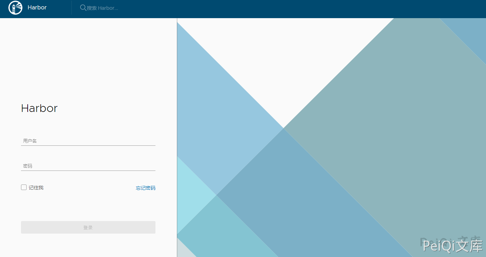
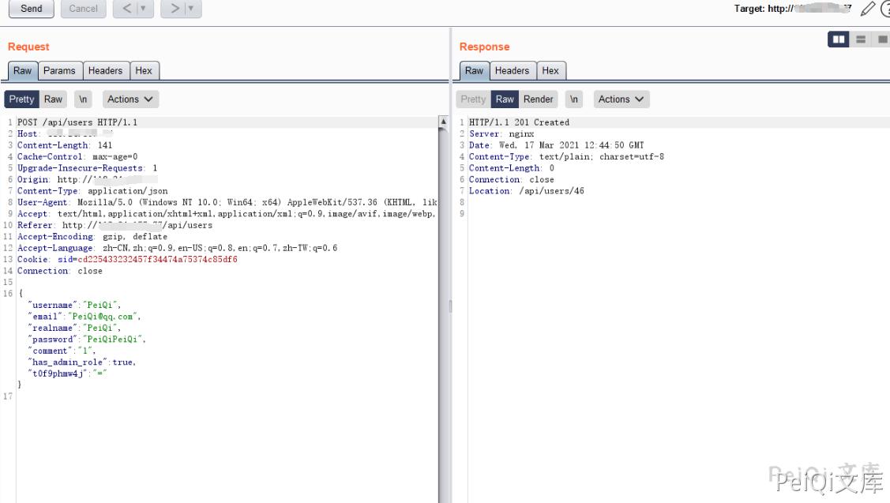
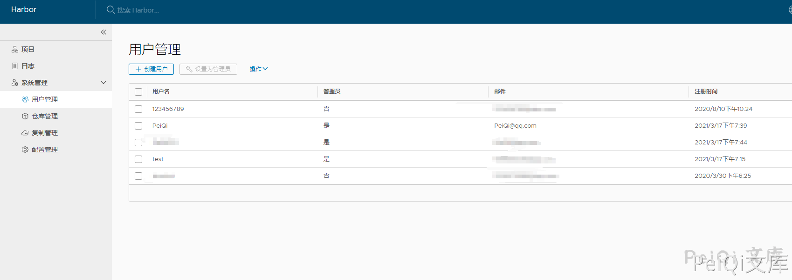

# Harbor 未授权创建管理员漏洞 CVE-2019-16097

## 漏洞描述

近日，镜像仓库Harbor爆出任意管理员注册漏洞，攻击者在请求中构造特定字符串，在未授权的情况下可以直接创建管理员账号，从而接管Harbor镜像仓库。我们得到消息，第一时间对该漏洞进了验证，官方已发布公告说明，最新的1.7.6和1.8.3已修复此漏洞，请使用到的用户尽快升级至安全版本。

Harbor是一个用于存储和分发Docker镜像的企业级Registry服务器。Harbor 1.7.0版本至1.8.2版本中的core/api/user.go文件存在安全漏洞。攻击者通过在请求中添加关键参数，即可利用该漏洞创建管理员账户，从而接管Harbor镜像仓库。

## 漏洞影响

```
Harbor 1.7.0版本至1.8.2版本
```

## 网络测绘

```
title="Harbor"
```

## 漏洞复现

登录页面如下E



向**/api/user** 接口发送创建用户的请求, 状态码返回201即创建成功




使用创建的账户成功登录后台




## 