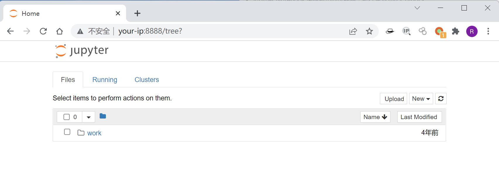
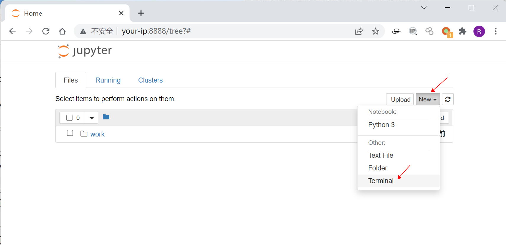
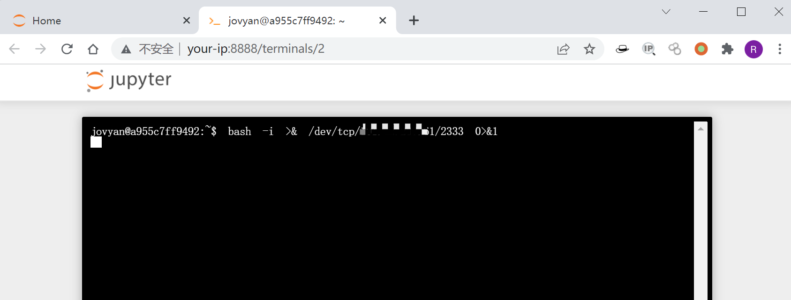

# Jupyter Notebook 未授权访问远程命令执行漏洞

## 漏洞描述

Jupyter Notebook（此前被称为 IPython notebook）是一个交互式笔记本，支持运行 40 多种编程语言。

如果管理员未为Jupyter Notebook配置密码，将导致未授权访问漏洞，游客可在其中创建一个console并执行任意Python代码和命令。

## 漏洞影响

```
Jupyter Notebook
```

## 网络测绘

```
app="Jupyter-Notebook" && body="Terminal"
```

## 环境搭建

Vulhub运行测试环境：

```
docker-compose up -d
```

运行后，访问`http://your-ip:8888`将看到Jupyter Notebook的Web管理界面，并没有要求填写密码。



## 漏洞复现

访问目标, 点击new→Terminal即可创建一个控制台，可以直接执行任意命令：



执行命令并反弹shell：



监听2333端口，成功接收反弹shell：


